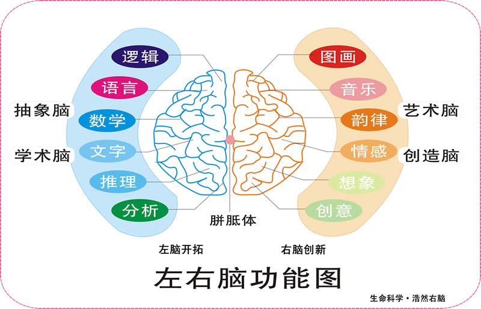
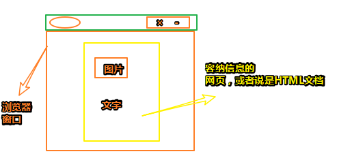
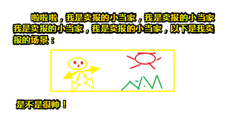
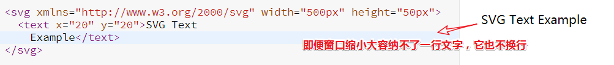
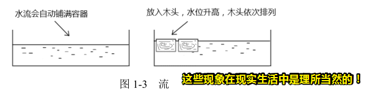
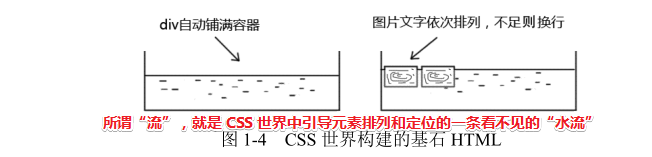

# 第1章 概述

> 要深入理解一个事物之前，最好先对其整体有个大概了解，这样才不至于蠡测管窥（指人对事物的观察和了解很狭窄，很片面）。

如你把CSS看作是一座大山的话，那么当你对CSS有了整体的认知的时候，你深入此山就不会迷路了！

那么我们该如何提高这所谓的「整体认知」呢？—— 对 CSS 这门语言特性的描述就有助于对 CSS 的整体认知

具体表现为： CSS 这门语言本身并无逻辑可言，看重的是**特性间的相互联系和具象能力**。而典型的计算机开
发语言看重逻辑思维和抽象能力，这就是为啥那些擅长 C++或者 Java 之类的程序员学习 CSS 往往没有如鱼得水的感觉的原因……

如何学习CSS？——不要把CSS属性看作是干巴巴的属性，你要建立类似“人与人关系”这种很情感化的联系。还有就是关于对CSS的认知，你需要从多个角度进行，如CSS的「世界观」、CSS的历史等等，这样一来你就会对 CSS 这门语言的理解表现得更为准确和丰满……

## ★CSS 世界的“世界观”

### ◇形象点？

如果你把所有的CSS属性看作是个有血有肉、有着不同个性和身世的个体，你说这可以构造出怎样一个世界呢？

> 可以想想「盾之勇者成名录」、「刀剑神域」、「魔法禁书目录」等什么的

假如CSS世界就是一部动漫世界，而这部动漫叫做「建筑神域」，那么剧情呢？则是讲述一群**建筑魔法师**为**国家**存亡惊心动魄战斗的故事

在这个世界里，有很多国家，如「Chrome 王国」、「IE 王国」等等，每个国家里边都有很多子民。当然还有一个最最重要的旁白，那就是我啦，一个闲得蛋疼的吃瓜群众

有一天，来自Chrome王国的width魔法师正如往常一样，进行着无聊到爆的训练，只见它口中念念有词「对面的div石头看过来，50%，变」，一个魔法棒轻轻一挥，那块div石头，就被拦腰折断了……（旁白同样表示无聊到爆）

就这样一遍又一遍的训练着……（旁白表示要睡着了……）突然，天有不测之风云，狂发暴雨突然而至，此时，正有一块石头从天飞速而降，而且正对着width魔法师的头顶，width瞪大了双眼，或许是长久以往的训练结果，它便立刻逼逼几句，然而并无卵用啊！这块石头可并没有拦腰折断啊！啥变化都没有，这石头似乎在无视width呀！

此时width回忆起过往的种种，看来自己要死了，但临死之前，它一定要把这件事（误以为是敌国IE的袭击）告诉正在另一块山头训练的display魔法师知晓，好让Chrome王国做好防御与进攻的准备（旁白表示好感人，但觉得贱人就是矫情，因为你TM不会躲开啊，难道你TM吓得走不动了？……）

width酝酿一波舍身赴死的感情之后，就使出了平生所有的力气，如同祭出大招狮吼功般，怒喊「老d，哥们先走一步了，敌袭……」，老d一回头，便看到那块石头，或许也是长久以往的训练结果，看到石头，总得逼逼两句——「重塑，幻化，flex」

画面切回来

width看着那块近在矩尺的石头，便闭上眼睛等待着死亡的降临，此时它的内心独白「要死了吗？嗯，是吧！再见 了各位……」（旁白表示你TM平时不是喜欢逼逼吗？这次你的老d兄都把石头幻化了，你TM还不使用魔法吗？先前无效，不代表这次也无效啊！）

或许width有主角光环吧！突然刮起一阵大风，把width给吹倒了，刚好倒了个狗吃屎……（旁白表示无语……）

width吐出嘴巴的石子，便走了过去看看这块石头到底为何物，一看发现它是个flex，便想「这TM刚刚我的魔法怎么会无效呢？」，再试试，「对面的div石头看过来，50%，变」……结果，变为两半……

此时display跑过来了，然后便说道「老w你没事吧？」

「没事，刚刚我的魔法失效了，而现在又有效了……」

「应该不是这个原因，我在远处看到它的整个真面目了，它是块span之石，所以你的魔法才对它无效，为了让你的魔法有效，我便让它幻化为flex了，所以你现在的魔法又有效了……」

（完）

### ◇CSS里边的东西都在动漫世界里代表什么？

1. HTML：魔法石

2. 选择器：选择法器

3. CSS属性：魔法师

4. CSS各种属性值：魔法师的魔法技能

5. 浏览器：魔法师所在的「王国」

   > 注意：
   >
   > “王国”会不断更新法律法规（版本升级），决定是否允许使用新的魔法石（HTML5 新标签新属性），是否允许新的魔法师入“国籍”（CSS3 新属性），或者允许魔法师使用某些新技能（CSS 新的属性值），以及是否舍弃某些魔法技能（如 display:run-in）

6. 操作系统：整个动漫世界

   > 不同的操作系统代表不同的**平行世界**，所以，CSS世界有这么几个比较大的平行世界，即Windows 世界、OS X 世界以及移动端的iOS世界和Android 世界。不同世界的浏览器王国的命运不一样，例如，在OS X 世界中，IE王国是不存在的，而Safari王国却异常强大，但在Windows 世界中，Safari 王国却异常落寞。

以上这一切就构成了完整的 CSS 世界的“世界观”。

### ◇为何要通过动漫世界来认识 CSS 世界呢？

1. 将抽象的 CSS 直接和具体的现实世界相对应，更加易于理解。为什么这样说呢？你试想一下，对于普通
   人，理解魔法师和魔法石是不是要比理解 CSS 代码容易得多？
2. 以完整的体系来学习 CSS要比**单纯关注属性值**理解得更加深刻，可以培养从**宏观层面认识与理解 CSS** 的习惯
3. 方便我们记忆，枯燥的代码总是过目就忘，鲜活的角色总是印象深刻。
4. 可以让本书散发出与众不同的气质。

> 这可不是单纯为了具体而具体哦！这是有很多理由的……而且这些理由足矣支撑为啥这样做的原因……

## ★世界都是创造出来的

### ◇CSS世界的出现难道是凭空而来的？

何为[创造](https://baike.baidu.com/item/%E5%88%9B%E9%80%A0/34627)？简而言之，创造就是**把以前没有的事物创立或者制造出来**。而创造的一个最大特点是**有意识的对世界进行探索性劳动的行为**。

如语言、衣服、住房、食物、计算机等都是我们人类所创造出来的！至此，我们人类世界也就被创造出来了。

而我们之所以创造，那是因为创造出来的东东（不管是新方法、新理论，还是实实在在的东西等）都**可以达到某种目的行为**。

可见，这世界的事情只要发生了，都是有原因的，而这里边不管是人为的还是大自然所为的，它们都不是凭空就出现的！或许你会问「地球的存在是不是有原因的？当然，这也是有的，只是你不知道而已！」

所以CSS世界也是被创造出来的，即，CSS世界的出现不是没有原因的！

关于CSS世界出现的历史，你可以看看维基百科：

**➹：**[层叠样式表 - 维基百科，自由的百科全书](https://zh.wikipedia.org/wiki/%E5%B1%82%E5%8F%A0%E6%A0%B7%E5%BC%8F%E8%A1%A8)

一句话可以概括之就是「**之所以选择你，那是因为除了你CSS，它们都或多或少有些毛病！就你CSS目前看起来比较中庸**」

为什么我们要去了解CSS世界出现的历史？

那是因为我们要**想深入理解 CSS 属性的一些设计原因、表现原理还真离不开当时的历史环境**

### ◇CSS世界之所以诞生的历史

1995年。互联网刚诞生没多久，那时CSS还未出现，而且当时的互联网几乎都是文字信息，即广大用户拿着浏览器所看到的网页是没有图片的，基本都是些文字信息，是不是很「朴素」？如果当时的网页能显示图片，那简直比性爱还要爽！

我们知道互联网的一个最重要的概念就是「联」，如果所有的用户的联到你这个网站的网页那岂不是「发财」了？

假如存在同样一份信息的网页，如果你的网页比它的表现得更好，那么用户肯定不去「联」对方的网页啦！

因此对设计师的要求也就要越来越多！

风水轮流转，现在的前端发展一如当年一样迅猛！因此，我这种渣渣也就顺应潮流，搞了一波前端学习……

话又说回来，那时的HTML越来越庞杂，用户以及开发者的眼神也就越来越不好使了，这时，就急需其他专门负责样式的语言，毕竟规模一起来，原先的那种做法也就不适用了！因此你就得创造另外一种姿势来满足大众的需求了。

据说当时有几个样式表语言，如CHSS、PSL 96、CSS等，而当时胜利的是CSS，并存活到了现在！

或许你会问「为啥是CSS赢了呢？这肯定是有后台的！」

这并没有什么后台！因为一个**“层叠”**特性就GG了所有竞争者！

> 层叠二字，显然不难理解，但是与样式表语言结合起来了，那么这就是一种新的创造了！而这种创造也为CSS的最终胜利埋下了伏笔！
>
> 或许有些时候，技术真得不如理念重要！如果其他样式表语言也用了「层叠」这种特性，我想今天的我们所写的样式就不是按CSS的那一套规则来了！

### ◇什么叫层叠？

CSS全称是 Cascading Style Sheets，翻译成中文即「层叠样式表」。而所谓的「层叠」，顾名思义就是样式可以层层累加。举个栗子来说：

页面的元素都继承了12px的大小，然而某个标题元素，表示12px不够我塞牙缝，于是它自己自行就叠加了个14px，于是它就显示成了14px！而不是继承而来的12px！需要注意的是，这里是叠加，而不是覆盖哈！

可见，这种层叠策略对于样式的显示是相当的灵活。

### ◇小结

1. 1996-12-17，CSS1诞生，CSS 在样式呈现领域可谓所向披靡，没有遇到任何竞争对手
2. 1998-5-12，CSS2 发布，推行内容和表现分离，**表格（table）布局开始落寞**。

### ◇那些年，那些信息

你要知道1998年那阵子，腾讯、新浪和网易成立了，而且那个时候可是门户的时代，可没有想现在这样有这么多千奇百怪的web应用！

既然是门户网站，那么那时的人们**更关注的是信息的获取哈**！

因此，网站的功能主要就是**信息展示**啦！

> xx用户：「张三，你能不能把信息展示得好看一些？你看李四他们家的？多好看呀！要不是你这个网站有小色色的信息，我才不看你的呢！」

关于「信息」，就当时那个互联网而言的话，信息就是**图片和文字**，不像现在还有音频、视频等信息载体！

所以，**那时候的网站前端技术关心的是图片和文字的呈现**，你只要把图片和文字弄得好看一些，钞票大大得有！

而**CSS2（包括 9 年之后，也就是 2007 年才出现的 CSS2.1）都是为图文展示服务的。**

不管怎样，**CSS 世界的诞生就是为图文信息展示服务的。**

请把上面这句话当作是类似于「水往低处流」这样的物理规则、常识来记住！

### ◇世界都是创造出来的

来个首尾呼应，再次强调「**世界都是创造出来的**」。

为何我要反复强调这句话呢？**如果站在造物主的角度去思考 CSS 世界的种种表现，很多问题就会迎刃而解。**

> 讲真，这也忒难了吧！我可没有经历过那个时代啊！而且，即便经历过，就我这种「创造力」，只能回家卖红薯了呀！

假如有个机会可以让你当一回造物主，**让你自己重新构建一个 CSS 世界**，唯一的要求就是，**这个世界要非常便于图片和文字的呈现，你会去如何构建呢？**

> 「非常便于」？
>
> 图片和文字是两种不同的信息载体，图片，有一图胜千言的说法，可见图片对于用户来说，是极其重要的！毕竟，当你不理解这段文字内容的时候，或许一张图片，你就能完全理解和明白了！
>
> 根据，斯佩里左右脑分工理论：
>
> 
>
> 我大致可以了解到，左脑文字不行，那就右脑图画来！
>
> 言归正传，文字、图片有了，那么它们是在一个叫做网页里边，或者说是一个容器里边所呈现的，而这个容器是个 矩形，类似于这样：
>
> 
>
> 你说黄色框框里边的东西该如何呈现呢？既然是呈现，那就是CSS世界的事儿了，CSS说「水往低处流」，那么里边的内容就往低处流！
>
> 假如我是个小白，那么我会觉得，图片都文字混合在一起吧！就像写800字作文一样，第一行写完了就换第二行，中间偶尔就插入一张大图片，而且它是不换行的，独占一行，两边咩有文字的，居中的，类似于这样：
>
> 

**➹：**[信息 - 维基百科，自由的百科全书](https://zh.wikipedia.org/wiki/%E4%BF%A1%E6%81%AF)

**➹：**[什么叫做把书读厚，再把书读薄？如何做到？ - 知乎](https://www.zhihu.com/question/22115080)

**➹：**[斯佩里左右脑分工理论_百度百科](https://baike.baidu.com/item/%E6%96%AF%E4%BD%A9%E9%87%8C%E5%B7%A6%E5%8F%B3%E8%84%91%E5%88%86%E5%B7%A5%E7%90%86%E8%AE%BA)

## ★CSS完胜SVG的武器—流

SVG（Scalable Vector Graphics）是啥？——它叫可缩放矢量图形，是W3C XML的分支语言之一，用于标记**可缩放的**矢量图形。具体细节，请查看[MDN](https://developer.mozilla.org/zh-CN/docs/Web/SVG/Tutorial)或者[维基百科](https://zh.wikipedia.org/zh-hans/%E5%8F%AF%E7%B8%AE%E6%94%BE%E5%90%91%E9%87%8F%E5%9C%96%E5%BD%A2)，当然，如果你想看[W3C官方文档](https://www.w3.org/Graphics/SVG/IG/resources/svgprimer.html)也是可以的！

虽然SVG有种种优点，如开放、标准，和 CSS 和 JavaScript 都能很方便地进行交等等，但是它也是最近几年才火的！2003年1月，SVG才被确立为W3C标准，不过之后长达10年的时间里边，它都是默默无闻的！

很多人认为它之所以不火的缘故是因为它的竞争对手Flash，其实不然，因为现在看来，SVG显然要比Flash优秀得多啊！

至于它为什么不火，正是那被你忽视的CSS的缘故！

我们知道，在很长一段时间里边，**网站的主要功能都是图片和文字信息的展示，但是，SVG 的强项是图形，其文字内容的呈现实在不敢恭维。**

如文字的排版：



而这对于CSS来说，这简直是小儿科啊！一行容纳不了就换一行呗！何必要吊死在「一行」上呢？总之，CSS它可以做到自然换行，多行显示，给人一种阅读书本的赶脚！

不管怎样，SVG处理文字（如自动折行），真不是它所擅长的事儿！

至此，SVG就被打入冷宫了！谁叫 你连最基本的信息——文字，都不搞好呢？即便你此刻把图片搞得再6也不行。

于是，CSS表示「我就问，还有谁？」

当然，就现在而言，技术不同往日，**Web 呈现更加复杂和丰富多彩，图文显示仅仅是网页功能的一部分，于是，矢量且图形领域颇有造诣的 SVG 开始迎来了自己的第一春。**

说了那么多，其实我就是想告诉你「**为什么 CSS 世界的图文显示能力那么强？为什么它可以抑制 SVG 这么多年？**」

这是因为「**流**」这个理念呀！

> CSS之前因为层叠的缘故击败了其它的竞争对手，而如今又因为「流」的缘故，击败了在图形领域颇有造诣的SVG！

### ◇何为“流”

接触过CSS的人都知道「文档流」这个概念，当然，作者喜欢称它为「流」哈！因为这够简洁呀！如果你喜欢Rap的话，我想你对于flow或许再熟悉不过了！

那么什么是「流」呢？我想这个问题或许你没有深入思考过！

> **CSS 世界中的“流”**指的是什么呢？“流”实际上是 **CSS 世界中的一种基本的定位和布局机制**，可以理解为**现实世界的一套物理规则**，“流”跟现实世界的“水流”有异曲同工的表现。

我们从小接触过这样一套物理规则：



当我们**知道这套规则**之后，就可以**理解现象**，并且**预知现象**。例如，水量超过容器的容积很多，我们就可以预测
到水会溢出来。

这类似于：

```js
if(水量>容器体积) {
    //水溢出来了
} else {
    //水没有溢出来
}
```

回到CSS世界里边，我们借助现实生活中的物理学知识，就能很轻松地理解CSS世界里边「流」的概念了！为什么这么说呢？——因为**CSS 世界的“流”似乎就是按照物理世界的“水流”创造的**。

形象一点来说，就像这样：



> 根据CSS世界的物理规则，div你这块魔法石，默认就得自动铺满整个容器哈！而其它诸如图片、文字等依次排列，就像块木头一样，而且这无形中就把图片和文字给自动定位了！


### ◇流是如何影响整个CSS世界的


### ◇什么是流体布局 


## ★CSS世界的开启从IE8开始

## ★table自己的世界

## ★CSS新世界—CSS3


## ★总结

- CSS世界的「世界观」？即这个世界是怎样的……具体点就如动漫世界般，CSS属性为魔法师，CSS属性值为魔法技能等等……
- 我突然感觉到「**先把书读厚，再把书读薄**」的韵味！如上边就是对原文，不断地添加自己的理解！这是厚，至于「薄」，我想可以先记住一些关键点就好了！

## ★Q&A

### ①什么叫世界观？

(**也说宇宙观**)人们对整个世界的根本看法。基本内容包括：世界是物质的还是精神的；是发展的还是静止的；是可知的还是不可知的；人与世界的关系如何。

总之世界观就是世界是什么样的，也就是说CSS世界里所呈现的世界是什么样的（可以类比为动漫世界），如魔法师就是CSS属性等等

**➹：**[怎样理解人生观、价值观、世界观？ - 知乎](https://www.zhihu.com/question/20447176)

### ②「这世间上的事情只要发生了，都是有原因的。」这是真的吗？

CSS出现了，这是有原因的。

JavaScript出现了，这是有原因的。

我出生了，这是有原因的。

我选择学习前端，也是有原因的。

我与你相识相遇，也是有原因的，难道缘分也是原因？

……

换句话说，就是为什么这会发生？

可难道就没有一件事情是没有原因，然后自然而然地就发生了吗？

**➹：**[是不是世界上所有的事情都是有原因的？ - 知乎](https://www.zhihu.com/question/22940515)

**➹：**[有因必有果 这句话是真的吗? - 知乎](https://www.zhihu.com/question/38797613)

**➹：**[任何事情的发生都是有原因的，这是真的吗？](https://www.gotquestions.org/Chinese/Chinese-everything-happens-reason.html)

**➹：**[每件事情都是有它註定會發生的原因，甚至是專為你而發生的 - khemame](https://khemame.wordpress.com/2014/11/15/%E6%AF%8F%E4%BB%B6%E4%BA%8B%E6%83%85%E9%83%BD%E6%98%AF%E6%9C%89%E5%AE%83%E8%A8%BB%E5%AE%9A%E6%9C%83%E7%99%BC%E7%94%9F%E7%9A%84%E5%8E%9F%E5%9B%A0%EF%BC%8C%E7%94%9A%E8%87%B3%E6%98%AF%E5%B0%88%E7%82%BA/)

### ③什么叫门户网站？

**入口网站**（英语对应词：Web portal），指的是将不同来源的[信息](https://zh.wikipedia.org/wiki/%E4%BF%A1%E6%81%AF)以一种整齐划一的形式整理、储存并呈现的[网站](https://zh.wikipedia.org/wiki/%E7%BD%91%E7%AB%99)。用户可以根据信息来源、信息类型、[关键字](https://zh.wikipedia.org/wiki/%E9%97%9C%E9%8D%B5%E5%AD%97)检索以及其他方式，来筛选并获取在门户网站内发布的所有内容。

> 关键点，信息都是来自该门户网站的服务器，不管是原创的，还是复制粘贴的都行！总之，这不是给个链接，链接到别人网站的网站！

**➹：**[门户网站 - 维基百科，自由的百科全书](https://zh.wikipedia.org/wiki/%E9%97%A8%E6%88%B7%E7%BD%91%E7%AB%99)

