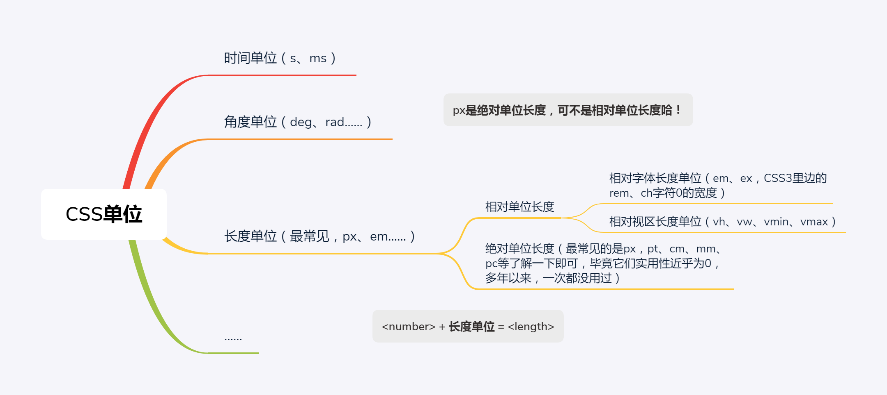

# 需提前了解的术语和概念

## ★2.1 务必了解的 CSS 世界的专业术语

我该如何才能让了解一些专业术语呢？——嗯……通过一段很常见的CSS代码来告诉你：

```css
.vocabulary {
    height: 99px;
    color: transparent;
}
```

### ◇属性

对应的是平常我们书面或交谈时**对 CSS 的中文称谓**，如你在跟人家说这段代码时，「xxx元素高度 99 像素」、「xxx元素里边的文字颜色透明」，可见「高度」、「颜色」就是CSS 世界的属性，也就是所谓的魔法石，也像是现实世界里人的姓氏：

```
A：我姓「height」，名「99px」，敢问兄台如何称呼？
B：兄台客气了，我姓「color」，单名一个「transparent」，很高兴认识你呀！
```

### ◇值

**“值”大多与数字挂钩**。在 CSS 世界中，值的分类非常广泛，下面是一些常用的类型：

1. 整数值，如 `z-index:1` 中的 `1`，属于`<integer>`，同时也属于`<number>`。
2. 数值，如 `line-height:1.5` 中的 `1.5`，属于`<number>`
3. 百分比值，如 `padding:50%`中的 `50%`，属于`<percent>`。
4. 长度值，如 `99px`。
5. 颜色值，如`#999`。
6. [字符串值](https://developer.mozilla.org/zh-CN/docs/Web/CSS/text-overflow)，如 `text-overflow: "…";`，CSS变量，如 `--external-link: "external link";`
7. 位置值，如 `left`
8. 角度值，如 `transform: rotate(0deg)`
9. [频率值](https://developer.mozilla.org/zh-CN/docs/Web/CSS/frequency)，如`0Hz`、`0kHz`
10. 时间值，如 `transition: background-color 0.3s ease;`
11. ……

上边的值当中，8910等类型是CSS3新世界里边的，常用的是前5个值！

**➹：**[CSS3 Transitions, Transforms和Animation使用简介与应用展示 « 张鑫旭-鑫空间-鑫生活](https://www.zhangxinxu.com/wordpress/2010/11/css3-transitions-transforms-animation-introduction/)

**➹：**[CSS/CSS3长度、时间、频率、角度单位大全 « 张鑫旭-鑫空间-鑫生活](https://www.zhangxinxu.com/wordpress/2011/03/css-css3-unit-units/)

**➹：**[CSS的值和单位 - 学习 Web 开发 - MDN](https://developer.mozilla.org/zh-CN/docs/Learn/CSS/Introduction_to_CSS/Values_and_units)

### ◇关键字

关键字指的是 CSS 里面**很关键的单词**，这里的单词特指**英文单词** ，如abc就不是单词了，那么它在CSS世界里边出现了，就不属于关键字了。典型的关键字有 `transparent `、`solid `、`inherit `，而其中里边的 `inherit `也称作“**泛关键字**”，所谓泛关键字，可以理解为“**公交车关键字**”，就是“**所有 CSS 属性都可以使用的关键字”的意思。** 

### ◇变量

CSS 中目前可以称为变量的比较有限， CSS3 中的 `currentColor` 就是变量，非常有用。 需要注意的是，它不是关键字，因为它并不是一个单词呀！

**➹：**[currentColor-CSS3超高校级好用CSS变量 « 张鑫旭-鑫空间-鑫生活](https://www.zhangxinxu.com/wordpress/2014/10/currentcolor-css3-powerful-css-keyword/)

### ◇长度单位 



一些注意点：

1. 2%后面的百分号%不是长度单位 ，2%就是一个完整的值，就是一个整体，我想你一定认为 0.02 是值，没错， 2%也同样是值 

2. “值”那里提到的`<length>`，貌似和这里的“长度单位”比较暧昧啊 ?

   我们必须把它们之间的关系搞清楚。只需要一句话：即可：

   ```
   <number> + 长度单位 = <length>
   ```

### ◇功能符 

**值以函数的形式指定（就是被括号括起来的那种）**

主要用来表示：

1. 颜色（rgba 和 hsla），如 ` rgba(0,0,0,.5`
2. 背景图片地址（url），如 `url('css-world.png')`
3. 元素属性值，如 `attr('href')`
4. 计算（[calc](https://developer.mozilla.org/zh-CN/docs/Web/CSS/calc)），如 `calc(100% - 80px)`
5. 过渡效果，如` scale(-1)`
6. ……

在了解calc的过程中，看到了一个[`<length>`](https://developer.mozilla.org/zh-CN/docs/Web/CSS/length)

> **`<length>`**是**表示距离尺寸的一种css数据格式**。许多CSS属性使用它，比如[`width`](https://developer.mozilla.org/zh-CN/docs/Web/CSS/width)、[`margin`](https://developer.mozilla.org/zh-CN/docs/Web/CSS/margin)、[`padding`](https://developer.mozilla.org/zh-CN/docs/Web/CSS/padding)、[`font-size`](https://developer.mozilla.org/zh-CN/docs/Web/CSS/font-size)、[`border-width`](https://developer.mozilla.org/zh-CN/docs/Web/CSS/border-width)、[`text-shadow`](https://developer.mozilla.org/zh-CN/docs/Web/CSS/text-shadow)。

其语法是这样的：

`<length>`数据类型包含[`<number>`](https://developer.mozilla.org/zh-CN/docs/Web/CSS/number)，后跟下面列出的单位（em、px……）之一。 与所有CSS维度一样，**单位字面值与数字之间没有空格**。 数字`0`后，长度单位是可选的。

### ◇属性值

属性**冒号后面的所有内容**统一称为属性值。例如，`1px solid rgb(0,0,0)`就可以称为属性值，它是由“值+关键字+功能符”构成的。**属性值也可以由单一内容构成**。例如，`z-index:1`的 `1` 也是属性值。

### ◇声明

属性名加上属性值就是声明，例如：

```css
color: transparent;
```

### ◇声明块

声明块是花括号（`{}`）包裹的**一系列声明**，例如：

```css
{
    height: 99px;
    color: transparent;
}
```

### ◇规则或规则集

出现了选择器，而且后面还跟着声明块，比如本小节一开始的那个例子，就是一个规则集：

```css
.vocabulary {
    height: 99px;
    color: transparent;
}
```

出现了`<number>`，而且后面还跟着长度单位，那就是 `<length>`、属性值，当然，0比较特殊，其长度单位是可选的！

### ◇选择器

选择器是用来**瞄准目标元素**的东西（也就是魔法师使用魔法棒所挥向魔法石时这么一个动作），例如，上面的`.vocabulary` 就是一个选择器。

- 类选择器：指以“`.`”这个点号开头的选择器。很多元素可以应用同一个类选择器。 **“类”，天生就是被公用的命**。
- ID 选择器：“`#`”打头，**权重相当高**。**ID 一般指向唯一元素**。但是，在 CSS 中，ID样式出现在多个不同的元素上并不会只渲染第一个，而是雨露均沾。但显然不推荐这么做，而是推荐是用class样式哈！
- 属性选择器：指含有`[]`的选择器，形如`[title]{}`、`[title= "css-world"]{}`、`[title~="css-world"]{}`、`[title^= "css-world"]{}`和`[title$="css-world"]{}`等。
-  伪类选择器：一般指**前面有个英文冒号**（`:`）的选择器，如`:first-child` 或`:last-child` 等。
-  伪元素选择器：就是有**连续两个冒号**的选择器，如:`:first-line`、`::first-letter`、`::before` 和`::after`。

### ◇关系选择器

关系选择器是指**根据与其他元素的关系选择元素**的选择器，常见的符号有空格、>、~，还有+等，这些都是非常常用的选择器。

- 后代选择器：选择所有合乎规则的后代元素。空格连接。
- 相邻后代选择器：仅仅选择合乎规则的儿子元素，孙子、重孙元素忽略，因此又称“子选择器”。>连接。适用于 IE7 以上版本。
- 兄弟选择器：选择当前元素后面的所有合乎规则的兄弟元素。~连接。适用于 IE7 以上版本。
- 相邻兄弟选择器：仅仅选择当前元素相邻的那个合乎规则的兄弟元素。+连接。适用于IE7 以上版本。

> 一句话概括就是先定一个点，然后找关系，把那些符合关系的元素或者说是魔法石，都给用上声明块！

### ◇@规则

@规则指的是**以@字符开始的一些规则**，像@media、@font-face、@page 或者@support，诸如此类。

> 做响应式布局时，媒体查询经常会用到，也就是 `@media`

## ★了解 CSS 世界中的“未定义行为”

### ◇概述

当某个浏览器中出现与其他浏览器**不一样的行为或样式表现**的时候，我们总会习惯把这种不一样的表现认为是**浏览器的 bug**。但在 CSS 世界，这种认识是**狭隘的**。

现实中，法律约束我们的行为，法律越界即为违法；

CSS世界中，Web标准约束元素的行为，**Web标准越界即为bug**。

但，不管是法律，还是Web标准，它们总是由人指定的，我们无法面面俱到，毕竟应用场景没有边界，千变万化，因此会存在法律空白、Web 标准空白！

因此，面对这些空白，既然你Web标准不提出来，那就由我浏览器厂商自己个性化定义一套符合现在这种应用场景的规范，然后自己实现就好了。所以，各大浏览器面对规范没有提出来的，但又有现实需求的，或多或少都会搞点个性化，而这样所造成的结果就是「样式或行为在Chrome这个国家里边，是合情合理的，但在firefox这个国家里边，是不允许的，是要被抓的！如我们是个允许吃肉的国家，但你在另外一个国家（只能吃素）做了同样的行为的话，那么该国家就会抓你了！」

所以说我们**遇到的表现差异并不是浏览器的 bug，用计算机领域的专业术语描述应该是“未定义行为”（undefined behavior）**，如果是Web标准规定的，而你浏览器为遵循的，那么我们可以说这是浏览器的bug，因此我们在测试一个网页的表现时，请选择那些兼容web标准高的浏览器，如Chrome、firefox等！

> 法律、web标准等空白之外的操作，不是违法或bug，如果是你没有遵守法律或web标准，那么就是违法或bug！
>
> 你所写的程序，违反了自己的需求、违反了自己脑海中的那一套逻辑，那就是有bug了！当然，需求之外，逻辑之外，也就是约束之外，那就不是说bug了，而是一种意外，一种未定义行为、一种创造！

### ◇看一个「未定义行为」的例子

> 我是真得服了这个火狐浏览器，安装后网页都不开！
>
> 不管我设置了防火墙运行该firefox应用通过，还是以管理员身份打开cmd，输入`netsh winsock reset`，重启电脑，都打不开网页！
>
> 我是真得想说一句「辣鸡，火狐浏览器，连最基本的需求都做不好！」
>
> 总不能说是我电脑问题吧？你看我用Chrome是可以浏览网页的，难道就你火狐特殊？

[demo](./demo/01-什么叫未定义行为.html)

我是在手机里边测试的，而且是轻轻一点：

Chrome的测试结果：先有弹框后有active

火狐的测试结果：先有active后又弹框

> 如果是重重一点的话，即摁的时间稍微久一点的话，那么它们俩所表现的行为是一致的！

通常情况下，`:active` 的表现都是符合预期的，但是，当遭遇其他一些处理的时候，事情就会变得不一样。如我们为这个焦点元素添加事件，比如同样是摁下鼠标这个动作，结果这两个王国，对同样一份代码，做出了两种表现！

难道这是 Firefox 浏览器的 bug 吗？或者说是Chrome浏览器的bug吗？

不不……这可不是bug，而是因为**规范上并没有对这种场景的具体描述，即遇到空白区了**！

所以 Firefox  不认为`:active` 发生在mousedown 事件之后，你也不能说它什么，对吧？

因此，像这种**规范顾及不到的细枝末节的实现，就称为“未定义行为”。**

## ★总结

- 这些术语各自表示什么，你需要知道！如说到「选择器」，你的脑海中就得出现选择器的外观是咋样的，虽然这些术语所呈现的都是些字符，但它们形式肯定与其它术语所代表的东东是有区别的，对吧！
- 只要超脱于约束之外，处于空白之中，那么你就不能说这是bug了，而是「未定义行为」！给个高大尚名字的话，那就是「创造」了！

## ★Q&A

### ① `<integer>`这个表示啥意思？

加了个尖括号？表示啥？

根据Java泛型的概念，这表示这个值的类型一定要是整形的！

**➹：**[标点符号的英语名称 - 阮一峰的网络日志](http://www.ruanyifeng.com/blog/2007/07/english_punctuation.html)

**➹：**[Java中的<>（尖括号）是什么意思？ Dovov编程网](https://www.dovov.com/java-161.html)

**➹：**[C++中尖括号的用法？ - 知乎](https://www.zhihu.com/question/61015480)

**➹：**[c语言编程 开头的＃include <stdio.h>是什么意思？ - 知乎](https://www.zhihu.com/question/61526366)

**➹：**[技术-理解 Bash 中的尖括号](https://linux.cn/article-10502-1.html)

**➹：**[数学运算中的尖括号是什么含义？ - 知乎](https://www.zhihu.com/question/51737074)

### ② 焦点元素与非焦点元素？

```
像<a>、<button>这样的元素，当我们使用键盘进行 Tab 键切换的时候，是可以被 focus 的，表现为虚框或
者外发光，这类元素称为“焦点元素”；非焦点元素指没有设置 tabindex 属性的<div>、<span>等普通元
素。在 IE6/IE7 浏览器下，非焦点元素对:active 置若罔。
```

