# 流 、 元 素 与 基 本 尺寸

## ★前言

流影响了整个CSS世界，因为它影响了魔法石——HTML，即它把众多的标签分为了两类——块级元素（block-level element）和内联元素（inline element）。

白话一点就是有光明魔法石和黑暗魔法石。

> 如果你遇到 `inline-level element`，请把它翻译为内联元素，而不是内联级元素。当然，它们俩只是称谓不同，所代表的东西都是一样的。

## ★块级元素

块级元素难道是`display`为`block`的元素？非也，它们俩不是一回事啊！你看li元素是块级元素，但是它的`display`为 `list-item`，所以你可以说「display为block的元素一定是块级元素，但是块级元素不一定是display为block的元素。」

那么满足什么特征？这块魔法石就块级元素呢？

> **一个水平流上只能单独显示一个元素，多个块级元素则换行显示。**

由于块级元素，天生自带 **换行**天赋，所以理论上它都可以**配合 clear 属性来清除浮动**带来的影响 ：

对浮动的理解（还有其它清楚浮动的姿势，但了解这一种就已经够用了）：


注意：清除浮动一直用`block`就好了，其它 的诸如  `list-item`、 `table`等，或多或少都会有这样那样不尽如人意的地方。

### ◇为什么 list-item 元素会出现项目符号

> 在 CSS 世界中，很多看似**“理所当然”**的现象的背后，实际上可能有一整套的体系支撑。**挖掘简单现象背后的原因**，会让你学到很多别人很难学到的 CSS 技能和知识。

块级元素，理所当然它的display应该为 `block`，负责结构 ；内联元素，理所当然它的display应该为 `inline`，负责内容 ；

但是，display除了可以取这两种值以外，还有其它值，如 `list-item`、`inline-block`等

当一个元素是块级盒子的时候：

它的display值可以是`block`、 `list-item`、`table`等……

既然有多种值，那么同样是块级盒子的盒子，将会有多种姿势，如 `list-item`就会有个「附加盒子」，学名为标记盒子（marker box），专门用来放圆点、数字这些项目符号，简单来说，你这个 `display`为  `list-item` 元素，**除了有块级盒子以外，还有一个附加盒子，也就是你比那些大众块级盒子，多了个百宝袋，可以存放许多东西！**

然而，display值还有一种值是 `inline-block`，这种值就很有意思了，穿着 inline 的皮藏着 block 的心。

为了解释这样的值，于是我们认为每个元素都有两个盒子——**外在盒子和内在盒子**。

外在盒子：**负责元素是可以一行显示，还是只能换行显示**（男）

内在盒子：**负责宽高、内容呈现什么的**。（女）

由于外在、内在这样的叫法过于通俗，于是内在盒子就换了个专业的名字，叫**容器盒子**

至此，我们对display的各种属性值有了不一样的理解：

- `block`：display为block值的元素的这种盒子实际上由**外在的“块级盒子”**和**内在的“块级容器盒子”**组

  

- `inline-block`：由**外在的“内联盒子”**和**内在的“块级容器盒子”**组成

  

- ` inline `：内外均是“内联盒子”

  

至此，你 就应该明白「`display`属性值是`inline-block`的元素既能和图文一行显示，又能直接设置 `width/height` ！」

因为**这样的元素，它有两个盒子**对吧！外面的盒子是 `inline` 级别（控制换行），而里面的盒子则是 `block` 级别的（负责宽高、内容呈现）

所以，根据以上的为了理解而理解，于是我们可以把 `display:block` 脑补成 `display:block-block`，同理，`display:table` 应该脑补成 `display:block-table`

所以说**我们平时的写法实际上是一种简写**。

出个题测试一下学习成果，`display:inline-table`这样的盒子是怎么组成的？

外面的盒子是个inline盒子，即它的流是不换行的，里面的容器盒子是`table`，或许这个table是控制内容呈现的吧！不知能否设置宽高。

> 我重新理解了一下之前的认识：
>
> 在理解之前，请把页面所有的元素看做是一个个矩形盒子！
>
> 外在的盒子，所面对的参照物是一行，针对的是流、布局，它告知我们似乎加换行符
>
> 内在的盒子，所面对的参照物是盒子自己本身，即元素本身，针对的是元素自己能否改变宽高，以及内容的呈现是怎样的！
>
> 举例子来说（可以把内容也当作是一个盒子）：
>
> block：block-block，外在有了换行符，内在有了大小变化
>
> inline：inline-inline，外在没有换行符，内在咩有大小变化，padding4个值都有实际效果，但是top和bottom会基于当前的位置扩散
>
> 
>
> 同样margin-left/right也有效果：
>
> 
>
> list-item：外在有了换行符，内在有大小变化，而且内容呈现是多了一个项目符号，类似于多了一个附加盒子用于装项目符号！一般配合ul元素使用！因为它们俩组合起来使用会有更多能力！
>
> inline-block：外在没有换行符，内在有大小变化
>
> inline-table：外在没有换行符，内在的内容表现如table一样，配合子元素为table-cell使用，天生自带水平均等分buff！
>
> flex：flex-flex，外在有换行符，内在的内容表现如flex一样，配合整个容器特有的属性以及其子元素的特有属性使用！
>
> ……
>
> 以上纯属为了理解而去理解的自圆其说。反正我这样理解有了更好地记忆！
>
> 至此，我看一个元素的角度发生了巨大的变化，即从原来的一个盒子看成是两个盒子！而且这种看法显然更符合自己对CSS的理解！或许牛逼之人，看待同一个东西的角度不同，对东西的理解程度也会有所不同，大部分人看到的只是糖，理解起来很吃力，少部分人看到的是糖背后的本质，理解起来很自然。如JavaScript的class特性是糖，如果你没有了解过ES5之前的构造函数以及其继承姿势的话，那么你是不能理解这种class特性的，那么这样使用起来的话，就会显得特别别扭，而且没有灵魂！
>
> **➹：**[display - CSS（层叠样式表） - MDN](https://developer.mozilla.org/zh-CN/docs/Web/CSS/display)
>
> **➹：**[`<display-outside>` - CSS：层叠样式表- MDN](https://developer.mozilla.org/zh-CN/docs/Web/CSS/display-outside)
>
> **➹：**[【归纳】display 的几种取值及其表现 - 樊凯强的博客- Franko's Blog](https://franko.top/1903/20190307A/)
>
> **➹：**[「 CSS 」display属性居然有这么多 - Eva's Blog](https://www.evacoder.com/2016/11/28/display/)
>
> **➹：**[text-align 属性值为： -webkit-match-parent，是什么意思_百度知道](https://zhidao.baidu.com/question/412323834.html)

### ◇display:inline-table 的盒子是怎样组成的 

外面是“内联盒子”，里面是“table 盒子”。得到的就是一个可以和文字在一行中显示的表格。

测试代码：

[demo](./demo/03/01-inline-table.html)

可见，我们的该**元素（div的display为inline-table）和文字一行显示**，且**行为表现如同真正的表格元素**（子元素宽度等分） 

> div元素伪装成了table元素

从代码中我们可以看到，我们对这个div搞了 `width:128px;`

你说「**元素都有内外两个盒子，我们平常设置的 width/height 属性是作用在哪个盒子上的？** 」

> 此刻的我认为是内在盒子，即容器盒子！

### ◇width/height 作用在哪个盒子上 

之前解释内外盒子的时候就已经提到过了：是内在盒子，也就是“**容器盒子**”。 

进一步思考：

**width 或 height 作用的具体细节是什么呢？** 

> 什么鬼作用的具体细节？不就是让一个元素看起来宽点、高点吗？

### ◇小结

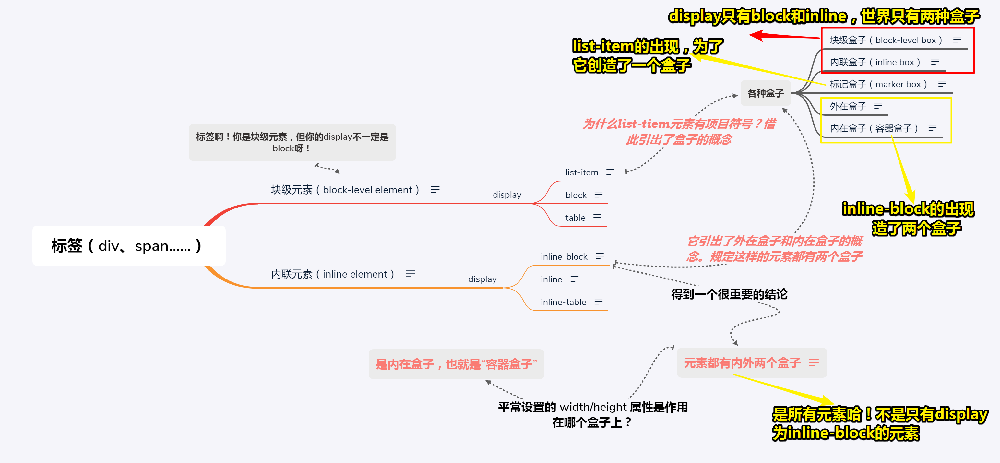


## ★width/height 作用的具体细节 

由于块级元素的流体特性主要体现在水平方向上，因此我们先着重讨论`width`

> 为什么这么说呢？按照自己的理解来看。从元素站在水平方向上来看的话，内联元素真得是不撞墙头心不死啊！而块级元素则是满满的占有欲啊，不允许其它元素跟我同处一行！
>
> 而这其中所涉及到的就是width，至于height一直都是被忽略的存在！

### ◇深藏不露的 width:auto 

> 连续很长的英文或数字，就像是天生自带 `white-space: nowrap;`
>
> 不知为何，我总是感觉以下内容的概述，就是if……else
>
> 这涉及到父元素与子元素，其实也就是嵌套，也就是你在body元素里看子元素一样
>
> 前提条件： `width:auto`
>
> 如果元素咩有设置宽度，那么它就是自适应父元素的宽度为100%
>
> 如果元素是浮动等，那就会出现xxx宽度表现
>
> ……
>
> 至此，我认为 你在写CSS的时候，应该知道你对元素不写宽度的时候，display等会对整个元素的宽度会有怎样的宽度表现
>
> 一句话概括之「打死我都不写宽度，但是宽度表现会因为你写的CSS声明或者文字内容或多或少会有些变化」


收缩到最小：[demo](./demo/03/02-一柱擎天.html)

超出容器限制：[demo](./demo/03/03-超出容器.html)

再次理解外和内：


内部尺寸：表示尺寸由内部元素决定；同理，外部尺寸：表示宽度由外部元素决定！

所以关于元素的尺寸表现：

**第一个「充分利用可用空间」就是外部尺寸啦！**，而且**这唯一的「外部尺寸」是「流」的精髓所在**

**而其余的则全部是内部尺寸！**

#### 4种尺寸表现

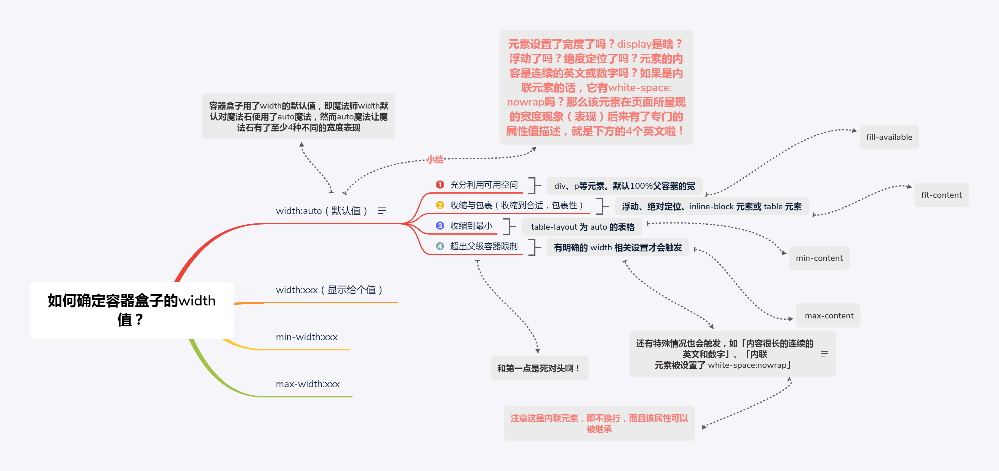

#### 区分外部尺寸与内部尺寸

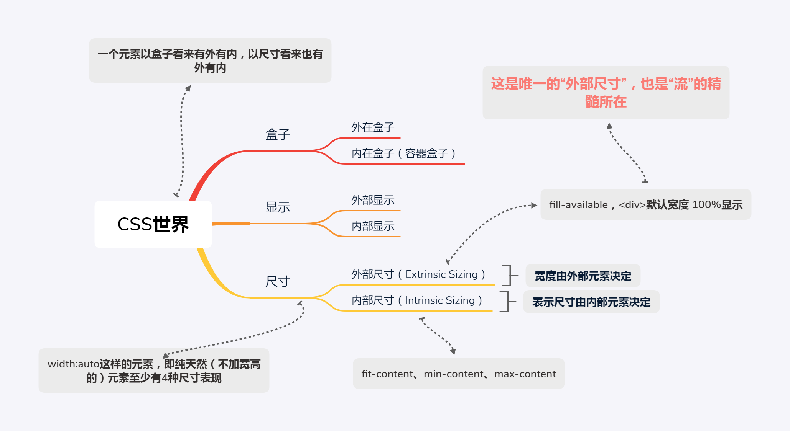

> 图中那个内在盒子得划分为外部尺寸和内部尺寸才好理解！
>
> 外部尺寸：考虑的是子父
>
> 内部尺寸：考虑的是父子
>
> 一图总结之：
>
> 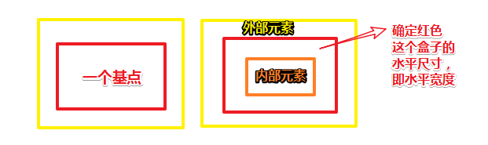
>
> 红色这个盒子就是容器盒子啦！


#### ①外部尺寸与流体特性

> 我在想作者是不是在把无法直接理解的CSS表现，直接添加了一层东西，然后就理解了
>
> 比如说，盒子到底有咩有内外之分呢？是不是作者为了理解这种CSS表现而意淫出来的呢？毕竟多了个内外之分，似乎更好地可以理解盒子了
>
> 可是这样的理解并不是绝对的理解，终究存在特殊情况，无法用内外盒子可以解释的呀！虽然是不完全归纳，但还是差强人意对吧！
>
> 又或者说，以我现在的水准还不能理解作者说得是啥内容？可是一本技术书你不讲得通俗易懂的话，那么谁还会看你的书啊？还不如去看MDN、CSS规范文档呢？

1. 正常流宽度：当我们在一个容器里倒入足量的水时，水一定会均匀铺满整个容器 。

   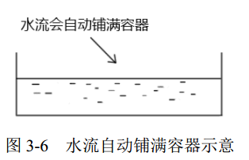

   回到CSS就是，在页面中随便扔一个`<div>`元素，**其尺寸表现就会和这水流一样铺满容器**。这就是 **block 容器的流特性**。这种特性，所有浏览器的表现都是一致的。 

   当然，流特性可不只是宽度100%显示这么简单，而是一种`margin/border/padding`和 `content 内容区域`**自动分配水平空间**的机制

   简单来说，如果对一个元素设置了 `width：100%`和没有设置是很大区别的：

   [demo](./demo/03/04-block元素流动性.html)

   即，没有设置width，不单只体现在 `width:100%`，还有margin等，而你设置了，那么margin等自动分配也就失效了！

   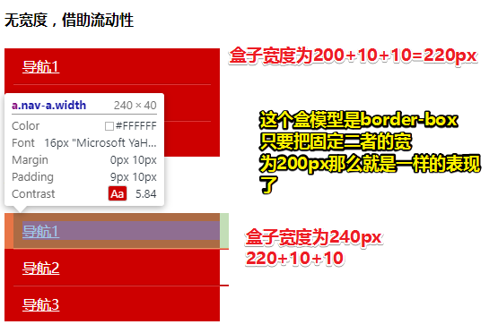

   可见，我们不写宽度好处多多呀！即便width为100%也不要写！

   毕竟表现为“外部尺寸”的块级元素**一旦设置了宽度，流动性就丢失了**

   具体点来说，写了width为100%的盒子宽度需要与其父元素的宽度一致啊！即相当于是写了 `width:240px;`，那么此时的元素尺寸就不是这真正意义上的外部尺寸，因为它失去了流的特性！

   形象点来说，你一个240px的容器，里边的水（盒子模型为boder-box的水，即盒子的宽度=content+pading+border）溢出了10px。

   总之，面对需要流特性的，那么你就不要写宽度了！100%宽度也不要写！

   之前的认识：`display：block;`，yy为 `display：block-block`。如今，需要官方一点为 `display:block flow;`

   flow即是内在盒子的尺寸表现。因此默认没有写宽度的block元素的尺寸表现是外部尺寸说了算，而且是具有flow特性的，即天生自带flow，即往容器倒水，自动铺满整个容器！

   总之内在盒子（关注点是大小，内容呈现）的尺寸看外部尺寸，那么它就是具有流体特性的盒子，反之，就是不具有。这就是不写width的好处了，但是很多时候，像我这些菜鸟为了布局，迫不得已需要书写宽度！但是这样一来也就丧失了流体特性了，况且流体特性的好处，刚刚那个demo例子你也见识到了，即不需要繁琐的计算。所以从今往后，能不写宽度就不写宽度，我宁可用padding也不用width写死这种菜鸡做法！

2. 格式化宽度。

   这给人的感觉，就像是把数据给清掉一样，即把写了width的值给格式化了！既然没有宽度，那么也就意味着有流特性的可能

   那么如何才能体现出格式化宽度呢？

   格式化宽度**仅出现在“绝对定位模型”**中，也就是出现在 position属性值为 absolute 或 fixed 的元素中

   我们知道「**默认情况下，绝对定位元素的宽度表现是“包裹性”，宽度由内部尺寸决定**」

   但是存在这么一种情况**其宽度是由外部尺寸决定的**

   那么这是一种什么样的情况呢？，代码如下：

   [demo](./demo/03/04-格式化宽度.html)

   从代码中可以看到，儿子的宽度=1000-20-20，这个1000来自于其最近的具有定位特性的祖先元素的宽度是 1000 像素，而20和20就是left和right的值。我们并咩有写宽度，但是其盒子宽度确实是由外部尺寸决定的！

   而且这个和上面的普通流一样，**“格式化宽度”具有完全的流体性**，也就是 margin、border、padding 和 content 内容区域同样会自动分配水平（和垂直）空间。

   需要注意的是，**“格式化宽度”水很深，同时也非常实用**。更多内容参看作者的第 6 章与 `position:absolute` 相关的内容

#### ②内部尺寸与流体特性

> 外部盒子和内在盒子（容器盒子）：针对一行、一个元素
>
> 外部尺寸和内部尺寸：针对内在盒子（容器盒子）尺寸本身、一个元素或多个元素

之前讲了外部尺寸，接下来说说内部尺寸

什么叫内部尺寸呢？

简单来说就是**元素的尺寸由内部的元素决定，而非由外部的容器决定**

> 按照自己的理解：外部的容器不是外部盒子，而是父元素！而内部的元素就是内在盒子，也就是当前子元素元素！

那么，我们如何快速判断一个元素使用的是否为“内部尺寸”呢？

**如果一个元素里边咩有内容，然后页面呈现这个元素的width值为0的话，那么它应用的就是“内部尺寸”啦！不然其width值可不是0哈！**

##### 内部尺寸的三种表现

1. 包裹性（shrink-to-fit ）

   它是 CSS 世界中**很重要的流布局表现形式**。 

   你以为包裹性只有包裹吗？那么你就大错特错了！

   它除了有「包裹」以外，还有「自适应性」

   而「自适应性」还是**区分后面两种尺寸表现很重要的一点**

   那么问题来了，这个「自适应性」指的是什么幺蛾子呢？

   > 指的是**元素尺寸由内部元素决定**，但**永远小于“包含块”容器的尺寸**（除非容器尺寸小于元素的“首选最小宽度”）。 

   对于这句话的理解：包含块容器指的是block父元素，如果子元素的宽度大于父元素的尺寸，那么子元素就会溢出哈！

   如果你一脸懵逼，那我换个姿势告诉你好了：

   > 你可以简单认为“包裹性”元素冥冥中有个 `max-width:100%`罩着的感觉（注意，此说法只是便于大家理解，**实际上是有明显区别的**）。 

   很多时候，我们都会担心某个元素内容太多而破坏布局，尤其是在作图文混排的时候，当然，如果“首选最小宽度”比容器宽度小 ，那么我们完全是不需要担心的！

   总之：

   > 对于一个元素，如果其 display 属性值是 inline-block，那么即使其里面内容再多，只要是正常文本，宽度也不会超过容器。 

   凡事发生必有缘由，「包裹性」也不例外。那么 CSS 世界的造物主**为何要设计“包裹性”这个东西呢？是为谁设计的呢？** 

   要回答上面这两个问题，很简单。引入一个button元素即可，我们知道button元素默认长得比较丑，而且样式定义兼容性又不好 。

   在页面代码里边，按钮通常以如下两种形式出现 ：

   ```html
   <button>按钮</button>
   <input type="button" value="按钮">
   ```

   由于「按钮是 CSS 世界中极具代表性的 inline-block 元素」，所以**它可谓展示“包裹性”最好的例子** 

   具体表现为：**按钮文字越多宽度越宽（内部尺寸特性），但如果文字足够多，则会在容器的宽度处自动换行（自适应特性）** 

   此时，或许你会问「这按钮TMD会自动换行？这不是说笑吗？」

   这可不是说笑哈！或许，这可能是因为你遇到下面这些情况而以偏概全了：

   - 实际项目中，按钮上的文字个数比较有限，没机会换行； 
   - `<button>`标签按钮才会自动换行， `<input>`标签按钮，默认 `white-space:pre`，是不会换行的，需要将 pre 值重置为默认的 normal。 

   眼见为实，show my code：

   [demo](./demo/03/05-按钮元素包裹性.html)

   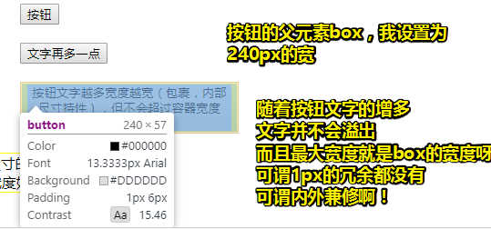

   > 包裹性难道是为button元素设计的？

   可是，这“包裹性”对实际开发有什么作用呢？ 而且很多时候我也没有意识到，有包裹性这个东西存在！

   请看这个需求：

   > 页面某个模块的文字内容是动态的，可能是几个字，也可能是一句话。然后，希望文字少的时候居中显示，文字超过一行的时候居左显示。

   这该如何实现呢？——实现如下：

   [demo](./demo/03/06-包裹性之开发中应用.html)

   > 我们可以看到，我们对box里边的内容并咩有设置宽度，再加上inline-block的作用。它并不会溢出，即它是有**自适应特性**的，即自动换行，而且它是**包裹的**，即它的宽度永远小于父元素240px的宽度，由于我们设置了padding，即子元素的宽度最大为220px，随着文字内容的增多，该子元素盒子的宽度也会增多，直到220px！（盒模型是border-box）
   >
   > 关于 `text-align: left;`，它给为的感觉是出现多行时才有效，而 `text-align: center;`，不管是一行还是多行，都会文本居中显示

   **除了 inline-block 元素，浮动元素以及绝对定位元素都具有包裹性，均有类似的智能宽度行为**。 

2. 首选最小宽度

   “首选最小宽度”，指的是元素**最适合的最小宽度** 

   在上边那个demo里边，外部容器的宽度是 240 像素，假设现在其宽度是 0 ，那么问里面的 inline-block 元素的宽度是多少 呢？

   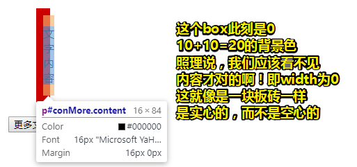

   儿子没有写宽度，那么就是`width:auto`，换而言之，它选择的是外部尺寸，而外部尺寸现在的width是0，所以儿子的宽度也是0，可是儿子现在能显示出来啊！而且宽度是16px，刚好是一个字的大小。

   可见这种现象，是不符合我们所想的！

   其实，在 CSS 世界中，**图片和文字的权重要远大于布局**，因此，**CSS 的设计者显然是不会让图文在 width:auto 时宽度变成 0 的，此时所表现的宽度就是“首选最小宽度”**

   > 如果是布局优先，那么文字就看不见了，这样布局就会好看很多，即文字不会溢出父元素的红色区域。可现在溢出了，那么也就表明，布局 vs 图文，显然是图文胜利，这也就是为什么有时候图文，会让布局如此难堪的原因了！因为图文是老大啊！可以无视布局，随意把盒子给戳破了！

   那么「首选最小宽度」的具体表现规则又是怎样的呢？——具体如下：

   - 东亚文字（如中文）最小宽度为每个汉字的宽度 

     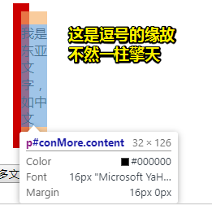

   - 西方文字最小宽度**由特定的连续的英文字符单元**决定。并不是所有的英文字符都会组成连续单元，一般会**终止于空格（普通空格）、短横线、问号以及其他非英文字符**等。例如，“display:inline-block”这几个字符以连接符“-”作为分隔符，形成了“display:inline”和“block”两个连续单元，由于连接符“-”分隔位置在字符后面，因此，最后的宽度就是“display:inline-”的宽度

     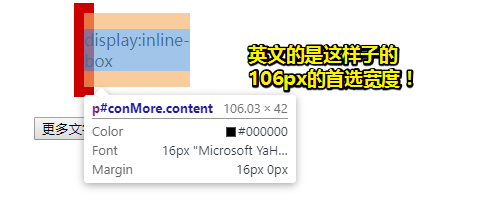

     如果想让英文字符和中文一样，每一个字符都用最小宽度单元，可以试试使用 CSS 中的 `word-break:break-all`。

     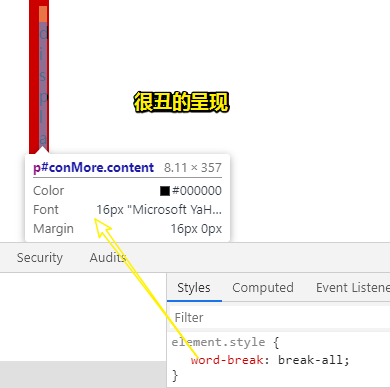

   - 类似图片这样的替换元素的最小宽度就是该元素内容本身的宽度。 

     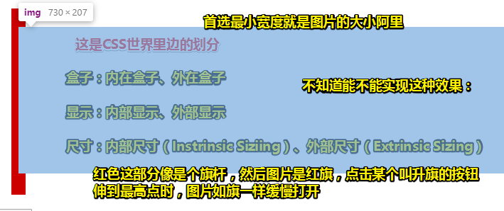

     图片和文字，终究是要比布局强，没有图片和文字？有了布局又有何用呢？

     就像是失去 了你，就算拥有全世界又如何？

   同理，“首选最小宽度”对我们实际开发有什么作用呢？ 

   > 可以让我们遇到类似现象的时候知道原因是什么，方便迅速对症下药，其他就没什么用了。 如知道那个 `word-break:break-all;`所存在的意义了吗？

   举个利用“首选最小宽度”构建图形的栗子：

   > 如何使用一层 HTML 标签分别实现下图所示的“凹”和“凸”效果（注意要兼容 IE8）？ 

   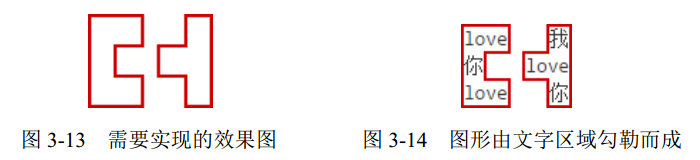

   [demo](./demo/03/07-首选最小宽度之凹凸效果实例.html)

   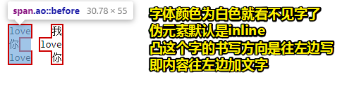

   > 关于outline：它是轮廓，它不占据空间，它们被描绘于内容之上，而且它可以是非矩形的。如果你改为boder的话，那么就没有效果了！

   我们利用了“首选最小宽度”的行为特点（父元素宽度为0）把需要的图形勾勒出来 。可是在这里，伪元素的内容默认是inline的呀，可不是inline-block呀！为啥还具有「首先最小宽度」呢？

   **在我看来首选最小宽度存在条件之一难道不是子元素为inline-block吗？（还有个条件父元素的width为0）**

   > 根据下文的解释，inline也有，只是丧失了包裹性的性，即自适应特性。

   我把伪元素的display改为inline-block，结果咩有凹，也咩有凸：

   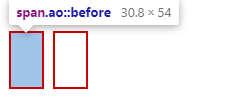

   你总不能说伪元素比较特殊，就可以违背这些条件吧！

   于是，我就测试了一下非伪元素的情况，结果一样。之前我们看到「首选最小宽度」的具体表现规则，它们都是矩形的，而且是inline-block，进一步为了理解而理解的测试：

   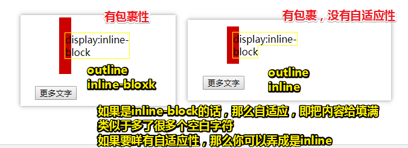

   有了包裹，那就有了首选最小宽度！但是如果还有自适应性的话，需要改该元素为inline-block才行，即inline-flow。**别忘了，这是内部尺寸！当我们没有对子元素写width的时候，我们所要的就是确定这个盒子的width到底是多少，以及明白这是如何确定的！**

   至此，我们就可以利用连续英文单词不换行的特性，我们就可以控制什么地方“凹”，什么地方“凸”啦！ 

3. 最大宽度

   最大宽度就是元素**可以有的最大宽度**。一些关于最大宽度的理解姿势：

   - “最大宽度”实际等同于“包裹性”元素设置 `white-space:nowrap` 声明后的宽
     度。 
   - 如果内部没有块级元素或者块级元素没有设定宽度值，则“最大宽度”实际上是**最大的连续内联盒子的宽度**。 

   什么叫连续内联盒子？

   简单理解就是「 display 为 inline、inline-block、inline-table 等元素」

   官方一点就是「“连续内联盒子”指的全部都是**内联级别的一个或一堆元素**，中间没有任何的换行标签`<br>`或其他**块级元素**」

   不懂？一图胜千言：

   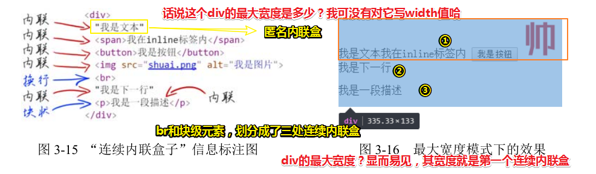

   图中，是一段很平常的 HTML 片段，其中有 3 处连续内联盒子，而且块级元素并咩有设定宽度值！所以很符合关于最大宽度的理解姿势的第二点！

   同样的问题：「最大宽度」对我们实际开发有什么作用呢？

   **大部分需要使用“最大宽度”的场景都可以通过设置一个“很大宽度”来实现。**

   需要注意的是，这里的**“很大宽度”和“最大宽度”是有本质区别的**。比如说：

   - 5张200px宽的图片，假设图片元素紧密排列，则父元素“最大宽度”就是 1000 像素。
   - 但是，实际开发的时候，我们**懒得计算**，可能直接设置容器 `width:2000px`，这里 2000px 就是“很大宽度”，即**宽度足够大**，可以**保证图片不会因为容器宽度不足而不在一行内显示**

   不管是给定了父元素容器的很大宽度，还是包裹性子元素且设置了 `white-space: nowrap;`的最大宽度，它们**都能实现几张图片左右滑来滑去的效果**

   我们知道，一般来讲，实现自定义滚动有两种原理：

   1. 借助原生的滚动，scrollLeft/scrollTop值变化，它的优点是简单，不足是效果呆板
   2. 根据内部元素的尺寸和容器的关系，通过修改内部元素的位置实现滚动效果，优点是效果可以很绽放。

   下边这个代码，我们引入了一个叫[iScroll](https://github.com/cubiq/iscroll)的库，用于模拟水平滚动，这个库要求我们使用第二种姿势，即只能使用「最大宽度」，这样一来我们滚动到底的时候，才是真的到底。

   [demo](./demo/03/08-使用iScroll模拟水平滚动.html)

   解释真的到底：

   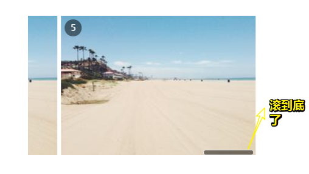

   代码中的ul是包裹性元素，且设置了 `white-space: nowrap;`，那么ul的最大宽度就是256*5=1280px，而页面的呈现，图片之间是近似于5px的间距，存在4个间距，即近似为20px，所以ul的实际最大宽度近似为1300px

   至此，**我们就无须滚2000px了，滚到刚刚好1300px就好了**！

   这样我们就省了对ul的宽度设置为2000px大小了！

至此关于内部尺寸的三种表现就看完了，但依旧不是很理解啊！尤其是最大宽度。看来还是得多看啊！

### ◇width 值作用的细节 


## ★总结

- “鑫三无准则”，即“无宽度，无图片，无浮动”。
  - 无宽度：表现为“外部尺寸”的块级元素一旦设置了宽度，流动性就丢失。而流动性并不是看上去的宽度100%显示这么简单，而是一种margin/border/padding和 content 内容区域自动分配水平空间的机制。

## ★Q&A

### ①反问和设问？

这是来自对下边这句话的疑问而提出的问题：「**凡事发生必有缘由。 CSS 世界的造物主为何要设计“包裹性”这个东西呢？是为谁设计的呢？反问是探究知识的很好的习惯和方式**。  」

难道这不是疑问吗？如果是反问的话，那么不需要回答了啊，这给我的感觉就是疑问啊！

> 疑问句分为一般疑问句、反问句、设问句三种
>
> 一般疑问句就是普通的疑问，问问题，例如：你吃饭了吗

最简明的表述：

> 疑问句包括一般疑问句（有疑而问）、反问句（无疑而问，只问不答）、设问句（无疑而问，自问自答）。

详细来说：

**①反问：**

反问是只问不答，答案暗含在反问句中，人们可以从反问句中领会到表达者的真意。

1. 钢琴笨重如棺材，小提琴要数十百元一具。制造虽精，世间有几人能够享有呢？
2. 我心里在想着，宁静的竹海里难道没有人家？

例1是肯定句式经过反问表达的是否的意思；例2是否定句式，经过反问表达的是肯定的意思。

反问句也可以用集中反问或连续反问，表达激动的感情，以增强文章感染力。如：

3. 声音是不太好听，有点沙哑，有点[毛毛](https://www.baidu.com/s?wd=毛毛&tn=SE_PcZhidaonwhc_ngpagmjz&rsv_dl=gh_pc_zhidao)刺刺的。可是公开教学课难道是上台表演吗？嗓子不好的人，就只能躲在树林子里读他喜欢的课文吗？京京心理难受极了。

反问句语气坚定有力，发人深思，可以增强文中的气势和说服力。

所以说，反问：

从反面提问，答案就在问题中，这种运用疑问的语气来表示肯定或否定的意思和强烈感情的修辞手法叫做反问。反问也叫激问、反诘、诘问。

运用反问，可以起到加强语气和发人深思的作用。

**②设问：**

为了引起别人注意，故意先提出问题，自问自答，叫做设问。

设问除了能引起注意外，还能启发读者思考。

1. 甚么叫自律？自律就是自己管束自己的行为。
2. 这人是谁？不是别人，原来是大明。
3. 数学真的很难吗？我看不是。

所以说，设问：

明知故问，自问自答，或提出问题，不需确定答案，这种修辞方式叫做设问。

运用设问，能引人注意，启发思考；有助于层次分明，结构紧凑；可以更好地描写人物的思想活动。

**➹：**[什麼是反问和设问?_百度知道](https://zhidao.baidu.com/question/39313438)

**➹：**[老师，怎样区分疑问句、反问句、设问句呢？_初二语文语言基础](https://dayi.jd100.com/question/2761616/)

### ②伪元素？

伪元素表示了某个元素的子元素。这个子元素虽然在逻辑上存在，但却并不实际存在于文档树中。

因为伪元素并不在文档树中，所以通过JS，也抓取不到伪元素，也不能给它绑事件

什么时候用伪元素？

HTML 标签的目的，就是为了展示内容信息。非内容信息要使用伪元素。如清楚浮动和图标等

**➹：**[CSS伪元素介绍 - 简书](https://www.jianshu.com/p/a52ed387e540)

**➹：**[使用 CSS 伪元素需要注意的 - 简书](https://www.jianshu.com/p/378f474c1ad0)

**➹：**[伪元素 ::after 和 ::before 应该这么用（一） - 前端八宝粥 - SegmentFault 思否](https://segmentfault.com/a/1190000015468617)

### ③水是静止的吗？

> 我想从新理解流！

大体而言，动水多为山谷中的溪流、江河之水和海水，静态之水多为湖水、潭水或水库蓄纳之水。不过，如果**仅仅从视觉上判断水是运动的或是静止的话，那则是非常片面的**。其实，不管何时、何地、何种水，其**运动是绝对的，静止则是相对的**。即使**表面是静止之水，如果从分子尺度衡量的话，它们也是无时无刻不处于运动之中，只不过它们的运动形式不易为人们所察觉罢了**。

就物理运动而言，水除了受地球重力影响会自高处向低处流动外，还有两种重要形式的运动就是克服地球引力而向上的蒸发运动和水平方向的蔓延渗透运动。**水的向下、向上和水平方向的三种运动形式**，对于自然界的地貌特征、气候类型、动植物分布、农作物生长乃至人体生命健康等来说，实在是太具有根本性的重要意义了。

**➹：**[水与哲学思想（中华水文化专题丛书） - 李中锋, 张朝霞 - Google 图书](https://books.google.co.jp/books?id=3mWADwAAQBAJ&pg=PT54&lpg=PT54&dq=%E6%B0%B4%E6%98%AF%E9%9D%99%E6%AD%A2%E7%9A%84%E5%90%97&source=bl&ots=kNPbJD2qB8&sig=ACfU3U1wKtn_XzdG5T7BWJY3OoKkcnAK_w&hl=zh-CN&sa=X&ved=2ahUKEwi84-jz2p3iAhU0x4sBHSOVA9IQ6AEwBXoECAgQAQ#v=onepage&q=%E6%B0%B4%E6%98%AF%E9%9D%99%E6%AD%A2%E7%9A%84%E5%90%97&f=false)

**➹：**[科学网-[转载]秀水拖蓝：水的哲学思想——中国古代自然哲学之精华-聂广的博文](http://wap.sciencenet.cn/blog-279293-1171128.html?mobile=1)

**➹：**[为什么水是透明的，我们能看见水；空气是透明的，我们却不能看见空气呢? - 知乎](https://www.zhihu.com/question/47702299)

---

至此回到文档流，我们可以把没有设置宽度的div看做是水流。把span看做是漂浮的木头，即我们无法对其设置宽高，而且具有排列顺序。

作者对流做了解释：

> 所谓“流”，就是 CSS 世界中引导元素排列和定位的一条看不见的“水流”

需要注意的是：「文档流从左往右自上而下」这种说法是不严谨的，因为我们可以改变流向！如水的向下，而不是默认水的水平……

总之，还可以是「文档流从右到左自上而下」

如果我们需要进行特殊布局的话，那么我们得要破坏流！

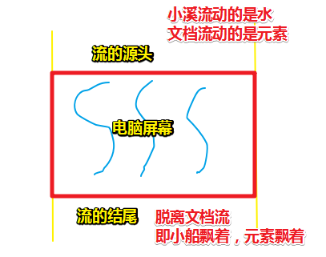

> 我还是把桥看作是div，当然，你可以把水平方向流动的水看做是div。图中少描绘了水流的水平流动，
>
> 把一行排列着漂浮着的木头看做是span，当然，木头可没有脱离水流，还是在文档流中，所以图中的小船比喻并不恰当。
>
> 不知为什么，感觉把HTML文档，即把网页立体化来看的话，然后页面一个个元素都是一块块板砖，就像是这样：
>
> 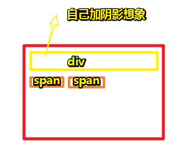
>
> 总之就是把元素凸起来看！

**➹：**[一篇文章了解HTML文档流(normal flow) - 知乎](https://zhuanlan.zhihu.com/p/31261020)

### ④流体布局和自适应布局？

> 自适应性：撞墙了，请自动换行

流体布局（(fluid layout，也叫Liquid Layout），即流式布局，指的是利用元素“流”的特性实现的各类布局效果。因为“流”本身具有自适应特性，所以“流体布局”往往都是具有自适应性的。——div+css布局实际指的就是流体布局！

“自适应布局”是对凡是具有自适应特性的一类布局的统称，“流体布局”要狭窄得多。

“流体布局”并不等同于“自适应布局”。表格布局设置为 100%也有自适应特性，但这不是利用元素「流」特性而实现的流体布局！

**➹：**[静态布局、自适应布局、流式布局、响应式布局、弹性布局等的概念和区别 - 简书](https://www.jianshu.com/p/0be6b9f77dd5)

**➹：**[应运而生的web页面响应布局 « 张鑫旭-鑫空间-鑫生活](https://www.zhangxinxu.com/wordpress/2011/09/%e9%a1%b5%e9%9d%a2%e5%93%8d%e5%ba%94%e5%b8%83%e5%b1%80/)

### ⑤物理学和CSS？

物理：“物理固自然”——物理就是关于大自然的事情

官方一点的解释：

物理学是一种自然科学，注重于研究物质、能量、空间、时间，尤其是它们各自的性质与彼此之间的相互关系。物理学是关于大自然规律的知识。更广义地说，物理学探索分析大自然所发生的现象，以了解其规则。

数学之于物理扮演了什么角色？——物理学的一个重要功能是描述，而描述则需要语言，数学就是物理学最基本的语言。

贪吃蛇的形象比喻：我们研究最微观的世界，可能需要的是最宏观的关于整个宇宙的知识。所以西方物理学界给物理学一个形象——贪吃蛇。即贪吃蛇的蛇头，就是宇宙层面上的物理问题。蛇尾，是基本粒子层面的物理。最宏观的头，衔着它最微观的尾巴。

那么CSS呢？

研究的是CSS世界里边大自然的规律！广义地来说就是分析样式对页面产生了什么现象，以了解其样式规则。

**➹：**[科学网-曹则贤：世界上80％的物理学家根本不懂物理](http://wap.sciencenet.cn/mobile.php?type=detail&cat=T&id=426211&mobile=1)


