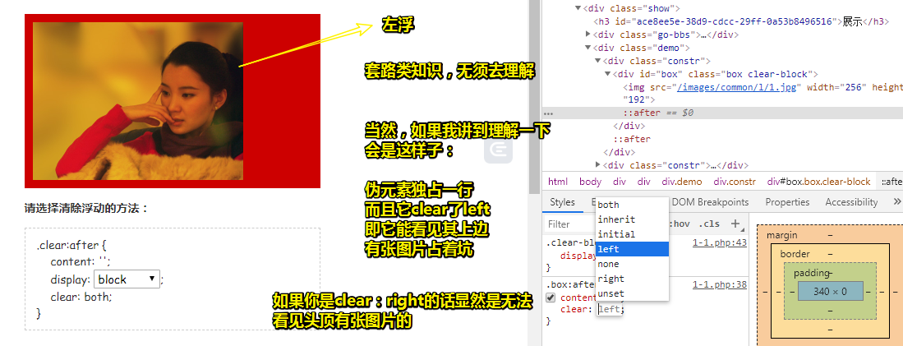
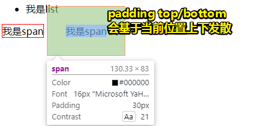
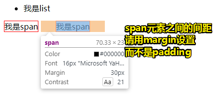
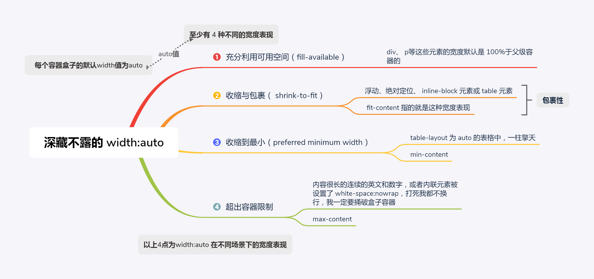
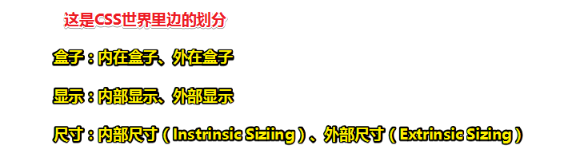

# 流 、 元 素 与 基 本 尺

## ★前言

流影响了整个CSS世界，因为它影响了魔法石——HTML，即它把众多的标签分为了两类——块级元素（block-level element）和内联元素（inline element）。

白话一点就是有光明魔法石和黑暗魔法石。

> 如果你遇到 `inline-level element`，请把它翻译为内联元素，而不是内联级元素。当然，它们俩只是称谓不同，所代表的东西都是一样的。

## ★块级元素

块级元素难道是`display`为`block`的元素？非也，它们俩不是一回事啊！你看li元素是块级元素，但是它的`display`为 `list-item`，所以你可以说「display为block的元素一定是块级元素，但是块级元素不一定是display为block的元素。」

那么满足什么特征？这块魔法石就块级元素呢？

> **一个水平流上只能单独显示一个元素，多个块级元素则换行显示。**

由于块级元素，天生自带 **换行**天赋，所以理论上它都可以**配合 clear 属性来清除浮动**带来的影响 ：

对浮动的理解（还有其它清楚浮动的姿势，但了解这一种就已经够用了）：

注意：清除浮动一直用`block`就好了，其它 的诸如  `list-item`、 `table`等，或多或少都会有这样那样不尽如人意的地方。

### ◇为什么 list-item 元素会出现项目符号

> 在 CSS 世界中，很多看似**“理所当然”**的现象的背后，实际上可能有一整套的体系支撑。**挖掘简单现象背后的原因**，会让你学到很多别人很难学到的 CSS 技能和知识。

块级元素，理所当然它的display应该为 `block`，负责结构 ；内联元素，理所当然它的display应该为 `inline`，负责内容 ；

但是，display除了可以取这两种值以外，还有其它值，如 `list-item`、`inline-block`等

当一个元素是块级盒子的时候：

它的display值可以是`block`、 `list-item`、`table`等……

既然有多种值，那么同样是块级盒子的盒子，将会有多种姿势，如 `list-item`就会有个「附加盒子」，学名为标记盒子（marker box），专门用来放圆点、数字这些项目符号，简单来说，你这个 `display`为  `list-item` 元素，**除了有块级盒子以外，还有一个附加盒子，也就是你比那些大众块级盒子，多了个百宝袋，可以存放许多东西！**

然而，display值还有一种值是 `inline-block`，这种值就很有意思了，穿着 inline 的皮藏着 block 的心。

为了解释这样的值，于是我们认为每个元素都有两个盒子——**外在盒子和内在盒子**。

外在盒子：**负责元素是可以一行显示，还是只能换行显示**（男）

内在盒子：**负责宽高、内容呈现什么的**。（女）

由于外在、内在这样的叫法过于通俗，于是内在盒子就换了个专业的名字，叫**容器盒子**

至此，我们对display的各种属性值有了不一样的理解：

- `block`：display为block值的元素的这种盒子实际上由**外在的“块级盒子”**和**内在的“块级容器盒子”**组

  

- `inline-block`：由**外在的“内联盒子”**和**内在的“块级容器盒子”**组成

  

- ` inline `：内外均是“内联盒子”

  

至此，你 就应该明白「`display`属性值是`inline-block`的元素既能和图文一行显示，又能直接设置 `width/height` ！」

因为**这样的元素，它有两个盒子**对吧！外面的盒子是 `inline` 级别（控制换行），而里面的盒子则是 `block` 级别的（负责宽高、内容呈现）

所以，根据以上的为了理解而理解，于是我们可以把 `display:block` 脑补成 `display:block-block`，同理，`display:table` 应该脑补成 `display:block-table`

所以说**我们平时的写法实际上是一种简写**。

出个题测试一下学习成果，`display:inline-table`这样的盒子是怎么组成的？

外面的盒子是个inline盒子，即它的流是不换行的，里面的容器盒子是`table`，或许这个table是控制内容呈现的吧！不知能否设置宽高。

> 我重新理解了一下之前的认识：
>
> 在理解之前，请把页面所有的元素看做是一个个矩形盒子！
>
> 外在的盒子，所面对的参照物是一行，针对的是流、布局，它告知我们似乎加换行符
>
> 内在的盒子，所面对的参照物是盒子自己本身，即元素本身，针对的是元素自己能否改变宽高，以及内容的呈现是怎样的！
>
> 举例子来说（可以把内容也当作是一个盒子）：
>
> block：block-block，外在有了换行符，内在有了大小变化
>
> inline：inline-inline，外在没有换行符，内在咩有大小变化，padding4个值都有实际效果，但是top和bottom会基于当前的位置扩散
>
> 
>
> 同样margin-left/right也有效果：
>
> 
>
> list-item：外在有了换行符，内在有大小变化，而且内容呈现是多了一个项目符号，类似于多了一个附加盒子用于装项目符号！一般配合ul元素使用！因为它们俩组合起来使用会有更多能力！
>
> inline-block：外在没有换行符，内在有大小变化
>
> inline-table：外在没有换行符，内在的内容表现如table一样，配合子元素为table-cell使用，天生自带水平均等分buff！
>
> flex：flex-flex，外在有换行符，内在的内容表现如flex一样，配合整个容器特有的属性以及其子元素的特有属性使用！
>
> ……
>
> 以上纯属为了理解而去理解的自圆其说。反正我这样理解有了更好地记忆！
>
> 至此，我看一个元素的角度发生了巨大的变化，即从原来的一个盒子看成是两个盒子！而且这种看法显然更符合自己对CSS的理解！或许牛逼之人，看待同一个东西的角度不同，对东西的理解程度也会有所不同，大部分人看到的只是糖，理解起来很吃力，少部分人看到的是糖背后的本质，理解起来很自然。如JavaScript的class特性是糖，如果你没有了解过ES5之前的构造函数以及其继承姿势的话，那么你是不能理解这种class特性的，那么这样使用起来的话，就会显得特别别扭，而且没有灵魂！
>
> **➹：**[display - CSS（层叠样式表） - MDN](https://developer.mozilla.org/zh-CN/docs/Web/CSS/display)
>
> **➹：**[`<display-outside>` - CSS：层叠样式表- MDN](https://developer.mozilla.org/zh-CN/docs/Web/CSS/display-outside)
>
> **➹：**[【归纳】display 的几种取值及其表现 - 樊凯强的博客- Franko's Blog](https://franko.top/1903/20190307A/)
>
> **➹：**[「 CSS 」display属性居然有这么多 - Eva's Blog](https://www.evacoder.com/2016/11/28/display/)
>
> **➹：**[text-align 属性值为： -webkit-match-parent，是什么意思_百度知道](https://zhidao.baidu.com/question/412323834.html)

### ◇display:inline-table 的盒子是怎样组成的 

外面是“内联盒子”，里面是“table 盒子”。得到的就是一个可以和文字在一行中显示的表格。

测试代码：

[demo](./demo/03/01-inline-table.html)

可见，我们的该**元素（div的display为inline-table）和文字一行显示**，且**行为表现如同真正的表格元素**（子元素宽度等分） 

> div元素伪装成了table元素

从代码中我们可以看到，我们对这个div搞了 `width:128px;`

你说「**元素都有内外两个盒子，我们平常设置的 width/height 属性是作用在哪个盒子上的？** 」

> 此刻的我认为是内在盒子，即容器盒子！

### ◇width/height 作用在哪个盒子上 

之前解释内外盒子的时候就已经提到过了：是内在盒子，也就是“**容器盒子**”。 

进一步思考：

**width 或 height 作用的具体细节是什么呢？** 

> 什么鬼作用的具体细节？不就是让一个元素看起来宽点、高点吗？

## ★width/height 作用的具体细节 

由于块级元素的流体特性主要体现在水平方向上，因此我们先着重讨论`width`

> 为什么这么说呢？按照自己的理解来看。从元素站在水平方向上来看的话，内联元素真得是不撞墙头心不死啊！而块级元素则是慢慢的占有欲啊，不允许其它元素跟我同处一行！
>
> 而这其中所涉及到的就是width，至于height一直都是被忽略的存在！

### ◇深藏不露的 width:auto 

> 连续很长的英文或数字，就像是天生自带 `white-space: nowrap;`
>
> 不知为何，我总是感觉以下内容的概述，就是if……else
>
> 这涉及到父元素与子元素，其实也就是嵌套，也就是你在body元素里看子元素一样
>
> 前提条件： `width:auto`
>
> 如果元素咩有设置宽度，那么它就是自适应父元素的宽度为100%
>
> 如果元素是浮动等，那就会出现xxx宽度表现
>
> ……
>
> 至此，我认为 你在写CSS的时候，应该知道你对元素不写宽度的时候，display等会对整个元素的宽度会有怎样的宽度表现
>
> 一句话概括之「打死我都不写宽度，但是宽度表现会因为你写的CSS声明或者文字内容或多或少会有些变化」

收缩到最小：[demo](./demo/03/02-一柱擎天.html)

超出容器限制：[demo](./demo/03/03-超出容器.html)

再次理解外和内：

内部尺寸：表示尺寸由内部元素决定；同理，外部尺寸：表示宽度由外部元素决定！

所以关于元素的尺寸表现：

**第一个「充分利用可用空间」就是外部尺寸啦！**，而且**这唯一的「外部尺寸」是「流」的精髓所在**

**而其余的则全部是内部尺寸！**

