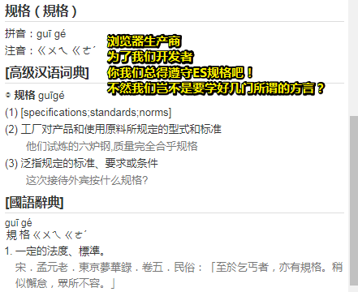
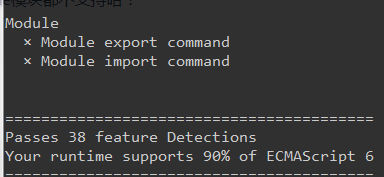
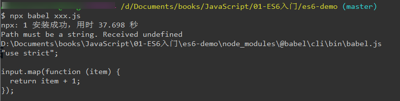
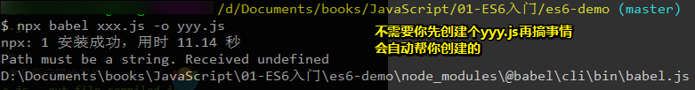
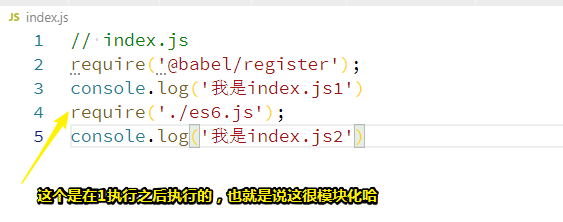
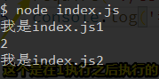
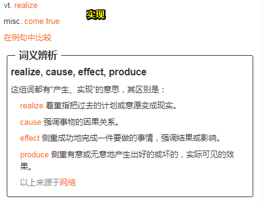
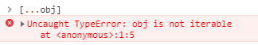
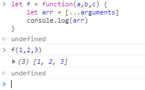

# ES6简介

> ECMAScript 6.0（以下简称 ES6）是 JavaScript 语言的下一代标准，已经在 2015 年 6 月正式发布了。它的目标，是使得 JavaScript 语言可以**用来编写复杂的大型应用程序**，成为**企业级开发语言**。

## ★ES与JavaScript的关系

> ECMAScript 和 JavaScript 的关系是，**前者是后者的规格，后者是前者的一种实现**（另外的 ECMAScript 方言还有 JScript 和 ActionScript）。日常场合，这两个词是可以互换的。



可见，如chrome浏览器厂商等，把标准变成了现实，即那些标准不再是说说而已，不再是空想，而是实打实的可以为我们开发者所用了……

当然，至于其它方言，无需理会，只需要知道有个叫JavaScript的家伙就好了！

## ★ES6 与 ES 2015 的关系

> ES6 既是一个历史名词，也是一个泛指，含义是 **5.1 版以后的 JavaScript 的下一代标准，涵盖了 ES2015、ES2016、ES2017 等等**，而 **ES2015 则是正式名称，特指该年发布的正式版本的语言标准**。本书中提到 ES6 的地方，一般是指 ES2015 标准，但有时也是泛指“下一代 JavaScript 语言”。

也就是说ES6有两种身份咯，一般的身份就是ES2015标准咯，不然为啥经常看到ES7、ES8、ES9……还不如直接都叫ES6好了！

## ★语法提案的批准流程

> 任何人都可以向标准委员会（又称 TC39 委员会）提案，要求修改语言标准。
>
> 一种新的语法从提案到变成正式标准，需要经历五个阶段。每个阶段的变动都需要由 TC39 委员会批准。
>
> - Stage 0 - Strawman（展示阶段）
> - Stage 1 - Proposal（征求意见阶段）
> - Stage 2 - Draft（草案阶段）
> - Stage 3 - Candidate（候选人阶段）
> - Stage 4 - Finished（定案阶段）
>
> 一个提案只要能进入 Stage 2，就差不多肯定会包括在以后的正式标准里面。ECMAScript 当前的所有提案，可以在 TC39 的官方网站[GitHub.com/tc39/ecma262](https://github.com/tc39/ecma262)查看。
>
> 本书的写作目标之一，是跟踪 ECMAScript 语言的最新进展，介绍 5.1 版本以后所有的新语法。对于那些明确或很有希望，将要列入标准的新语法，都将予以介绍。

xxx提了个标准（如怎么画个大饼）给TC9，结果目前到了草案阶段了，这意味着这个大饼画法在未来zzz年里肯定会纳入正式标准里边的。

虽然已经纳入标准了，但是开发者们依葫芦画瓢的做法，是咩有效果的，即画出来的大饼就是画出来的

要想画出真正的大饼，即可以吃的，而且还得让你说「真香」二字的大饼，这就得要浏览器厂商搞一些东西出来，用于解释你画出来的东西，解释完之后，就可以生成一个真实的大饼了……嗯……真香

## ★ES的历史

2015 年 6 月，ECMAScript 6 正式通过，成为国际标准。从 2000 年算起，这时已经过去了 15 年。

注意：JavaScript.next 指的是 ES6，第六版发布以后，就指 ES7。

## ★部署进度

1. 查看各大最新浏览器对ES6的支持程度：<https://kangax.github.io/compat-table/es6/>

   可见，随着时间的推移，支持度已经越来越高了，超过 90%的 ES6 语法特性都实现了。

2. Node 是 JavaScript 的服务器运行环境（runtime）。它对 ES6 的支持度更高。除了那些默认打开的功能，还有一些语法功能已经实现了，但是默认没有打开。使用下面的命令，可以查看 Node 已经实现的 ES6 特性。

   ```bash
   // Linux & Mac
   $ node --v8-options | grep harmony
   
   // Windows
   $ node --v8-options | findstr harmony
   ```

   > 在windows下的git bash会返回这样的`stdout is not a tty`结果，这样结果产生的原因是：
   >
   > 这不能按预期工作的原因似乎是git bash将命令传递给Windows cmd shell，而不是正确处理输出流
   >
   > 所以 你就在power shell运行此命令即可！
   >
   > [node.js - output is not tty - SegmentFault 思否](https://segmentfault.com/q/1010000005122070)

3. 一个工具通吃二者（浏览器和node）对ES6的支持程度：

   浏览器端的：<http://ruanyf.github.io/es-checker/>

   node端的：

   ```bash
   $ npm install -g es-checker
   $ es-checker
   
   =========================================
   Passes 24 feature Detections
   Your runtime supports 57% of ECMAScript 6
   =========================================
   ```

从中可以发现对Module模块都不支持哈！



这似乎可以使用webpack之类的来解决哈！

## ★Babel转码器

> 新建一个项目目录（如es6-demo），然后 `npm init`它！然后就可以对此项目安装命令了！

### ◇简介

[Babel](https://babeljs.io/) 是一个广泛使用的 ES6 转码器，可以将 ES6 代码转为 ES5 代码，从而在现有环境执行。这意味着，你**可以用 ES6 的方式编写程序，又不用担心现有环境是否支持**。如这样的效果：

```js
// 转码前
input.map(item => item + 1);

// 转码后
input.map(function (item) {
  return item + 1;
});
```

所以大胆地去使用箭头函数吧！当然，就目前而言你无须去转码哈！直接在浏览器运行即可！那些不支持的诸如export、import等就需要转码了！

### ◇安装

在项目目录中，安装 Babel：

```bash
$ npm install --save-dev @babel/core
```

### ◇配置文件.babelrc

Babel 的配置文件是`.babelrc`，存放在项目的根目录下。使用 Babel 的第一步，就是配置这个文件。

那么该配置文件的作用是什么呢？——用来设置转码规则和插件

这其中的基本格式是这样的：

```json
{
  "presets": [],
  "plugins": []
}
```

`presets`字段设定转码规则，官方提供以下的规则集，你可以根据需要安装。

```bash
# 最新转码规则
$ npm install --save-dev @babel/preset-env

# react 转码规则
$ npm install --save-dev @babel/preset-react
```

有了官方所提供的这些规则之后，我们就得将这些规则加入`.babelrc`中去，就像这样：

```javascript
 {
    "presets": [
      "@babel/env",
      "@babel/preset-react"
    ],
    "plugins": []
  }
```

注意，**以下所有 Babel 工具和模块的使用，都必须先写好`.babelrc`。**

### ◇命令行转码

Babel 提供命令行工具`@babel/cli`，用于命令行转码。

同样，我们也需要安装它，安装命令如下：

```bash
$ npm install --save-dev @babel/cli
```

基本用法如下。

```bash
# 转码结果输出到标准输出
$ npx babel example.js

# 转码结果写入一个文件
# --out-file 或 -o 参数指定输出文件
$ npx babel example.js --out-file compiled.js
# 或者
$ npx babel example.js -o compiled.js

# 整个目录转码
# --out-dir 或 -d 参数指定输出目录
$ npx babel src --out-dir lib
# 或者
$ npx babel src -d lib

# -s 参数生成source map文件
$ npx babel src -d lib -s
```

测试效果：

**①转码结果输出到标准输出**

先在根目录写个`xxx.js`：

```
input.map(item => item + 1);
```

然后就可以搞事情了：



**②转码结果写入一个文件**



剩下的两个测试也做了，其中第3个同样不需要事先创建文件，至于那个map文件是方便我们调试使用的！

### ◇babel-node

`@babel/node`模块的`babel-node`命令，提供一个支持 ES6 的 REPL 环境。它支持 Node 的 REPL 环境的所有功能，而且可以直接运行 ES6 代码。

首先，安装这个模块。

```bash
$ npm install --save-dev @babel/node
```

然后，执行`babel-node`就进入 REPL 环境。

```bash
$ npx babel-node
> (x => x * 2)(1)
2
```

`babel-node`命令可以直接运行 ES6 脚本。将上面的代码放入脚本文件`es6.js`，然后直接运行。

```bash
# es6.js 的代码
# console.log((x => x * 2)(1));
$ npx babel-node es6.js
2
```

> 似乎可以把用户输入的用es6语法写的代码通过这个模块把它们运行一遍哈！

### ◇@babel-register-模块

`@babel/register`模块改写`require`命令，为它加上一个**钩子**。此后，每当使用`require`加载`.js`、`.jsx`、`.es`和`.es6`后缀名的文件，就会**先用 Babel 进行转码**。

```bash
$ npm install --save-dev @babel/register
```

使用时，必须首先加载`@babel/register`。

```bash
// index.js
require('@babel/register');
require('./es6.js');
```

然后，就不需要手动对`index.js`转码了。

```bash
$ node index.js
2
```

需要注意的是，`@babel/register`只会对`require`命令加载的文件转码，而不会对当前文件转码。另外，由于它是实时转码，所以只适合在开发环境使用。

我的测试：



结果：



> 不需要我们手动转码之后再运行index.js代码了！只要发现你require（需要）了一下，即需要某个模块，那就先转码再引入，类似于这样：
>
> ```js
> console.log('我是index.js1')
> 
> //没有转码前：console.log((x => x * 2)(1));
> //转码后：
> "use strict";
> 
> console.log(function (x) {
>   return x * 2;
> }(1));
> 
> console.log('我是index.js2')
> ```

### ◇babel API

如果某些代码需要调用 Babel 的 API 进行转码，就要使用`@babel/core`模块。

```javascript
var babel = require('@babel/core');

// 字符串转码
babel.transform('code();', options);
// => { code, map, ast }

// 文件转码（异步）
babel.transformFile('filename.js', options, function(err, result) {
  result; // => { code, map, ast }
});

// 文件转码（同步）
babel.transformFileSync('filename.js', options);
// => { code, map, ast }

// Babel AST转码
babel.transformFromAst(ast, code, options);
// => { code, map, ast }
```

配置对象`options`，可以参看官方文档<http://babeljs.io/docs/usage/options/>。

下面是一个例子。

```javascript
var es6Code = 'let x = n => n + 1';
var es5Code = require('@babel/core')
  .transform(es6Code, {
    presets: ['@babel/env']
  })
  .code;

console.log(es5Code);
// '"use strict";\n\nvar x = function x(n) {\n  return n + 1;\n};'
```

上面代码中，`transform`方法的第一个参数是一个字符串，表示需要被转换的 ES6 代码，第二个参数是转换的配置对象。

### ◇@babel/polyfill

**Babel 默认只转换新的 JavaScript 句法（syntax），而不转换新的 API**，比如`Iterator`、`Generator`、`Set`、`Map`、`Proxy`、`Reflect`、`Symbol`、`Promise`等全局对象，以及一些定义在全局对象上的方法（比如`Object.assign`）都不会转码。

举例来说，ES6 在`Array`对象上新增了`Array.from`方法。Babel 就不会转码这个方法。如果想让这个方法运行，必须使用`babel-polyfill`，为当前环境提供一个垫片。

安装命令如下。

```bash
$ npm install --save-dev @babel/polyfill
```

然后，在脚本头部，加入如下一行代码。

```javascript
import '@babel/polyfill';
// 或者
require('@babel/polyfill');
```

Babel 默认不转码的 API 非常多，详细清单可以查看`babel-plugin-transform-runtime`模块的[definitions.js](https://github.com/babel/babel/blob/master/packages/babel-plugin-transform-runtime/src/definitions.js)文件。

> 这个似乎跟babel-register一个使用姿势哈！

### ◇浏览器环境

> 我就奇了怪了，之前的讲解都是在命令行里操作，说好的浏览器呢？

Babel 也可以用于浏览器环境，使用[@babel/standalone](https://babeljs.io/docs/en/next/babel-standalone.html)模块提供的浏览器版本，将其插入网页。

```html
<script src="https://unpkg.com/@babel/standalone/babel.min.js"></script>
<script type="text/babel">
// Your ES6 code
</script>
```

注意，**网页实时将 ES6 代码转为 ES5，对性能会有影响。生产环境需要加载已经转码完成的脚本**。

Babel 提供一个[REPL 在线编译器](https://babeljs.io/repl/)，可以在线将 ES6 代码转为 ES5 代码。转换后的代码，可以直接作为 ES5 代码插入网页运行。


## ★总结

- 一个[在线编译器](https://babeljs.io/repl/)，可以在线将 ES6 代码转为 ES5 代码

## ★Q&A

### ①实现？

实现：使成为现实、使原本不存在的情況成为事实。

eg：

1. 我决心提前五年,攻下落铃关,实现毛主席和 周总理的遗愿。——《为了周总理的嘱托…》
2. 实现理想、实现诺言

近义词：实行、完成

反义词：落空、空想

关于英文：



### ②npx是什么鬼？

在更新 npm 5.2.0 的时候发现会买一送一，自动安装了 npx

npx 会帮你执行依赖包里的二进制文件

npx 会自动查找当前依赖包中的可执行文件，如果找不到，就会去 PATH 里找。如果依然找不到，就会帮你安装！

npx 甚至支持运行远程仓库的可执行文件

如：npx http-server 可以一句话帮你开启一个静态服务器

> 所以这给我的感觉就像是糖……

**➹：**[npx 是什么 - 知乎](https://zhuanlan.zhihu.com/p/27840803)

### ③如何写个伪数组？

伪数组是一个含有length属性的json对象，

它是按照索引的方式存储数据，

它并不具有数组的一些方法，只能能通过Array.prototype.slice转换为真正的数组，并且带有length属性的对象

```js
var obj = {0:'a',1:'b',length:2}; // 伪数组
var arr = Array.prototype.slice.call(obj); // 转化为数组    
console.log(arr);  // 返回["a","b"]
```

可是当我在用这个 `[...obj]`语法的时候，居然不行了

说是：



我的天？wtf，mdn说到：

> 在JavaScript中, [`Object`](https://developer.mozilla.org/zh-CN/docs/Web/JavaScript/Reference/Global_Objects/Object) 是不可迭代的，除非它们实现了[迭代协议](https://developer.mozilla.org/en-US/docs/Web/JavaScript/Reference/Iteration_protocols#The_iterable_protocol). 因此, 你不能使用 [for…of ](https://developer.mozilla.org/en-US/docs/Web/JavaScript/Guide/Loops_and_iteration#for...of_statement)来迭代对象的属性.
>
> 做为替代你必须使用 [`Object.keys`](https://developer.mozilla.org/zh-CN/docs/Web/JavaScript/Reference/Global_Objects/Object/keys) 或 [`Object.entries`](https://developer.mozilla.org/zh-CN/docs/Web/JavaScript/Reference/Global_Objects/Object/entries) 来迭代对象的属性或属性值

既然这样，为了体现 这种语法`[...obj]`，只好这样了：



> 箭头函数用不了arguments

我用了babel转码工具测试了一下，这种 `[...obj]`语法是一种糖，结果如下：

```js
"use strict";

var f = function f(a, b, c) {
  var arr = Array.prototype.slice.call(arguments);
  console.log(arr);
};
```

**➹：**[js伪数组 · 前端总结 · 看云](https://www.kancloud.cn/q85727/lyul/230723)

**➹：**[TypeError: 'x' is not iterable - JavaScript - MDN](https://developer.mozilla.org/zh-CN/docs/Web/JavaScript/Reference/Errors/is_not_iterable)

### ④什么是REPL？

> 交互式解释器（REPL）既可以作为一个独立的程序运行，也可以很容易地包含在其他程序中作为整体程序的一部分使用。REPL为运行JavaScript脚本与查看运行结果提供了一种交互方式，通常REPL交互方式可以用于调试、测试以及试验某种想法。
>
> 基本上所有的脚本语言有REPL的。

**➹：**[nodejs里的repl - CNode技术社区](https://cnodejs.org/topic/55c2ba865965fe2c74f478ac)

### ⑤钩子到底是一个什么鬼东西？

1. 音乐创作中的钩子：它是一首歌中比较出彩的，容易被记住的片段（如歌词、旋律），能成为这首歌的一种符号存在，是一首歌的记忆点。说白了就是歌曲中让你有[耳朵虫](https://baike.baidu.com/item/%E8%80%B3%E6%9C%B5%E8%99%AB/5677048?fromtitle=%E8%80%B3%E8%99%AB&fromid=6751535)效果的东西

2. 在计算机中：就是在做这件事之前，先处理一下再做，形象一点就是在表白前，先喝点酒壮壮胆……

   eg：babel的register模块，require某个模块之前，先babel一下，然后再引入……

**➹：**[流行音乐创作中的“钩子”（hook）是一种什么技巧 ？ - 知乎](https://www.zhihu.com/question/20946058)

**➹：**[计算机英语中总出现的"hooks" 是什么意思? "钩子" ? 这个钩子应该怎么理解? 是回调的意思? - 知乎](https://www.zhihu.com/question/20610442)

### ⑥polyfill？

**➹：**[Web开发中的“黑话” - Livoras - SegmentFault 思否](https://segmentfault.com/a/1190000002593432)

