# JavaScript不只是简单的构建块

## ★前言

**➹：**[JavaScript 标准库 - JavaScript - MDN](https://developer.mozilla.org/zh-CN/docs/Web/JavaScript/Reference/Global_Objects)

## ★1.1-JavaScript对象、基本类型 和 字面量之间的区别

> **➹：**[javascriptcookbook/recipe1-1.js at master · ppambler/javascriptcookbook](https://github.com/ppambler/javascriptcookbook/blob/master/chap1/recipe1-1.js)

它们各自的创建方式：

字面量：

```js
var str = '我是字符串字面量'
var num = 1.45
var answer = true
```

基本类型：

```js
var str1 = String("string");
var num1 = Number(1.45);
var bool1 = Boolean(true);
```

以上两种创建姿势咩有啥区别，类型都是基本类型的，当然我们一般肯定是用字面量姿势啦！

对象：

```js
var str2 = new String("string");
var num2 = new Number(1.45);
var bool2 = new Boolean(true);
```

这种姿势跟上面那两种姿势就有区别了，因为这次得到是实例化的东西，即它们是引用类型的……而之前的则是基本类型

为此，我们可以通过全等来区分这个变量到底是直接的字面量还是对象化的字面量……

什么场景下使用？

你不需要额外的扩展功能，那就用字面量吧！如果需要，那就实例化吧！虽然字面量看起来也能使用一些api，但这似乎是隐式转化为对象的结果！

**➹：**[String - JavaScript - MDN](https://developer.mozilla.org/zh-CN/docs/Web/JavaScript/Reference/Global_Objects/String#%E5%9F%BA%E6%9C%AC%E5%AD%97%E7%AC%A6%E4%B8%B2%E5%92%8C%E5%AD%97%E7%AC%A6%E4%B8%B2%E5%AF%B9%E8%B1%A1%E7%9A%84%E5%8C%BA%E5%88%AB)

小结：

1. 目前有6种基本数据类型，其中有构造函数的有String、Number、Boolean

   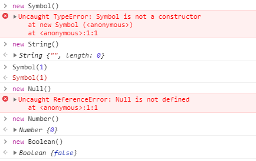

   

**➹：**[JavaScript 数据类型和数据结构 - JavaScript - MDN](https://developer.mozilla.org/zh-CN/docs/Web/JavaScript/Data_structures)

## ★1.2-从一个字符串里边提取一个列表

有这样一个字符串：

```
This is a list of items: cherries, limes, oranges, apples.
//这是一份物品清单:樱桃、酸橙、桔子、苹果。
```

我想要这样的结果：

```js
['cherries','limes','oranges','apples']
```

所以请告诉我怎么做？

1. 把含有列表的子串从字符串中提取出来
2. 把子串搞成转化成数组姿势

我忘记的API用法：

1. `**indexOf()**` 方法返回调用  [`String`](https://developer.mozilla.org/zh-CN/docs/Web/JavaScript/Reference/String) 对象中第一次出现的指定值的索引，开始在 fromIndex进行搜索。如果未找到该值，则返回-1。

   ```
   str.indexOf(searchValue[, fromIndex])
   //arg1:一个字符串表示被查找的值;arg2:可选，表示调用该方法的字符串中开始查找的位置。可以是任意整数。默认值为 0
   ```

2. **`substring()`** 方法返回一个字符串在**开始索引到结束索引**之间的一个子集, 或从**开始索引直到字符串的末尾的一个子集**。

   ```
   str.substring(indexStart[, indexEnd])
   //①：需要截取的第一个字符的索引，该字符作为返回的字符串的首字母
   //②：可选。一个 0 到字符串长度之间的整数，以该数字为索引的字符不包含在截取的字符串内。
   //包含给定字符串的指定部分的新字符串。
   ```

   注意：包前不包后

代码：

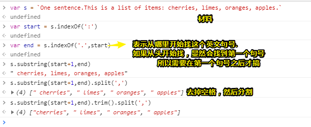

开头的空格和结尾的空格可以被去掉了，但是中间的空格 呢？

难到让我以逗号和空格分割吗？

```js
s.substring(start+1,end).trim().split(', ')
//["cherries", "limes", "oranges", "apples"]
```

或者遍历每个数组元素，然后对每个元素都trim一下：

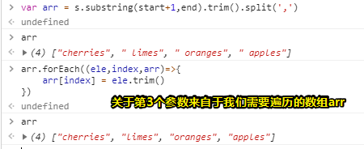

能不能高级点？比如说使用正则什么的

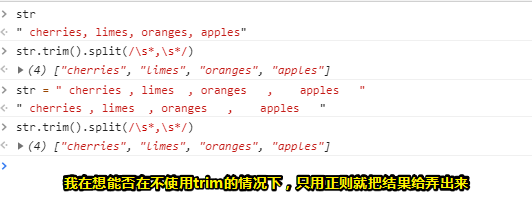

我知道这个正则为何意，但是我不能明白的是当我们用的是字符串分割是很死的，而正则则是很动态的，如每个item之间的空格是不一致的，如果我们用字符串的话，显然每个元素的item是无法去除的，至此我们就需要用到遍历了！而正则则不然！有种把空格归一然后再分割的感觉！

如果我不使用trim的话：

```js
var str = " cherries , limes  , oranges   ,    apples   "
str.split(/^\s*|\s*,\s*|\s*$/)
//["", "cherries", "limes", "oranges", "apples", ""]
```

我很好奇数组中的空字符串元素是怎么来的！

解析一下：

我们以空格为分割符，而分割的结果的显然是没有空格的，当然你可以把这些空格（不管多少个空格）都看作是一个 类似于`￥`这样的占位符，既然如此，那就是：

```js
var str = "￥cherries￥limes￥oranges￥apples￥"
str.split('￥')
//["", "cherries", "limes", "oranges", "apples", ""]
```

由此可见，字符串的开始和结束，显然是空字符串哈！

所以，出现空字符串的原因就是：

`split`函数分隔的时候会将分隔符分隔成左右两部分。如果左边没有字符就返回空字符串，在这里我们字符串的开头的左边显然是没有字符的，既然如此那就返回空字符串呗！

然后你要去掉数组首尾的两个元素的话，那就是：

```js
arr.shift()
arr.pop()
```

不过这看起来又多用了两个API，还不如用字符串的trim呢！对 了，split方法还有第二个参数，用于指定返回前几个元素，如你传个3，表示返回前3个元素回来就好了！

把这个去掉空格的封装一下：

```js
//这个函数很low，只针对以逗号和空格分割，我在想能不能实现正则是可变的，比如我们可以传个逗号字符串过来
function trim(str) {
	var arr = str.split(/^\s*|\s*,\s*|\s*$/)
	arr.shift()
	arr.pop()
	str = arr.join()
	return str
}
```

这是可以实现的，如下面这两种姿势（思路无非就是可以激活字符串姿势的正则而已！）

1. 使用RegExp
2. 使用eval函数

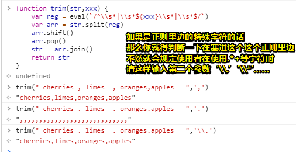

感觉这个函数并无卵用，如果说有用的话，那无非就是对一些API整合起来，这样一来就会记得牢一点呗！

**➹：**[javascript - 正则表达式应用split问题 - SegmentFault 思否](https://segmentfault.com/q/1010000008084267)

如果代码冗长，可以使用链式姿势调用！

## ★1.3-检查一个存在的，但是非空的字符串

> 也就是说检查一个字符串变量是已经声明好的，而且它不是一个空字符串！

问题：

我想要验证一个变量是否已经被定义了，是否为字符串，而且还有它是否为空字符串

解决：

```js
var unknownVariable = '666'
//var unknownVariable = new String('666')
if (((typeof unknownVariable != 'undefined' && unknownVariable) && unknownVariable.length > 0) && typeof unknownVariable.valueOf() == 'string') {
    console.log('这个变量已经被声明了，它是个字符串，而且它是非空的，即便它是用new的姿势所弄出来的字符串对象')
}
```

讨论：

1. 直接判断一个变量的length是否等于0，然而在此之前你需要判断这个变量是否存在length属性，甚至你需要判断这个变量是否已经被声明了。至此，我们需要typeof这个运算符

2. typeof有它自己的一套的逻辑，比如说如果变量是null、array、hash表，那么这就是object啦！而函数则是function，undefined则是undefined

   ```js
   //确保我们这个变量是否是长度大于0的字符串
   if (typeof unknownVariable == 'string' && unknownVariable.length > 0){}
   ```

3. 如果你不管这个字符串是字面量姿势还是对象姿势的话，那么这个typeof就有问题啦！况且null同样是返回object的，还有就是我们这个变量总不能是个undefined吧！即只是声明了，未初始化，然后JavaScript给了它一个undefined的初始值吧！

   ```js
   //确保这个变量是否被定义了，而且不是null
   if (typeof unknownVariable != 'undefined' && unknownVariable){}
   ```

4. 关于length，字符串字面量有length属性，同样字符串对象也有，还有数组也有，所以你还得加一个锁：

   ```js
   //数组，你别想着冒充为一个字符串哈！如果是typescript的话，我想不需要这么判断吧！
   if (((typeof unknownVariable != 'undefined' && unknownVariable) && unknownVariable.length > 0) && typeof unknownVariable.valueOf() == 'string') {}
   ```

   valueOf()这个方法，可以返回一个对象的基本类型值（未包装的值），即一个字面量，注意这个方法对字符串字面量，布尔量字面量同样有效，因为会隐式包装，只是数值字面量就没效了，不过你对合法的数值（不是NaN之类的）加个括号就好了！

   如果是字符串对象，那么结果就是typeof为string的结果，而数组则是返回数组字面量啦！然后你typeof的话，那么结果就是object啦！

至此，无论未知变量的值和类型是怎样的，这个测试功能都不会抛出错误，并且只在非空字符串的情况下会成功，无论字符串是字符串对象还是字面量。

> 注意：我们对valueOf()的使用是有限的，总之，这个方法主要由JavaScript引擎使用！当一个基本类型的字面量希望自己能被包装，那么JavaScript引擎就会包装它为一个相应的对象！

我们这个过程挺复杂的，其实，在测试值，无须用这种姿势以保证测试的广泛性，就一般而言，我们只需要判断一个变量的类型是否为字符串，然后这个字符串的长度是否大于0即可！

额外的知识——松散姿势和严格姿势的等性运算符：

松散姿势，多了很多隐式类型转换的弊端，显然这让我们的代码很没有安全感！

```js
var a = '666'
var b = new String('666')
a == b //true
//直观点的例子，'0'会隐式转换，类似于toNumber('0')
var c = 0
var d = '0'
c == d //true
```

难道松散姿势就没有优点吗？——有的

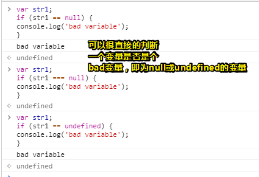

在这里我们利用了`undefined==null`这种特性！

因此：

```
typeof unknownVariable != 'undefined' && unknownVariable
//可以简写成这样
unknownVariable != null
```

所以之前的代码，我们可以缩短成这样了：

```
var unknownVariable = '666'
//var unknownVariable = new String('666')
if (( unknownVariable != null && unknownVariable.length > 0) && typeof unknownVariable.valueOf() == 'string') {
    console.log('这个变量已经被声明了，它是个字符串，而且它是非空的，即便它是用new的姿势所弄出来的字符串对象')
}
```

那么，我们是不是应该始终使用全等呢？毕竟类似上面的例子比较少啊？

作者在这里说到，他打算违背业界的一致肯定！即说「不」哈！

只要你能够理解松散的等，和严格的等，以及知道你要的只是值相等，不涉及类型的话，那么你是可以用松散的等的！

如：不管用户传了个数字`100`，还是字符串 `'100'`，以下是等价的：

```js
if (counter == 100) ...
if (parseInt(counter) === 100) ...
```

> 注意：如果类型非常重要，那么第一个测试就应该是类型测试，不过这会产生一个相关的错误哈！但是，这不是你代码的本意（不在乎这个值的类型，不管你是字符串100还是数值100，都通过！）

还有一个例子（不在意是否是字符串字面量还是对象字符串）：

```js
var str = 'test';
var str2 = new String('test');
doSomething(str);
doSomething(str2);
...
function doSomething (passedString) {
  //如果用了全等，那str2就GG了  
	if (passedString == 'test')
    ...
}
```

了解更多：

**➹：**[比较操作符 - JavaScript - MDN](https://developer.mozilla.org/zh-CN/docs/Web/JavaScript/Reference/Operators/Comparison_Operators)

**➹：**[★Annotated ES5](http://es5.github.io/#x11.9.3)

**➹：**[「每日一题」为什么推荐使用 === 不推荐 == - 知乎](https://zhuanlan.zhihu.com/p/22745278)

## ★1.4-插入一些特殊字符

问题：

想要在字符串里边插入一个特殊字符，如一个换行（line feed）

解决：

可以在字符串里边使用一个转义序列（escape sequences），如你想要搞个版权符号（©），你可以直接输入这样一个特殊字符，也可以使用转义序列 `\u00A9`

```
<div id="result"></div>©

var resultString = "<p>This © page \u00A9 Shelley Powers </p>";
// print out to page
var blk = document.getElementById("result");
blk.innerHTML = resultString;
```

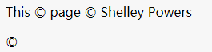

讨论：

在JavaScript里边，转义序列是以反斜杠（backslash）字符开头的。这个反斜杠字符会向处理字符串的应用程序发出一个信号——**接下来是需要进行特殊处理的字符序列**，所以你看着办吧！

那么还有哪些转义序列呢？

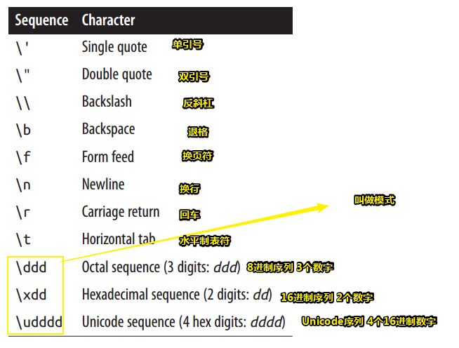

表中最后3个转义序列是模式（patterns，设计模式那个模式，也就是套路），这其中，它们提供不同的数值将导致不同的转义序列。解决方案中的版权符号（`\u00A9`）就是Unicode序列模式的一个例子。

注意，表中列出的所有转义序列都可以用一个Unicode序列来表示，毕竟Unicode是用于一致性编码的一个计算标准，而且Unicode序列是一个给定字符的一种特殊模式，即告诉反斜杠后边的字符序列是按照Unicode序列这种模式解析的！例如，水平制表符（tab）(`\t`)也可以表示为Unicode转义序列`\u0009`。当然，如果用户代理不考虑这些特殊字符的话(就像浏览器对待水平制表符所做的那样)，那么这种用法就没有什么实际意义了。

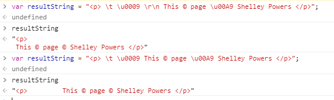

> 回车可不会换行，直接写个  `\n`就好了，不需要像在Windows系统里边的文本文件那样 ，每个换行都会有 `\r\n`的身影

转义序列最常见的用途之一：

```js
var newString = 'You can\'t use single quotes ' +
'in a string surrounded by single quotes.' +
'Oh, wait a sec...yes you can.';
```

即，这个字符串是单引号还是双引号包裹的，那么其中里边的子串如果需要用到单引号或双引号的话，那么就得转义一下，把有意义的搞成无意义的，把无意义的搞成有意义的！如单引号有意义，那就转义一下，就变成普通的单引号字符了，如n这个字符没有意义，搞个反斜杠上去，这个n就有意义了，变成换行了！

## ★1.5-使用新字符串替换正则匹配模式

问题：

您希望用一个新的子串替换所有用正则匹配到的子串。

解决方案：

使用字符串的replace()方法，并使用正则表达式：

```js
var searchString = "Now is the time, this is the tame";
var re = /t\w{2}e/g;
var replacement = searchString.replace(re, "place");
console.log(replacement); // Now is the place, this is the place
```

讨论：

1. 该正则用到了全局搜索 `g`，不然的话，只搞第一个`time`就完事了，而第二个tame，则GG了

2. 我们除了可以使用正则字面量，即斜杠 `/`开头，斜杆 `/`结束这种姿势以外，还可以使用内置（ built-in）的 `RegExp`对象，如：

   ```js
   var re = new RegExp('t\\w{2}e',"g");
   var replacement = searchString.replace(re,"place");
   console.log(p);
   ```

3. 关于正则字面量与正则对象的区别：

   1. 不需要周围有斜杆，字符串姿势即可
   2. **如果字符串里边有斜杆的话，需要用 `\`转义一下才行**
   3. 全局标志（the global indicator）是该 `RegExp`对象的第二个可选参数
   4. 二者可以交替使用，但字面量姿势无法构建动态地正则表达式，而正则对象是可以的，毕竟是个字符串哈！当你使用ES6的模板字符串时你就明白了！

**扩充：正则表达式快速入门**

正则表达式是由1个或多个字符所组成的，而这些字符可以是单独使用的普通字符，也可以是特殊字符，也可以是二者结合使用，就像下边这样：

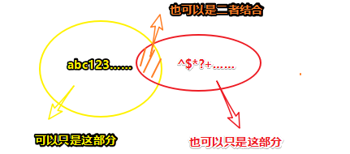

举个栗子来说：

```js
var re = /technology\s+book/;
```

这个就是正则表达式啦，它用于匹配一个字符串，而该字符串必须满足这样条件我才要：

以一个technology单词开头，以一个book单词结束，中间可以是一个空格或数不尽的空格！

总之，这就是一个正则表达式匹配姿势啦！

关于反斜杠 `\`，它有两个用途：

1. 要么与普通字符一起使用，指定这个普通字符是一个特殊字符。如 `\s`、`\w`
2. 要么与特殊字符一起使用，例如加号(`+`)，指定该特殊字符应该按其字面意思去处理，即它就是个加号 `+`字符，普通字符。如 `\+`（普通的加号）

在上边的那个例子当中：

反斜杠 `\` 与`s`一起使用，它将字母`s`转换为特殊字符，而这个特殊字符即是**它可以指定任意一个空白字符(空格、制表符、换行符或表单换行符)**。`\s`特殊字符后面跟着一个加号`\s+`，**它是一个信号**，用于匹配其前面的字符(在本例中是空格字符)一次或多次。

所以，这个正则表达式的运行结果可有：

```js
technology book
technology 			book
//下边这种姿势就不行了，因为单词间没有空格哈
technologybook
```

总之，`+`这个特殊字符**所发出的信号**是单词之间至少存在一个空格！

一张表显示JavaScript应用程序中最常用的特殊字符：

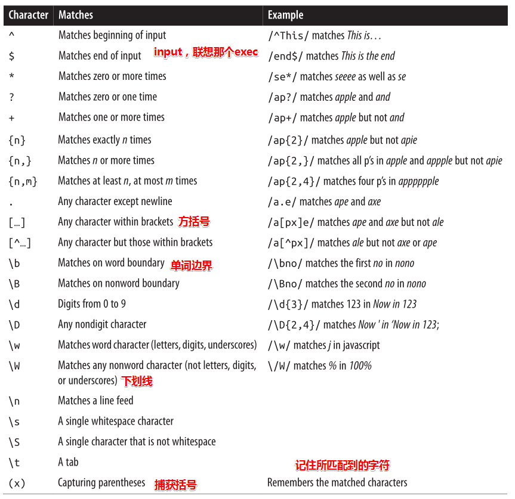

注意：

> 正则表达式功能强大，但可能比较棘手。
>
> 所以推荐你阅读这本书：[正则表达式经典实例（第2版） (豆瓣)](https://book.douban.com/subject/25986599/)

## ★1.6-查找并高亮一个模式的所有实例

> 模式（Pattern）指的是正则表达式
>
> 子串指的是，匹配项

**①问题：**

**希望在字符串里边找到模式的所有实例。**

**②做法：**

1. 模式的exex方法
2. 通过全局标志`g`，**循环定位**一个模式的所有实例

例如任何以t开头，以e结尾的单词，而且中间有任意数量的字符:

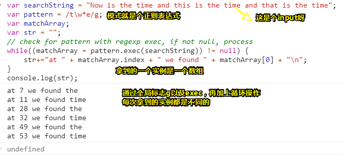

> 去掉全局标志g的操作使程序陷入了死循环，毕竟一直都是匹配到一个`the`啊！
>
> 还有 `！=null`有没有都可以，在这里只是为了让程序更易阅读吧！
>
> 注意，pattern通过  `RegExp.lastIndex` 这个方法可以记住下次匹配的起始索引，如一开始匹配到了 `the` ，那么接下来就会从`the`之后的那个空格开始检索，即第`10`号索引开始！简而言之，你可以把整个循环操作理解为匹配到一个实例就把字符串切割成一个片段！你可以在循环里边添加这行测试：
>
> ```js
> console.log(pattern.lastIndex)
> ```
>
> 我很好奇，这个 `RegExp.lastIndex`为啥不是这种姿势 `RegExp.prototype.lastIndex`？
>
> 于是我就测试了一波，这个方法似乎在RegExp实例`exec`一下字符串的时候，该实例才会出现一个`lastIndex`属性
>
> 为此，我就到[mdn](https://developer.mozilla.org/zh-CN/docs/Web/JavaScript/Reference/Global_Objects/RegExp/lastIndex)上查找了一波：
>
> **只有正则表达式使用了表示全局检索的 "`g`" 标志时，该属性才会起作用**
>
> 总之，它有很多诸如`如果……那么……`这样的规则

**③讨论**

> 可以把正则表达式或者说是模式看做是夹公仔的夹子，与现实相反的是，你可以自定义生成各式各样的夹子！至于，底下那边的那些毛绒玩具就是字符串源啦！

RegExp的`exec(str)`告诉正则表达式「你要去执行（executes）匹配`str`」，如果没有找到匹配项，则返回null;如果找到匹配项，则返回包含匹配项信息的对象。返回的数组中包含**实际匹配的值**、找到匹配的字符串中的**索引**、匹配的**任何括号子字符串**和**原始字符串**:

- index：找到匹配项的索引
- input：所输入的原始字符串，即这个str
- [0]：匹配的值
-  [1],…,[n]+：匹配括号括起来的子字符串（如果有的话）

测试圆括号捕获匹配的值：

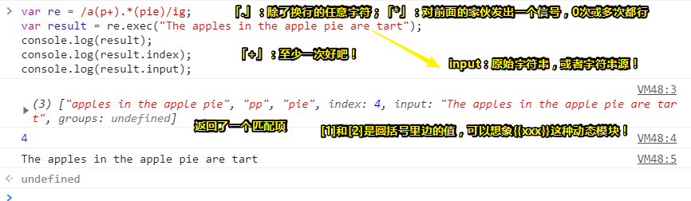

解释一波：

数组结果包含索引为`0`处的完整匹配值，其余的数组条目是括号匹配的结果。index是匹配的索引，input只是被匹配的字符串的重复。在解决方案中，除了匹配的值外，还打印出找到匹配项的**索引**。

解决方案里边还使用**全局标志(g)**。这将触发**RegExp对象来保存每个匹配项的位置**，并在前面所发现的匹配项**之后才开始搜索**。在循环中使用时，我们可以**找到模式匹配字符串的所有实例**。在解决方案中，打印出以下内容:

> 不知为何关于，对match翻译，我对「相配」比较感冒！而不是匹配！

```
at 7 we found the
at 11 we found time
at 28 we found the
at 32 we found time
at 49 we found the
at 53 we found time
```

可见time和the都符号我们的正则表达式（模式）

让我们看看**全局搜索的本质**。

创建一个web页面，其中包含一个textarea和一个用于访问用户输入的文本框，它们一个提供字符串源，一个提供一个模式。而该模式用于创建`RegExp`对象，然后将其应用于textarea里边的字符串。

构建一个result字符串，这其中包括不匹配的文本以及匹配到的文本，但匹配到的文本被一个`span`元素包围(**使用一个CSS class来突出显示文本**)。然后，使用div元素的`innerHTML`将得到的字符串插入到页面中。

使用`exec`和**全局标志**在文本字符串中**搜索**和**突出显示**所有匹配项：

```html
<!DOCTYPE html>
<html>
<head>
    <title>Searching for strings</title>
    <style>
        .found
            {
                background-color: #ff0;
            }
        </style>
</head>
<body>
    <form id="textsearch">
        <textarea id="incoming" cols="150" rows="10">
        </textarea>
        <p>
            Search pattern: <input id="pattern" type="text" />
        </p>
    </form>
    <button id="searchSubmit">Search for pattern</button>
    <div id="searchResult"></div>
    <script>
        document.getElementById("searchSubmit").onclick=function() {
            // get pattern
            var pattern = document.getElementById("pattern").value;
            var re = new RegExp(pattern,"g");
            // get string
            var searchString = document.getElementById("incoming").value;
            var matchArray;
            var resultString = "<pre>";
            var first=0;
            var last=0;
            // find each match
            while((matchArray = re.exec(searchString)) != null) {
                last = matchArray.index;
                // get all of string up to match, concatenate
                resultString += searchString.substring(first, last);
                // add matched, with class
                resultString += "<span class='found'>" + matchArray[0] + "</span>";
                first = re.lastIndex;
            }
            // finish off string
            resultString += searchString.substring(first,searchString.length);
            resultString += "</pre>";
            // insert into page
            document.getElementById("searchResult").innerHTML = resultString;
        }
	</script>
</body>
</html>
```

> 上边代码的大概思路：
>
> 1. 模式的lastindex（动态的）和匹配项的index（动态的）
> 2. 找到匹配项加个标签和class
> 3. 拼接字符串
> 4. 把字符串结果作为某个xx元素的子元素！
>
> 关于阻止表单的默认提交：
>
> 1. return false
> 2. e.preventDefault()
>
> **➹：**[JavaScript阻止表单提交-子匠_Zijor的博客](http://www.dengzhr.com/js/576)

**➹：**[JS Bin - Collaborative JavaScript Debugging](https://jsbin.com/cukejaguso/edit?html,output)

效果：

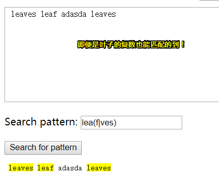

`bar(|)`是一个条件测试，它将根据bar两边的值匹配一个单词。所以`leaf`是匹配的，`leaves`同样也是匹配的，当然，`lea`也是可以的，像是 `leap`则GG！

通过RegExp的`lastIndex`属性，我们可以访问并找到最后一个索引。如果想同时跟踪第一个匹配项和最后一个匹配项，那么`lastIndex`属性是非常方便的。

**④了解更多**

1.5节描述了另外一种标准姿势——**find-and-replace**

1.7节提供了一种更简单的方法来**查找并突出显示字符串里边的文本**。

## ★1.7-使用捕获圆括号来交换一个字符串中的单词

**①问题：**

这是外国名，名字+姓，现在要把姓和名交换以下位置！以便先有姓后有名！

**②解决：**

使用捕获圆括号和正则表达式来查找并记住字符串中的两个名称，然后，就将它们反转:

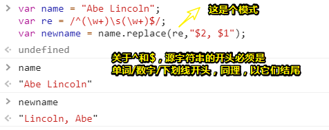

> 关于这个replace方法：
>
> **replace()** 方法返回一个由替换值（`replacement`）替换一些或所有匹配的模式（`pattern`）后的新字符串。模式可以是一个字符串或者一个[正则表达式](https://developer.mozilla.org/zh-CN/docs/Web/JavaScript/Reference/RegExp)，替换值可以是一个字符串或者一个每次匹配都要调用的函数。
>
> 原字符串不会改变。
>
> 不管怎样，记住  `$1/$2/$&`各自表示啥意思就好了！
>
> **➹：**[String.prototype.replace() - JavaScript - MDN](https://developer.mozilla.org/zh-CN/docs/Web/JavaScript/Reference/Global_Objects/String/replace)
>
> **➹：**[js--string/正则表达式replace方法详解 - 前端填坑 - SegmentFault 思否](https://segmentfault.com/a/1190000008787668)
>
> **➹：**[String 对象之 replace方法 - 简书](https://www.jianshu.com/p/44d8c7863206)
>
> **➹：**[js String的replace方法详解 - wfbob的专栏 - CSDN博客](https://blog.csdn.net/wfbob/article/details/44283725)

**③讨论**

1. 论捕获圆括号与replace的配合，如 `$1和$2`

2. 如果你不适用圆括号的话，还有其它特殊字符可以与replace配合：

   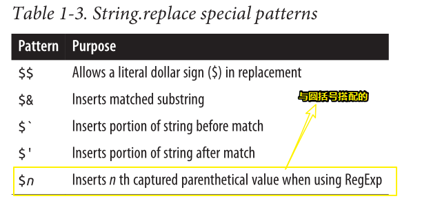

   > 具体解释参看上边的第二个链接就好了，注意可没有 `$0`哈！

搜索字符并高亮它的简化版：

```html
<!DOCTYPE html>
<html>

<head>
  <title>Searching for strings</title>
  <style>
    .found {
      background-color: #ff0;
    }
  </style>
</head>

<body>
  <form id="textsearch">
    <textarea id="incoming" cols="100" rows="10">
</textarea>
    <p>
      Search pattern: <input id="pattern" type="text" />
    </p>
  </form>
  <button id="searchSubmit">Search for pattern</button>
  <div id="searchResult"></div>
  <script>
    document.getElementById("searchSubmit").onclick = function () {
      // get pattern
      var pattern = document.getElementById("pattern").value;
      var re = new RegExp(pattern, "g");
      // get string
      var searchString = document.getElementById("incoming").value;
      // replace
      var resultString = searchString.replace(re, "<span class='found'>$&</span>");
      // insert into page
      document.getElementById("searchResult").innerHTML = resultString;
    }
  </script>
</body>

</html>
```

相较于之前的那个版本，这个版本不会保留换行，而之前那个则会保留换行。

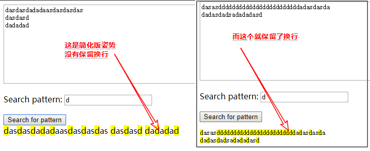

还可以使用`exec()`方法通过RegExp对象访问捕获的文本。让我们回到配方1.7解决方案代码，这次使用exec()

```js
var name = "Abe Lincoln";
var re = /^(\w+)\s(\w+)$/;
var result = re.exec(name);
var newname = result[2] + ", " + result[1];
```

如果您想访问捕获的圆括号值，但又不需要在字符串替换中使用它们，那么这种方法非常方便。

