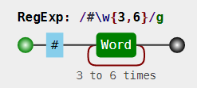
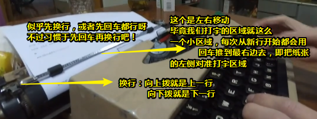

# 正则表达式字符匹配攻略

## ★一句很重要的话

> 正则表达式是匹配模式，要么匹配字符，要么匹配位置。 

请记住这句话，最好每看一个内容，就重新理解一遍这句话

## ★两种模糊匹配

如果正则只有精确匹配是没多大意义的，如这类似于你经常在编辑器里的查找替换操作！

```js
var regex = /hello/;
console.log( regex.test("hello") );
// => true
```

正则表达式之所以强大，是因为其能实现模糊匹配 ，而这模糊匹配姿势又分为横向模糊和纵向模糊！

关于test方法：

`test()` 方法执行一个检索，用来查看正则表达式与指定的字符串是否匹配（只要存在匹配即可，不需要是精确匹配的）。返回 `true` 或 `false`。

### ◇横向模糊匹配

是什么？——横向模糊指的是，一个正则可匹配的字符串的长度不是固定的，可以是多种情况的 

实现姿势是使用量词，如 `{m,n} `，连续出现最少m次，最多n次

例如： `/ab{2,5}c/ `


其它网站的可视化：


让你的正则用起来：


> g是正则的一个修饰符，表示全局匹配，即按顺序找出所有符合的子串，总之类似于「你喜欢2019版倚天屠龙记里边哪位美女？周芷诺？赵敏？——小学生才做选择，我全都要」
>
> 关于对横向的理解，类似于鸣人的影分身之术！

 `match()` 方法检索返回一个字符串匹配正则表达式的的结果。

**➹：**[String.prototype.match() - JavaScript - MDN](https://developer.mozilla.org/zh-CN/docs/Web/JavaScript/Reference/Global_Objects/String/match)

### ◇纵向模糊匹配 

是什么？——纵向模糊指的是，一个正则匹配的字符串，具体到某一位字符时，它可以不是某个确定的字符，可以有多种可能

实现姿势？——使用字符组，如 `[abc]`，表示你在abc三个字符中选一个

测试： `/a[123]b/ `


我还是觉得这个的可视化好一点：


代码：


> 都说了选一个

正确姿势：

```js
var regex = /a2{1,2}b/g;
var string = "a0b a1b a2b a3b a4b a22b";
console.log( string.match(regex) );
// ["a2b", "a22b"]
```

> 给人的感觉类似于一个包子中可以是肉馅、韭菜馅、白菜馅等等，当然这只能放一种馅料

只要掌握横向和纵向模糊匹配，就能解决很大部分正则匹配问题 

## ★字符组（纵向模糊匹配）

字符组也叫字符类，不过，这只是其中一个字符，如`[abc]`，表示匹配一个字符，那么这个字符是啥呢？它可以是「a」或「b」或「c」，总之就是3个字符选一个……白话一点就是，现在有个单选题，其中有a、b、c三个选项，然后你就选一个看得比较顺眼的就行了呗！——强调从一组字符中**选一个**

### ◇范围表示法

为什么需要这种姿势？——因为如果字符组里的字符特别多的话 ，那就不得不需要这种姿势了！

那么它长啥样的呢？——比如 `[123456abcdefGHIJKLM]`，可以写成 `[1-6a-fG-M]`。用连字符 `-` 来省略和简写。

可见，我们这个连字符是有特殊用途的，总不能只是单纯的把 `-`看作是一个 很普通的字符吧！

假如我们要匹配 `"a"`、`"-"`、`"z"` 这三者中任意一个字符，那该咋办呢？

总不能写成是 `[a-z]`吧！如果真这样写了，那我们就是表示从26个英文小写字母中选一个了呀！

所以我们可以写成这样：`[-az]` 或 `[az-]` 或 `[a\-z]` 

即这个 `-`，要么在开头，要么在结尾，要么用反斜杠 `\`转义一下。总之就不要让引擎认为这是**范围表示法**就行了

### ◇排除字符组

很多时候，不要什么远远比要什么简单得多！如不要吃饭，就是不要吃饭；我要买这个，我要买那个，我要买很多很多东西……

因此，纵向模糊匹配，除了原先那种「要其中一个」之外，还有一种「不要这些那些」姿势，也就是说**某位字符可以是任何东西，但就不能是 "a"、"b"、"c"** 

至此，又产生了一个新的概念，叫做 **排除字符组（反义字符组） **

那么它是如何表示的呢？

例如 `[^abc]`，表示是一个除 "a"、"b"、"c"之外的任意一个字符。字符组的**第一位**放 `^`（脱字符），表示**求反**的概念。 

> `^`这个符号在其它地方或是其它意思，如在数学中它是指数，次方之意，在JavaScript中，它则是「[按位异或](https://developer.mozilla.org/zh-CN/docs/Web/JavaScript/Reference/Operators/Bitwise_Operators#(%E6%8C%89%E4%BD%8D%E5%BC%82%E6%88%96))」

当然，这种姿势同样也有相应的范围表示法！

### ◇常见的简写形式

当你有了**字符组**的概念之后，一些常见的符号你也就理解了！毕竟它们都是些系统自带的简写形式。


> 关于换行符和回车符，难道不是属于行结束符这个类别吗？
>
> **➹：**[JavaScript转义字符对照表 - 常用参考表对照表 - 脚本之家在线工具](http://tools.jb51.net/table/javascript_escape)
>
> **➹：**[特殊字符\u2028导致的Javascript脚本异常 - 良村 - 博客园](https://www.cnblogs.com/rrooyy/p/5349978.html)
>
> **➹：**[水平制表符和垂直制表符有什么区别？ - 知乎](https://www.zhihu.com/question/19773623)

老哥，我想匹配任意字符 呀！能告诉我怎么做吗？

可以使用 `[\d\D]`、`[\w\W]`、`[\s\S]` 和 `[^]` 中任何的一个。 

总体来说就是，你不要我就要，你要我就不要！

以上各字符组对应的可视化形式是： 


另外一个可视化工具：


嗯……肯定是相信前者啦！注意如果 `^`没有 `[]`包裹的话，表示匹配字符串的开始！

## ★量词（横向模糊匹配）

量词也称重复。掌握 `{m,n}` 的准确含义后，**只需要记住一些简写形式**。

### ◇简写形式


以上量词对应的可视化形式是：


> ？：`[0,1]`
>
> +：`[1,正无穷)`
>
> *：`[0,正无穷)`

### ◇贪婪匹配和惰性匹配


该正则`/\d{2,5}/`，表示数字**连续出现** 2 到 5 次。会匹配 2 位、3 位、4 位、5 位连续数字


其中 `/\d{2,5}?/`表示，虽然 2 到 5 次都行，当 2 个就够的时候，就不再往下尝试了。

总之我们可以通过在量词后面加个问号就能实现惰性匹配 了！因此，所有惰性匹配情形如下 ：


对惰性匹配的记忆姿势：人家问你「你很贪婪吗？」——我想你肯定会回答说「当然，不是啦！毕竟贪婪并不是一个褒义词……」

惰性量词可视化姿势：


关于两个`？`：


> 我不知道后面那个空字符串表示什么，难道字符串的末尾还有一个字符？还有就是为啥还有空字符串出现啊？
>
> 照理说不应该全是数字吗？


假如没有空格（空格也是一个字符）：


由于我们是匹配单个字符的，可见有两个 `？` ，导致一个字符都咩有匹配到！


相关问题：

**➹：**[javascript正则表达式对字符串分组时产生空字符串组？ - SegmentFault 思否](https://segmentfault.com/q/1010000000688726)

**➹：**[JavaScript拆分字符串时产生空字符的原因 - SegmentFault](https://web.archive.org/web/20150429045955/http://segmentfault.com/a/1190000000692744)

**➹：**[JavaScript拆分字符串时产生空字符的解决方案_javascript技巧_脚本之家](https://www.jb51.net/article/55688.htm)

**➹：**[ECMAScript Language Specification - ECMA-262 Edition 5.1](https://web.archive.org/web/20150425074317/http://www.ecma-international.org/ecma-262/5.1/#sec-15.5.4.10)

ES5规范实在是难懂

**➹：**[ECMAScript5.1中文版 + ECMAScript3 + ECMAScript（合集）](https://yanhaijing.com/es5/#386)

**➹：**[ECMAScript规范-第三版_中文版.pdf](https://yanhaijing.com/es5/ECMAScript%E8%A7%84%E8%8C%83-%E7%AC%AC%E4%B8%89%E7%89%88_%E4%B8%AD%E6%96%87%E7%89%88.pdf)

> 有时间可以去看看ES3规范
>
> 因为会有这样 的介绍：
>
> 

## ★多选分支

一个模式可以实现横向和纵向模糊匹配。而多选分支可以支持多个子模式**任选其一**。

姿势如下：`(p1|p2|p3)`，其中 p1、p2 和 p3 是子模式，用 `|`（管道符）分隔，表示**其中任何之一** 

有这么两个字符串 `“good”`、`“nice”`

我们要写一个都能匹配它们俩的，可以这样写：


可视化姿势：


写在一起的测试代码：

```js
var regex = /good|nice/g;
var string = "good idea, nice try.";
console.log( string.match(regex) );
// => ["good", "nice"]
```

> 不过这种精确匹配没啥意义哈！

注意，分支结构也是惰性的，即当前面的匹配上了，后面的就不再尝试了 。如：


## ★案例分析

### ◇匹配 16 进制颜色值 

```
#ffbbad
#Fc01DF
#FFF
#ffE
```


关键是利用了量词默认的贪婪匹配！

可视化姿势：



虽然这个结果出来了，但是并不严谨！万一出现有傻逼写错了颜色值了呢？如 `#aaaa`、`#adadd`……还有字母不用该有26个这么多！

因此如果你要严谨点的话，可以用下面这种姿势：

```js
var regex = /#([0-9a-fA-F]{6}|[0-9a-fA-F]{3})/g;
var string = "#ffbbad #Fc01DF #FFF #ffE";
console.log( string.match(regex) );
// => ["#ffbbad", "#Fc01DF", "#FFF", "#ffE"]
```

分析：

1. 这明显是用16进制姿势来表示颜色，因此，这一个字符就是16进制的，即有15种字符可以选择了（忽略大小写的话），所以可有字符组 `[0-9a-fA-F] `
2. 字符可以出现 3 或 6 次，因此需要是用到量词和分支结构

一些注意点：

1. 使用分支结构时，需要注意顺序！

其可视化：


## ★总结

- JavaScript编程中如果遇到[这个表中](http://tools.jb51.net/table/javascript_escape)的这些特殊字符，需要使用**反斜杠**来向文本字符串添加这些特殊字符，这就是JavaScript的转义字符。如 `\u000D`=> `\\u000D`

- 横向和纵向，前者表示横向可以有多个字符，而后者则表示纵向可以切换一个个字符：

  

- 


## ★Q&A

### ①关于回车（carriage return）换行（line feed）？



这是英文打字机哈！即手工操作……然而当出现电传打字机之后，就能解释为什么我们每次换行时，都会有一些 `\r\n`或者 `\n`这样的字符

- windows：`\r\n`，出现原因，由于我们是电传打字姿势，而不是人工，当我们打完了一行之后，然后另起一行的话，在另起一行的这段时间内，新的字符可不会停止传输啊，而且在这段时间内，刚好传了两个字符（比如说「ab」），那么这两个字符就会丢失了，因此为了占个位，形容一下打字机的操作，就用了 `\r\n`。我在想能否缓存几个字符再打，这样就不用添加多余的两个字符了！
- Mac/Linux/Unix： `\n`，出现原因，那时存储器很贵，每行结尾加两个字符太浪费了！

**➹：**[874教你用英文打字机_哔哩哔哩 (゜-゜)つロ 干杯~-bilibili](https://www.bilibili.com/video/av3427677/)

**➹：**[回车和换行 - 阮一峰的网络日志](http://www.ruanyifeng.com/blog/2006/04/post_213.html)


