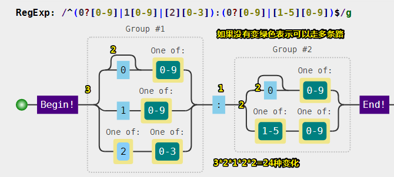

# 正则表达式字符匹配攻略

## ★一句很重要的话

> 正则表达式是匹配模式，要么匹配字符，要么匹配位置。 

请记住这句话，最好每看一个内容，就重新理解一遍这句话

## ★两种模糊匹配

如果正则只有精确匹配是没多大意义的，如这类似于你经常在编辑器里的查找替换操作！

```js
var regex = /hello/;
console.log( regex.test("hello") );
// => true
```

正则表达式之所以强大，是因为其能实现模糊匹配 ，而这模糊匹配姿势又分为横向模糊和纵向模糊！

关于test方法：

`test()` 方法执行一个检索，用来查看正则表达式与指定的字符串是否匹配（只要存在匹配即可，不需要是精确匹配的）。返回 `true` 或 `false`。

### ◇横向模糊匹配

是什么？——横向模糊指的是，一个正则可匹配的字符串的长度不是固定的，可以是多种情况的 

实现姿势是使用量词，如 `{m,n} `，连续出现最少m次，最多n次

例如： `/ab{2,5}c/ `


其它网站的可视化：


让你的正则用起来：


> g是正则的一个修饰符，表示全局匹配，即按顺序找出所有符合的子串，总之类似于「你喜欢2019版倚天屠龙记里边哪位美女？周芷诺？赵敏？——小学生才做选择，我全都要」
>
> 关于对横向的理解，类似于鸣人的影分身之术！

 `match()` 方法检索返回一个字符串匹配正则表达式的的结果。

**➹：**[String.prototype.match() - JavaScript - MDN](https://developer.mozilla.org/zh-CN/docs/Web/JavaScript/Reference/Global_Objects/String/match)

### ◇纵向模糊匹配 

是什么？——纵向模糊指的是，一个正则匹配的字符串，具体到某一位字符时，它可以不是某个确定的字符，可以有多种可能

实现姿势？——使用字符组，如 `[abc]`，表示你在abc三个字符中选一个

测试： `/a[123]b/ `


我还是觉得这个的可视化好一点：


代码：


> 都说了选一个

正确姿势：

```js
var regex = /a2{1,2}b/g;
var string = "a0b a1b a2b a3b a4b a22b";
console.log( string.match(regex) );
// ["a2b", "a22b"]
```

> 给人的感觉类似于一个包子中可以是肉馅、韭菜馅、白菜馅等等，当然这只能放一种馅料

只要掌握横向和纵向模糊匹配，就能解决很大部分正则匹配问题 

## ★字符组（纵向模糊匹配）

字符组也叫字符类，不过，这只是其中一个字符，如`[abc]`，表示匹配一个字符，那么这个字符是啥呢？它可以是「a」或「b」或「c」，总之就是3个字符选一个……白话一点就是，现在有个单选题，其中有a、b、c三个选项，然后你就选一个看得比较顺眼的就行了呗！——强调从一组字符中**选一个**

### ◇范围表示法

为什么需要这种姿势？——因为如果字符组里的字符特别多的话 ，那就不得不需要这种姿势了！

那么它长啥样的呢？——比如 `[123456abcdefGHIJKLM]`，可以写成 `[1-6a-fG-M]`。用连字符 `-` 来省略和简写。

可见，我们这个连字符是有特殊用途的，总不能只是单纯的把 `-`看作是一个 很普通的字符吧！

假如我们要匹配 `"a"`、`"-"`、`"z"` 这三者中任意一个字符，那该咋办呢？

总不能写成是 `[a-z]`吧！如果真这样写了，那我们就是表示从26个英文小写字母中选一个了呀！

所以我们可以写成这样：`[-az]` 或 `[az-]` 或 `[a\-z]` 

即这个 `-`，要么在开头，要么在结尾，要么用反斜杠 `\`转义一下。总之就不要让引擎认为这是**范围表示法**就行了

### ◇排除字符组

很多时候，不要什么远远比要什么简单得多！如不要吃饭，就是不要吃饭；我要买这个，我要买那个，我要买很多很多东西……

因此，纵向模糊匹配，除了原先那种「要其中一个」之外，还有一种「不要这些那些」姿势，也就是说**某位字符可以是任何东西，但就不能是 "a"、"b"、"c"** 

至此，又产生了一个新的概念，叫做 **排除字符组（反义字符组） **

那么它是如何表示的呢？

例如 `[^abc]`，表示是一个除 "a"、"b"、"c"之外的任意一个字符。字符组的**第一位**放 `^`（脱字符），表示**求反**的概念。 

> `^`这个符号在其它地方或是其它意思，如在数学中它是指数，次方之意，在JavaScript中，它则是「[按位异或](https://developer.mozilla.org/zh-CN/docs/Web/JavaScript/Reference/Operators/Bitwise_Operators#(%E6%8C%89%E4%BD%8D%E5%BC%82%E6%88%96))」

当然，这种姿势同样也有相应的范围表示法！

### ◇常见的简写形式

当你有了**字符组**的概念之后，一些常见的符号你也就理解了！毕竟它们都是些系统自带的简写形式。


> 关于换行符和回车符，难道不是属于行结束符这个类别吗？
>
> **➹：**[JavaScript转义字符对照表 - 常用参考表对照表 - 脚本之家在线工具](http://tools.jb51.net/table/javascript_escape)
>
> **➹：**[特殊字符\u2028导致的Javascript脚本异常 - 良村 - 博客园](https://www.cnblogs.com/rrooyy/p/5349978.html)
>
> **➹：**[水平制表符和垂直制表符有什么区别？ - 知乎](https://www.zhihu.com/question/19773623)

老哥，我想匹配任意字符 呀！能告诉我怎么做吗？

可以使用 `[\d\D]`、`[\w\W]`、`[\s\S]` 和 `[^]` 中任何的一个。 

总体来说就是，你不要我就要，你要我就不要！

以上各字符组对应的可视化形式是： 


另外一个可视化工具：


嗯……肯定是相信前者啦！注意如果 `^`没有 `[]`包裹的话，表示匹配字符串的开始！

## ★量词（横向模糊匹配）

量词也称重复。掌握 `{m,n}` 的准确含义后，**只需要记住一些简写形式**。

### ◇简写形式


以上量词对应的可视化形式是：


> ？：`[0,1]`
>
> +：`[1,正无穷)`
>
> *：`[0,正无穷)`

### ◇贪婪匹配和惰性匹配


该正则`/\d{2,5}/`，表示数字**连续出现** 2 到 5 次。会匹配 2 位、3 位、4 位、5 位连续数字


其中 `/\d{2,5}?/`表示，虽然 2 到 5 次都行，当 2 个就够的时候，就不再往下尝试了。

总之我们可以通过在量词后面加个问号就能实现惰性匹配 了！因此，所有惰性匹配情形如下 ：


对惰性匹配的记忆姿势：人家问你「你很贪婪吗？」——我想你肯定会回答说「当然，不是啦！毕竟贪婪并不是一个褒义词……」

惰性量词可视化姿势：


关于两个`？`：


> 我不知道后面那个空字符串表示什么，难道字符串的末尾还有一个字符？还有就是为啥还有空字符串出现啊？
>
> 照理说不应该全是数字吗？


假如没有空格（空格也是一个字符）：


由于我们是匹配单个字符的，可见有两个 `？` ，导致一个字符都咩有匹配到！


相关问题：

**➹：**[javascript正则表达式对字符串分组时产生空字符串组？ - SegmentFault 思否](https://segmentfault.com/q/1010000000688726)

**➹：**[JavaScript拆分字符串时产生空字符的原因 - SegmentFault](https://web.archive.org/web/20150429045955/http://segmentfault.com/a/1190000000692744)

**➹：**[JavaScript拆分字符串时产生空字符的解决方案_javascript技巧_脚本之家](https://www.jb51.net/article/55688.htm)

**➹：**[ECMAScript Language Specification - ECMA-262 Edition 5.1](https://web.archive.org/web/20150425074317/http://www.ecma-international.org/ecma-262/5.1/#sec-15.5.4.10)

ES5规范实在是难懂

**➹：**[ECMAScript5.1中文版 + ECMAScript3 + ECMAScript（合集）](https://yanhaijing.com/es5/#386)

**➹：**[ECMAScript规范-第三版_中文版.pdf](https://yanhaijing.com/es5/ECMAScript%E8%A7%84%E8%8C%83-%E7%AC%AC%E4%B8%89%E7%89%88_%E4%B8%AD%E6%96%87%E7%89%88.pdf)

> 有时间可以去看看ES3规范
>
> 因为会有这样 的介绍：
>
> 

## ★多选分支

一个模式可以实现横向和纵向模糊匹配。而多选分支可以支持多个子模式**任选其一**。

姿势如下：`(p1|p2|p3)`，其中 p1、p2 和 p3 是子模式，用 `|`（管道符）分隔，表示**其中任何之一** 

有这么两个字符串 `“good”`、`“nice”`

我们要写一个都能匹配它们俩的，可以这样写：


可视化姿势：


写在一起的测试代码：

```js
var regex = /good|nice/g;
var string = "good idea, nice try.";
console.log( string.match(regex) );
// => ["good", "nice"]
```

> 不过这种精确匹配没啥意义哈！

注意，分支结构也是惰性的，即当前面的匹配上了，后面的就不再尝试了 。如：


## ★案例分析

**匹配字符，无非就是字符组、量词和分支结构的组合使用罢了**。

下面找几个例子演练一下（其中，**每个正则并不是只有唯一写法**）： 

### ◇匹配 16 进制颜色值

```
#ffbbad
#Fc01DF
#FFF
#ffE
```


关键是利用了量词默认的贪婪匹配！

可视化姿势：


虽然这个结果出来了，但是并不严谨！万一出现有傻逼写错了颜色值了呢？如 `#aaaa`、`#adadd`……还有字母不用该有26个这么多！

因此如果你要严谨点的话，可以用下面这种姿势：

```js
var regex = /#([0-9a-fA-F]{6}|[0-9a-fA-F]{3})/g;
var string = "#ffbbad #Fc01DF #FFF #ffE";
console.log( string.match(regex) );
// => ["#ffbbad", "#Fc01DF", "#FFF", "#ffE"]
```

分析：

1. 这明显是用16进制姿势来表示颜色，因此，这一个字符就是16进制的，即有15种字符可以选择了（忽略大小写的话），所以可有字符组 `[0-9a-fA-F] `
2. 字符可以出现 3 或 6 次，因此需要是用到量词和分支结构

一些注意点：

1. 使用分支结构时，需要注意顺序！

其可视化：


### ◇匹配时间

以24小时制为例

要求匹配：

```
23:59
02:07
```


思路：同样分析进制的问题，分钟显然是60进制的

> 我无法理解为啥可以写出来，或许我知道了这些练习的思路，是会往字符组和量词里边靠吧！

官方答案：

```js
var regex = /^([01][0-9]|[2][0-3]):[0-5][0-9]$/;
console.log( regex.test("23:59") );
console.log( regex.test("02:07") );
// => true
// => true
```

分析：

```
共 4 位数字，第一位数字可以为 [0-2]。
当第 1 位为 "2" 时，第 2 位可以为 [0-3]，其他情况时，第 2 位为 [0-9]。
第 3 位数字为 [0-5]，第4位为 [0-9]。共 4 位数字，第一位数字可以为 [0-2]。
当第 1 位为 "2" 时，第 2 位可以为 [0-3]，其他情况时，第 2 位为 [0-9]。
第 3 位数字为 [0-5]，第4位为 [0-9]。
```

> 我用代码块包裹这段分析内容，这样我就无须为它们`类似这样`搞上代码格式  了
>
> 关于官方做法，我没有想到需要如此精确匹配啊！
>
> 而且出现了两个莫名其妙的字符，即，`^`和 `$`
>
> 注：正则中使用了 `^` 和 `$`，分别表示字符串开头和结尾 
>
> 这个 `^`不是字符组里边取反的吗？

如果也要求匹配 "7:9"，也就是说时分前面的 "0" 可以省略。

因此可有：

```js
var regex = /^(0?[0-9]|1[0-9]|[2][0-3]):(0?[0-9]|[1-5][0-9])$/;
console.log( regex.test("23:59") );
console.log( regex.test("02:07") );
console.log( regex.test("7:9") );
// => true
// => true
// => true
```

可视化 姿势：



其它的：


> 这个案例可以搞歌词匹配的活儿

### ◇匹配日期

比如 `yyyy-mm-dd` 格式为例。 

要求匹配：

```
2017-06-10
```


官方答案：

```js
var regex = /^[0-9]{4}-(0[1-9]|1[0-2])-(0[1-9]|[12][0-9]|3[01])$/;
console.log( regex.test("2017-06-10") );
// => true
```

分析：

```
年，四位数字即可，可用 [0-9]{4}。
月，共 12 个月，分两种情况 "01"、"02"、…、"09" 和 "10"、"11"、"12"，可用 (0[1-9]|1[0-2])。
日，最大 31 天，可用 (0[1-9]|[12][0-9]|3[01])。
```

> 我似乎一直都忽视了关于日期定义的规则，比如月有12个月，最大有31天，如果你写成2017-23-33岂不是有问题？
>
> 还有那个连字符无须转义啊，毕竟不是在字符组里边！
>
> 下次写的时候要分析好一些东西的规则才行！而这写规则就是为我们书写正则而服务的！

可视化：


其它的：


### ◇window 操作系统文件路径 

要求匹配： 

```
F:\study\javascript\regex\regular expression.pdf
F:\study\javascript\regex\
F:\study\javascript
F:\
```

代码：

```js
var strPath = `F:\\study\\javascript\\regex\\regular expression.pdf
F:\\study\\javascript\\regex\\
F:\\study\\javascript
F:\\`
strPath.match(/((F:\\)?(\w{5}\\\w{10})\\?(\w{5}\\)?(\w{7}\s\w{10}\.\w{3})?)|(F:\\)/g)
strPath.match(/(F:\\)?(\w{5}\\\w{10})?\\?(\w{5}\\)?(\w{7}\s\w{10}\.\w{3})?/g)
```


去掉管道符：


发觉用match去测试，似乎不是很正确啊：


正确姿势：

```js
var reg = /((F:\\)?(\w{5}\\\w{10})\\?(\w{5}\\?)?(\w{7}\s\w{10}\.\w{3})?)|(F:\\)/g
strPath.match(/((F:\\)?(\w{5}\\\w{10})\\?(\w{5}\\?)?(\w{7}\s\w{10}\.\w{3})?)|(F:\\)/g)
//["F:\study\javascript\regex\regular expression.pdf", "F:\study\javascript\regex\", "F:\study\javascript", "F:\"]
```

官方答案：

```js
var regex = /^[a-zA-Z]:\\([^\\:*<>|"?\r\n/]+\\)*([^\\:*<>|"?\r\n/]+)?$/;
console.log( regex.test("F:\\study\\javascript\\regex\\regular expression.pdf") );
console.log( regex.test("F:\\study\\javascript\\regex\\") );
console.log( regex.test("F:\\study\\javascript") );
console.log( regex.test("F:\\") );
// => true
// => true
// => true
// => true
```

分析：

```
整体模式是:
盘符:\文件夹\文件夹\文件夹\

其中匹配 "F:\"，需要使用 [a-zA-Z]:\\，其中盘符不区分大小写，注意 \ 字符需要转义。

文件名或者文件夹名，不能包含一些特殊字符，此时我们需要排除字符组 [^\\:*<>|"?\r\n/] 来表示合法
字符。

另外它们的名字不能为空名，至少有一个字符，也就是要使用量词 +。因此匹配 文件夹\，可用
[^\\:*<>|"?\r\n/]+\\。

另外 「文件夹\」，可以出现任意次。也就是 ([^\\:*<>|"?\r\n/]+\\)*。其中括号表示其内部正则是一个整体。

路径的最后一部分可以是 「文件夹」，没有 \，因此需要添加 ([^\\:*<>|"?\r\n/]+)?。

最后的结果就是「拼接」成了一个看起来比较复杂的正则
```

注意:

在JavaScript 中字符串要表示字符 `\` 时，也需要转义 

可视化姿势：


另外一个可视化：


> 我似乎开始明白什么叫做规则了，目录命名需要规则，日期、时间、16进制颜色值等都有各自的规则
>
> 而这些规则的体现是那些字符串
>
> 而我们则是基于那些规则以及正则语法的规则来去找到那些满足规则的字符串……
>
> 难道这就是正则表达式对一个人的思维所起到的影响吗？即，对规则的抽象，而这抽象的具体实现则是正则的规则，即另外一个你需要很熟悉的规则，或者说是你能用字符（如所谓的正则字符）描述这种规则抽象

### ◇匹配 id

要求从 

```html
<div id="container" class="main"></div>
```

提取出 `id="container"`。 

分析：

1. 确定目标

2. 看看CSS的id属性的值命名规则：

   来自HTML4.01规范：

   > id和name的标记必须以字母( `[A-Za-z]` )开头，后面可以是任意数量的字母、数字( `[0-9]` )、连字符(`“-”`)、下划线(`“_”`)、冒号(`“:”`)和句点(`“.”`)。

   注意：不能包含空格，不过class属性是允许的，还有就是至少有存在一个字符！

   当存在多个单词时，有些人喜欢驼峰、有些人喜欢 连字符`-`（常用），还有些人喜欢下划线

3. `id=""`这肯定是精确的啦，主要是这其中的值如何通过正则来描述

**➹：**[web网页中ID用纯数字命名可以吗？ - 知乎](https://www.zhihu.com/question/20441736)

**➹：**[id - HTML（超文本标记语言） - MDN](https://developer.mozilla.org/zh-CN/docs/Web/HTML/Global_attributes/id)

**➹：**[命名 CSS 的类或 id 时单词间如何连接？ - 知乎](https://www.zhihu.com/question/19748433)

**➹：**[css命名长度对查找效率有影响吗？ - 知乎](https://www.zhihu.com/question/64766816)

测试：


> 这个正则可不是一次就写好的，是边测试边更新的，比如第一次测试能匹配，但是id属性值，如果换成其它的又不行了，至此，你就需要改一下你的正则了！

可视化：


官方答案：

最开始的答案：

```js
var regex = /id=".*"/
var string = '<div id="container" class="main"></div>';
console.log(string.match(regex)[0]);
// => id="container" class="main"
```

可视化姿势：


其它姿势：


分析：

```
因为 . 是通配符，本身就匹配双引号的，而量词 * 又是贪婪的，当遇到 container 后面双引号时，是不会
停下来，会继续匹配，直到遇到最后一个双引号为止
```

那么如何解决呢？——使用惰性匹配 ：

```js
var regex = /id=".*?"/
var string = '<div id="container" class="main"></div>';
console.log(string.match(regex)[0]);
// => id="container"
```

> 再次理解了惰性，即秉持着能省则省，能不一分钱就不一分钱，刚好及格等这样的原则

不过，这样也会有一个问题，即，效率比较低，因为其匹配原理会涉及到“**回溯**”这个概念 

在这里先把优化给贴出来：

```js
var regex = /id="[^"]*"/
var string = '<div id="container" class="main"></div>';
console.log(string.match(regex)[0]);
// => id="container"
```

可视化：


注：这里的粉红色填充表示不需要这个双引号，而需要的则是黄色

> 老师的这个是假设开发者已经遵循了id属性的命名规范，或者说是说我们只是想要`id=""`，至于双引号里边的内容是什么，我们不需要管！
>
> 这个正则是表示只要双引号里边是**除了双引号以外的任何字符**那就匹配吗？
>
> 之前学到`[^]`表示匹配任何字符，而加个 `''`就是表示除了双引号以外的任意字符咯！
>
> 
>
> 如果我要理解 `[^]`为啥会匹配任何字符的话，我会认为 `^`是除了null（表示空、无）字符以外的所有字符！

## ★本章小结

> 掌握字符组和量词就能解决大部分常见的情形，也就是说，当你会了这二者，JavaScript 正则算是**入门**了 。

---

## ★总结

- JavaScript编程中如果遇到[这个表中](http://tools.jb51.net/table/javascript_escape)的这些特殊字符，需要使用**反斜杠**来向文本字符串添加这些特殊字符，这就是JavaScript的转义字符。如 `\u000D`=> `\\u000D`

- 横向和纵向，前者表示横向可以有多个字符，而后者则表示纵向可以切换一个个字符：

  

- 突然觉得此刻所做的匹配无非就是精确匹配，只是我们通过一些符号模拟出所有符合该特征的东西的出来！

- 写正则的思路：

  1. 我要找哪些字符串
  2. 这些字符串之所以所存在的规则、特征
  3. 如何用正则去描述这些规则（需要注意字符是否需要转义等）
  4. 测试自己所写的正则是否可以找到这些字符串
  5. 完善优化，需要注意的是，并不是不止一条正则可以找到字符串，就像是阐述一个件事，可以用中文、英语等各种语言，其中中文有它的语言规则，同样，英文也有它的语言规则，但是对于正则来说，只有正则这门语言，只是我们可以在阐述一件事时，可以从各种角度出发来把一件事给说清楚，总之，就是条条大路通罗马，不要认为你的正则跟人家所写的不一样，就认为自己是错的，当然，如果不一样的话，你可以去看看别人的思路，有些时候，或许结果一致，但是思路却是错误的！就像我在上文写到的做法！

- 写正则的时候千万不要看答案！不然，你是无法提高，毕竟结果是很容易理解，但是过程则可以磨砺你的思维

- 再次强调，我们通过正则这门语言的规则去描述一坨字符串中某些子串的特征或者是说这些子串之所以存在的规则，装逼一点额说法是就是规则的规则，即元规则，而描述这元规则的则是用到了正则这门语言（DSL）。通过元规则我们就可以从一坨字符串中找到我们想要的子串了，注意这是相连的字符哈！

  **➹：**[如何设计一门语言（十）——正则表达式与领域特定语言（DSL） - 陈梓瀚(vczh) - 博客园](https://www.cnblogs.com/geniusvczh/p/3323637.html)

- 再次看这样的教程：

  **➹：**[正则表达式30分钟入门教程](https://deerchao.net/tutorials/regex/regex.htm)

  这个教程我没怎么看，但我此时觉得并不适合入门！

  感觉一摞知识点直接打脸，而且显得有点混乱（我不知道是不是形乱而神不乱），总之，没有像这本书的作者那样写得如此循环渐进啊！

## ★Q&A

### ①关于回车（carriage return）换行（line feed）？


这是英文打字机哈！即手工操作……然而当出现电传打字机之后，就能解释为什么我们每次换行时，都会有一些 `\r\n`或者 `\n`这样的字符

- windows：`\r\n`，出现原因，由于我们是电传打字姿势，而不是人工，当我们打完了一行之后，然后另起一行的话，在另起一行的这段时间内，新的字符可不会停止传输啊，而且在这段时间内，刚好传了两个字符（比如说「ab」），那么这两个字符就会丢失了，因此为了占个位，形容一下打字机的操作，就用了 `\r\n`。我在想能否缓存几个字符再打，这样就不用添加多余的两个字符了！
- Mac/Linux/Unix： `\n`，出现原因，那时存储器很贵，每行结尾加两个字符太浪费了！

**➹：**[874教你用英文打字机_哔哩哔哩 (゜-゜)つロ 干杯~-bilibili](https://www.bilibili.com/video/av3427677/)

**➹：**[回车和换行 - 阮一峰的网络日志](http://www.ruanyifeng.com/blog/2006/04/post_213.html)

### ②关于调用字符串的match()方法，其返回值出现空字符串以及其结尾还有个空字符串的原因？


