# FAQ

> 记录看书过程中遇到的一些问题

## ★第 1 章

## ★第 2 章

### 1. 监听事件只执行一次？

```js
document.body.addEventListener("mousemove", function() {	//#B
    var second = document.getElementById("second");
    addMessage(second, "Event: mousemove");
},{
	once: true,
});
```

添加第三个参数，这个参数是可选的！`once`表示 `listener `在添加之后最多只调用一次。如果是`true`， `listener` 会在其被调用之后自动移除。

**➹：**[只执行一次的事件绑定函数 - 个人文章 - SegmentFault 思否](https://segmentfault.com/a/1190000014900491)

**➹：**[EventTarget.addEventListener() - Web API 接口参考 - MDN](https://developer.mozilla.org/zh-CN/docs/Web/API/EventTarget/addEventListener)

**➹：**[mousemove - Web API 接口参考 - MDN](https://developer.mozilla.org/zh-CN/docs/Web/API/Element/mousemove_event)

### 2. whatwg是个什么组织？

> 浏览器厂商和标准组织博弈出来的产物，重要的是明白它们背后的人是谁。WHATWG受到了Opera, Mozilla和Chrome, Safari的支持，而W3C的背后则隐藏着IE这个微软菊苣。私以为在工业发展速度远远超过标准定义的今天，WHATWG或许会更权威一点。关于HTML5标准的定制，最开始是WHATWG在做的，由于到后期大部分浏览器厂商都已经实现了统一标准，W3C想不支持也是不行的啊，这就是传说中的霸王硬上弓？

所以我们就看这个文档就好了，而不是w3c！

**➹：**[HTML Standard](https://html.spec.whatwg.org/)

**➹：**[DOM Standard](https://dom.spec.whatwg.org/)

**➹：**[whatwg 是个什么组织？和 W3C 的关系是？ - SegmentFault 思否](https://segmentfault.com/q/1010000002408941?name=HTML&description=&isPrivate=0)

### 3.关于JavaScript引擎——SpiderMonke？

> **SpiderMonkey** 是Mozilla使用**C/C++**编写的[JavaScript](https://developer.mozilla.org/zh-cn/JavaScript) 引擎。它被用于包括Firefox在内的多个Mozilla产品中,使用的是MPL 2授权协议.

**➹：**[SpiderMonkey - 维基百科，自由的百科全书](https://zh.wikipedia.org/wiki/SpiderMonkey)

**➹：**[SpiderMonkey - Mozilla 产品与私有技术 - MDN](https://developer.mozilla.org/zh-CN/docs/Mozilla/Projects/SpiderMonkey)

### 4.V8 vs SpiderMonke？

比较版本：

- Nodejs(V8) Ver0.6.13
- Spidermonkey Ver1.8

结果：

> 这是2014年2月的比较结果

1. V8在性能上比当前版本的Spidermonkey要出色很多
2.  在Linux及多核计算能力一般的CPU环境下，异步非阻塞IO的V8性能优势非常大
3. Dict字典操作上，优势没有其他两项明显，说明V8在字典操作上的优化还有待进一步提高。期待后续新版本V8在这一项上性能的进一步优化。

> 一句话概括之「V8牛逼！」

**➹：**[javascript引擎 PK: V8 vs Spidermonkey - 程序园](http://www.voidcn.com/article/p-tsikhzve-ea.html)

**➹：**[引擎浅谈 SpiderMonkey & Google V8 - 吃代码的兔子窝](https://www.wangshaoxing.com/blog/javascript-engines.html)

**➹：**[★JS 引擎比较 - Mozilla 产品与私有技术 - MDN](https://developer.mozilla.org/zh-CN/docs/Mozilla/Projects/SpiderMonkey/Comparision_of_JS_engines)

### 5. 有哪些Web APIs？

> 浏览器暴露给JavaScript 引擎的主要全局对象是window对象，它代表了包含着一个页面的窗口。window对象是获取所有其他全局对象、全局变量（甚至包含用户定义对象）和浏览器API的访问途径。

在为Web编写代码时，有很多可用的Web API。下面列出了你在开发Web应用程序或站点时可以使用到的所有API以及interfaces(对象类型的接口)。

Web APIs通常与JavaScript一起使用，但并非总是如此。

**➹：**[Web API 接口参考 - MDN](https://developer.mozilla.org/zh-CN/docs/Web/API)

### 6. 关于断言函数？

第一个参数为true，那么第二个参数就有意义了，然后就可以搞事情了！不过一般用于测试代码是否按预期的执行！

```js
function assert(value, text) {
  var li = document.createElement("li");
  li.className = value ? "pass" : "fail";
  li.appendChild(document.createTextNode(text));
  var results = document.getElementById("results");
  if (!results) {
    results = document.createElement("ul");
    results.setAttribute('id','results');
    document.body.appendChild(results);
  }
  results.appendChild(li);
}

function pass(text) { assert(true, text); }
function fail(text) { assert(false, text); }
function report(text) { pass(text); }
```

使用：

```js
assert(store.add(ninja),"Function was safely added.");
assert(!store.add(ninja),"But it was only added once.");
```

下边这个代码形式上就与assert函数很类似了

```js
document.body.addEventListener("click", function(){		   //#C
    var second = document.getElementById("second");
    addMessage(second, "Event: click");
});
```

### 7. 默认的页面构建结束后，才会执行事件处理吗？

我一直认为只有JavaScript代码执行完毕后才会去解析剩下的HTML元素，结果并非一定是这样的！可能解析了一点JavaScript代码之后，就又会去解析剩下的HTML了！

可这样就不合理了，有些时候肉眼所观测到的不一定是正确的呀！可能v8做了优化，毕竟我那个循环测试是可以用什么JIT编译器优化的

关于事件处理确实只有在callstack清空后，以及DOM树解析完毕后才会触发用户点击过后所执行的回调

还有script2的代码还没有结束，那么当用户点击了在script1时就绑定了事件的按钮，是不会立刻就执行的！

[demo](./demo/01-页面构建结束后才会拿到请求结果吗.html)

**➹：**[JIT 编译器快速入门 - 掘金](https://juejin.im/post/58c7777eda2f605dc5b1c258)

### 8. 注册事件处理器之两种姿势区别？

- 通过把函数赋给某个特殊属性；
- 通过使用内置addEventListener方法。

代码分别如下：

当DOM已经就绪并全部构建完成，就会触发这个事件：

```js
window.onload = function(){};
```

---

```js
document.body.addEventListener("mousemove", function() {
    //为mousemove事件注册处理器
    var second = document.getElementById("second");
    addMessage(second, "Event: mousemove");
});

document.body.addEventListener("click", function(){
    //为click事件注册处理器
    var second = document.getElementById("second");
    addMessage(second, "Event: click");
});
```

前者缺点：

对于某个事件只能注册一个事件处理器。也就是说，一不小心就会将上一个事件处理器（所谓的回调函数呀！这个回调函数是浏览器自己去调用的）改写掉

后者优点：

让我们能够注册尽可能多的事件处理器。也就是说，一个事件可以触发多个回调，而且这会根据你所注册的事件处理器的代码顺序决定

因此推荐使用后者！

[demo](./demo/02-注册事件处理器的两种姿势区别.html)

### 9. 运行时的页面构建过程之生命周期概览：页面构建和事件处理


> 浏览器接收的HTML代码用作创建**DOM的蓝图**，它是客户端Web应用结构的**内部展示阶段**。
>
> 即便script标签里边该执行的代码都执行完了，但是我们还是有机会去修改DOM树的节点的，因为我们还有事件处理呀！只要Web页面不关闭，我们就有程序与用户交互！用户做什么动作，我们就会有相应的程序执行给他们看！

一个页面的打开到一个页面的关闭，意味着该页面生命的结束！

### 10. 练习题


## ★第 3 章

### 1. 函数与方法的区别？？

方法和对象相关

函数和对象无关

Java：只有“方法”，于是有静态方法和方法这样直接的区别

C++：方法在类里边，即为成员函数，否则，则是函数！

C：只有函数

JavaScript：对象里边的函数叫方法，对象外边的函数叫函数！

总之，它们俩都差不多！只不过方法可以访问对象里边的那些字段，从传参的角度来说，函数是显示传递参数的，而方法通常是隐式传递的！如隐式传个this值！

**➹：**[如何理解 JavaScript 中方法（method）和函数（function）的区别？ - 知乎](https://www.zhihu.com/question/22602023)

**➹：**[方法（method）和函数（function）有什么区别？ - 文章 - 伯乐在线](http://blog.jobbole.com/44230/)

**➹：**[oop - What's the difference between a method and a function? - Stack Overflow](https://stackoverflow.com/questions/155609/whats-the-difference-between-a-method-and-a-function)

**➹：**[In JavaScript: Syntax difference between function & method definition within a class - Stack Overflow](https://stackoverflow.com/questions/14088842/in-javascript-syntax-difference-between-function-method-definition-within-a-c)

### 2. 回调函数在哪种情况下会同步调用，或者异步调用呢？

同步回调（不等结果，直接调用）：

```js
function useless(ninjaCallback) {
　return ninjaCallback();
}
```

异步调用（等待结果，某个合适的时间点）：

```js
document.body.addEventListener("mousemove", function() {
　var second = document.getElementById("second");
　addMessage(second, "Event: mousemove");
});
```


### 3.  箭头函数和函数表达式的区别是什么？

基本没啥区别，箭头函数是函数表达式的语法糖！

### 4. 你为什么需要在函数中使用默认参数？

当用户传的实参数量少于形参数量时，就会出现形参为空值的情况，为了避免这种情况，我们还可以使用惰性求值，即兜底求值的做法，来避免这种情况，不过使用ES6的新特性——默认参数，显然要简洁、方便很多！

### 5. 存储函数？

```js
//store：仓库、商店之意，用于存储不带重复的函数！
var store = {
    nextId: 1, //跟踪下一个要被复制的函数
    cache: {}, //使用一个对象作为缓存， 我们可以在其中存储函数
    add: function(fn) {
        if (!fn.id) {
            fn.id = this.nextId++;
            this.cache[fn.id] = fn;
            return true;
        }
    } //仅当函数唯一时， 将该函数加入缓存
};

function ninja(){}

assert(store.add(ninja),
       "Function was safely added."); //测试上面的代码按预期工作
assert(!store.add(ninja),
       "But it was only added once.");
```

这个代码很有意思：` this.cache[fn.id] = fn;` 为cache选项对象属性添加的属性是动态，即与这个函数的id是一致的！

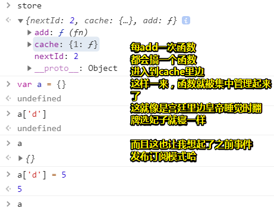

之前写的event-hub，用于自定义事件，触发回调：

```js
window.eventHub = {
    // 定义一个hash表
    events:{

    },
    // 发布
    emit(eventName,data) {
        for(let key in this.events) {
            if(key === eventName) {
                let fnList = this.events[key]
                // 推使用map，因为相较于forEach有返回值哈
                fnList.map((fn)=>{
                    fn.call(undefined,data)
                })
                
            }
        }
    },
    // 订阅
    on(eventName,fn) {
        if(this.events[eventName] === undefined) {
            this.events[eventName] = []
        }
        this.events[eventName].push(fn)
    }
}
```

### 6. 自记忆函数？（论函数属性的重要性）

> 记忆化（memoization）是一种构建函数的处理过程，能够记住上次计算结果

这种函数可以自己曾经接收过的参数，至此，就不需要重新计算了，即直接就可以拿到结果！

举个栗子来说，如（判断一个数是不是素数）：

```js
    function isPrime(value) {
      if (!isPrime.answers) {
        isPrime.answers = {};
      } //创建缓存，调用函数，然后函数自己为自己添加属性，而不是我们在这个函数外边创建，可见我们这封装很完整

      if (isPrime.answers[value] !== undefined) {
        return isPrime.answers[value];
      } //检查缓存的值

      var prime = value !== 1;
	 
      //用于计算素数的这个算法很简单，当然，这效率确实不高哈！但
      for (var i = 2; i < value; i++) {
        if (value % i === 0) {
          prime = false;
          break;
        }
      } //如果所传的参数是很大的数的话，那么这个循环的计算量也是挺大的！如果我们重复传相同的参数，
        //那么这计算显然也是重复进行的，因此我们的缓存就起作用了，即可以让你无须重复计算，直接拿到结果

      return isPrime.answers[value] = prime; //存储计算的值
    }

    assert(isPrime(5), "5 is prime!" ); //测试该函数是否正常工作
    assert(isPrime.answers[5], "The answer was cached!" );
```

> 我开始明白看一些优秀的JavaScript源码的意义了！

测试结果：

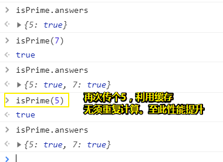

总之，我们可以按照参数把结果存储起来！函数在，即函数的这个缓存属性也就在了！

> 与上边那个问题的区别：一个是存粹的放，不要结果的记忆，一个是放，要结果的记忆！

适用场景：

1. 动画中的计算、搜索不经常变化的数据或任何耗时的数学计算
2. 通过字符串生成MD5

> 为什么说函数作为一等公民呢？
>
> 1. 可以作为参数
> 2. 可以回调
> 3. 函数也可以有属性呀！
> 4. ……
>
> 对象？一等公民？做梦……

### 7. 函数声明和函数表达式、IIFE各自的区别？

函数声明有只有两种姿势：全局声明，局部声明，必须要名字

函数表达式：名字有没有都行，赋值语句里的一部分（变量和属性）、函数参数、返回值、IIFE等

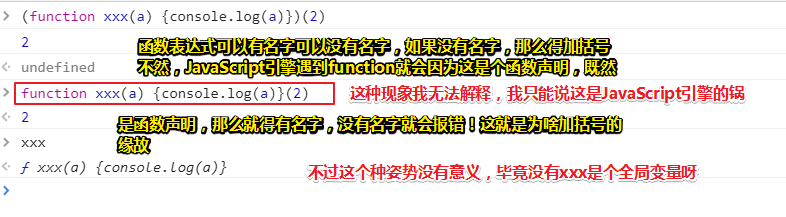

只要在括号里边，xxx这个标识符有没有都不会作为一个全局变量而存在

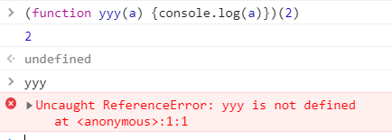

一般我们都去掉，毕竟可以少写3个字符呀！

不管是`xxx()`这种标识符调用函数，还是 `(function(){})()`这种，圆括号 `()`左边的叫做左值，用于求得一个函数值呀！

关于IIFE，我们还有其它姿势 `+、-、/、~`，不过这种姿势很奇怪，所以不常使用，总之不管是圆括号，还是奇怪姿势，都是为了**向JavaScript引擎发一个信号说你接下来要处理的代码是表达式，而不是语句**呀！

还有一点你需要注意的是，`+function(){}()`，左值不会在保存起来，当然，我们只需这个函数值被调用了然后执行了即可！

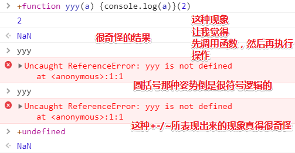

总之，无须关细节，你只需要知道函数被立即执行了！

### 8. 为什么会出现箭头函数？

因为在JavaScript中我们会使用大量的函数，所以添加一些语法糖是有意义的，它使我们能够以更短、更简洁的方式创建函数，从而使我们作为开发人员的生活更愉快

中文本里的书提到：箭头函数它是函数表达式的简化版，但英文版并没有说，而且我们可以直接这样：

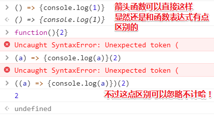

总之，关于上来说，可以认为「**箭头函数它是函数表达式的简化版**」

其语法：

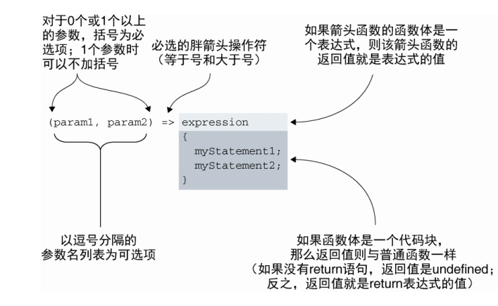

1个参数，一个表达式，最简洁

除此之外，啥都需要有！

### 9. 关于实参和形参的区别？

它们俩都是术语，而且它们基本一样，几乎可以互换：

- 形参是我们**定义函数时**所列举的变量
- 实参是我们**调用函数时**所传递给函数的值

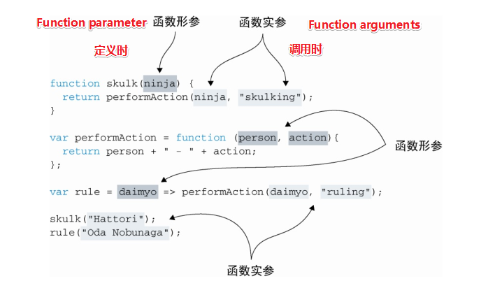

> 请记住是arguments

如果实参数量大于形参的话，不会抛出错误！

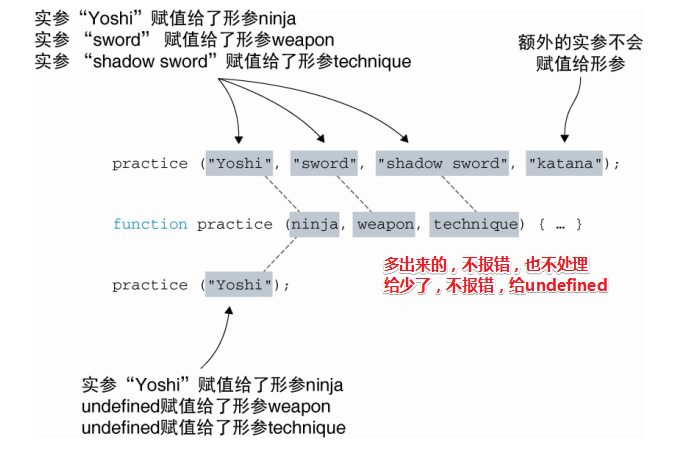

需要注意的是，额外的实参，我们也是可以拿到的，这可以通过 `arguments`这个伪数组获取！

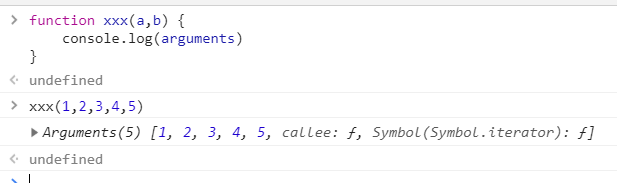

关于剩余参数（`...arg`，拿到的`arg`是个数组 ），只有函数的**最后一个参数才能是剩余参数**。试图把省略号放在不是最后一个形参的任意
形参之前都会报错，错误以`SyntaxError: parameter after rest parameter` 的形式展现。

关于默认参数：

出现的缘由：

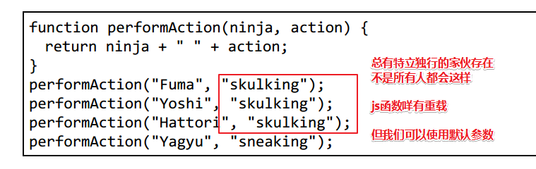

出现后的好处：

1. 可以避免空值
2. 作为配置函数行为的相对简单的标志——可以生成更简单、更优雅的代码。

不好的：

1. 不能提高代码的可读性，请避免这种写法，当然适当地使用默认参数，还是阔以的！

注意：

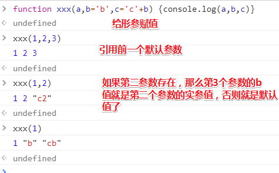

总之，实参的值是优先级，没有传过来就用默认值，否则就用传过来的值！

### 10. 一道关于剩余参数的题？

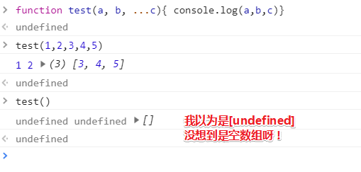

