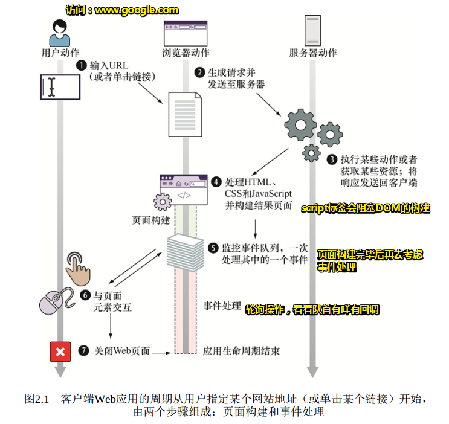
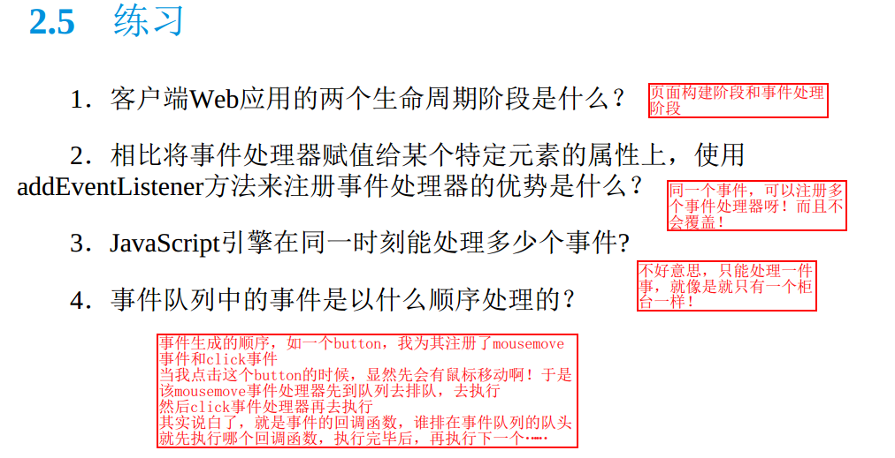

# FAQ

> 记录看书过程中遇到的一些问题

## ★第 1 章

## ★第 2 章

### 1. 监听事件只执行一次？

```js
document.body.addEventListener("mousemove", function() {	//#B
    var second = document.getElementById("second");
    addMessage(second, "Event: mousemove");
},{
	once: true,
});
```

添加第三个参数，这个参数是可选的！`once`表示 `listener `在添加之后最多只调用一次。如果是`true`， `listener` 会在其被调用之后自动移除。

**➹：**[只执行一次的事件绑定函数 - 个人文章 - SegmentFault 思否](https://segmentfault.com/a/1190000014900491)

**➹：**[EventTarget.addEventListener() - Web API 接口参考 - MDN](https://developer.mozilla.org/zh-CN/docs/Web/API/EventTarget/addEventListener)

**➹：**[mousemove - Web API 接口参考 - MDN](https://developer.mozilla.org/zh-CN/docs/Web/API/Element/mousemove_event)

### 2. whatwg是个什么组织？

> 浏览器厂商和标准组织博弈出来的产物，重要的是明白它们背后的人是谁。WHATWG受到了Opera, Mozilla和Chrome, Safari的支持，而W3C的背后则隐藏着IE这个微软菊苣。私以为在工业发展速度远远超过标准定义的今天，WHATWG或许会更权威一点。关于HTML5标准的定制，最开始是WHATWG在做的，由于到后期大部分浏览器厂商都已经实现了统一标准，W3C想不支持也是不行的啊，这就是传说中的霸王硬上弓？

所以我们就看这个文档就好了，而不是w3c！

**➹：**[HTML Standard](https://html.spec.whatwg.org/)

**➹：**[DOM Standard](https://dom.spec.whatwg.org/)

**➹：**[whatwg 是个什么组织？和 W3C 的关系是？ - SegmentFault 思否](https://segmentfault.com/q/1010000002408941?name=HTML&description=&isPrivate=0)

### 3.关于JavaScript引擎——SpiderMonke？

> **SpiderMonkey** 是Mozilla使用**C/C++**编写的[JavaScript](https://developer.mozilla.org/zh-cn/JavaScript) 引擎。它被用于包括Firefox在内的多个Mozilla产品中,使用的是MPL 2授权协议.

**➹：**[SpiderMonkey - 维基百科，自由的百科全书](https://zh.wikipedia.org/wiki/SpiderMonkey)

**➹：**[SpiderMonkey - Mozilla 产品与私有技术 - MDN](https://developer.mozilla.org/zh-CN/docs/Mozilla/Projects/SpiderMonkey)

### 4.V8 vs SpiderMonke？

比较版本：

- Nodejs(V8) Ver0.6.13
- Spidermonkey Ver1.8

结果：

> 这是2014年2月的比较结果

1. V8在性能上比当前版本的Spidermonkey要出色很多
2.  在Linux及多核计算能力一般的CPU环境下，异步非阻塞IO的V8性能优势非常大
3. Dict字典操作上，优势没有其他两项明显，说明V8在字典操作上的优化还有待进一步提高。期待后续新版本V8在这一项上性能的进一步优化。

> 一句话概括之「V8牛逼！」

**➹：**[javascript引擎 PK: V8 vs Spidermonkey - 程序园](http://www.voidcn.com/article/p-tsikhzve-ea.html)

**➹：**[引擎浅谈 SpiderMonkey & Google V8 - 吃代码的兔子窝](https://www.wangshaoxing.com/blog/javascript-engines.html)

**➹：**[★JS 引擎比较 - Mozilla 产品与私有技术 - MDN](https://developer.mozilla.org/zh-CN/docs/Mozilla/Projects/SpiderMonkey/Comparision_of_JS_engines)

### 5. 有哪些Web APIs？

> 浏览器暴露给JavaScript 引擎的主要全局对象是window对象，它代表了包含着一个页面的窗口。window对象是获取所有其他全局对象、全局变量（甚至包含用户定义对象）和浏览器API的访问途径。

在为Web编写代码时，有很多可用的Web API。下面列出了你在开发Web应用程序或站点时可以使用到的所有API以及interfaces(对象类型的接口)。

Web APIs通常与JavaScript一起使用，但并非总是如此。

**➹：**[Web API 接口参考 - MDN](https://developer.mozilla.org/zh-CN/docs/Web/API)

### 6. 关于断言函数？

第一个参数为true，那么第二个参数就有意义了，然后就可以搞事情了！

```js
document.body.addEventListener("click", function(){		   //#C
    var second = document.getElementById("second");
    addMessage(second, "Event: click");
});
```

### 7. 默认的页面构建结束后，才会执行事件处理吗？

我一直认为只有JavaScript代码执行完毕后才会去解析剩下的HTML元素，结果并非一定是这样的！可能解析了一点JavaScript代码之后，就又会去解析剩下的HTML了！

可这样就不合理了，有些时候肉眼所观测到的不一定是正确的呀！可能v8做了优化，毕竟我那个循环测试是可以用什么JIT编译器优化的

关于事件处理确实只有在callstack清空后，以及DOM树解析完毕后才会触发用户点击过后所执行的回调

还有script2的代码还没有结束，那么当用户点击了在script1时就绑定了事件的按钮，是不会立刻就执行的！

[demo](./demo/01-页面构建结束后才会拿到请求结果吗.html)

**➹：**[JIT 编译器快速入门 - 掘金](https://juejin.im/post/58c7777eda2f605dc5b1c258)

### 8. 注册事件处理器之两种姿势区别？

- 通过把函数赋给某个特殊属性；
- 通过使用内置addEventListener方法。

代码分别如下：

当DOM已经就绪并全部构建完成，就会触发这个事件：

```js
window.onload = function(){};
```

---

```js
document.body.addEventListener("mousemove", function() {
    //为mousemove事件注册处理器
    var second = document.getElementById("second");
    addMessage(second, "Event: mousemove");
});

document.body.addEventListener("click", function(){
    //为click事件注册处理器
    var second = document.getElementById("second");
    addMessage(second, "Event: click");
});
```

前者缺点：

对于某个事件只能注册一个事件处理器。也就是说，一不小心就会将上一个事件处理器（所谓的回调函数呀！这个回调函数是浏览器自己去调用的）改写掉

后者优点：

让我们能够注册尽可能多的事件处理器。也就是说，一个事件可以触发多个回调，而且这会根据你所注册的事件处理器的代码顺序决定

因此推荐使用后者！

[demo](./demo/02-注册事件处理器的两种姿势区别.html)

### 9. 运行时的页面构建过程之生命周期概览：页面构建和事件处理



> 浏览器接收的HTML代码用作创建**DOM的蓝图**，它是客户端Web应用结构的**内部展示阶段**。
>
> 即便script标签里边该执行的代码都执行完了，但是我们还是有机会去修改DOM树的节点的，因为我们还有事件处理呀！只要Web页面不关闭，我们就有程序与用户交互！用户做什么动作，我们就会有相应的程序执行给他们看！

一个页面的打开到一个页面的关闭，意味着该页面生命的结束！

### 10. 练习题



