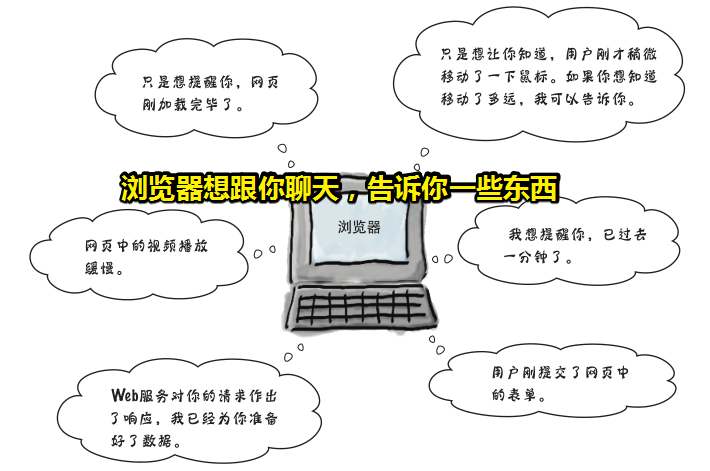
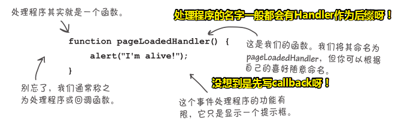
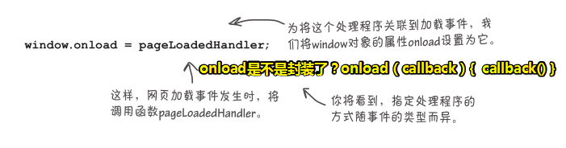
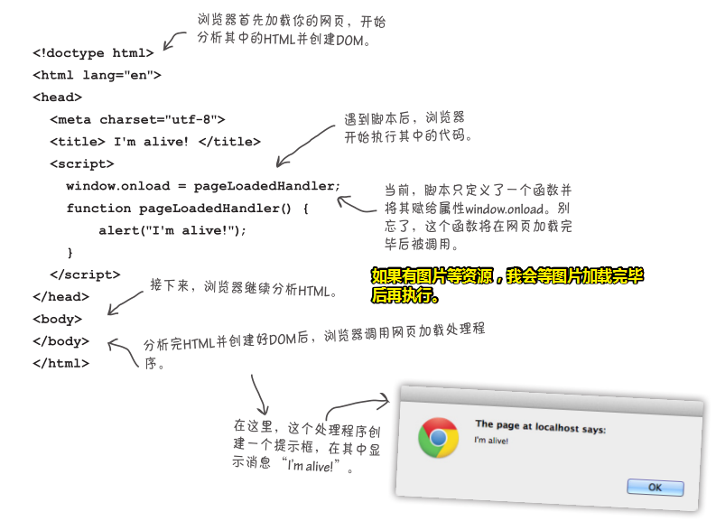
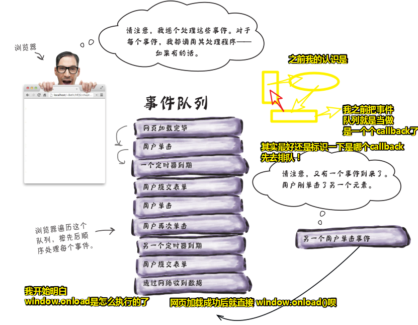
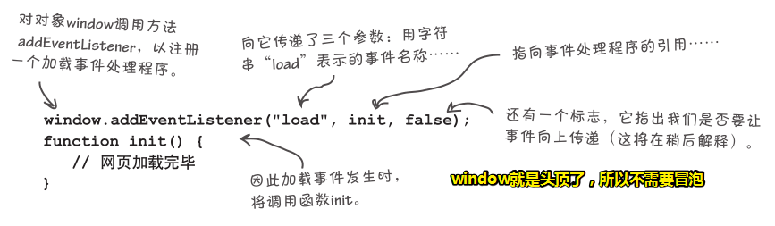
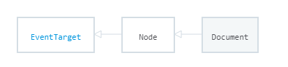

# 异步编码：处理事件

## ★引子

在写popover组件的时候，我发现我对事件的认识，始终有点模糊！因此，我打算重新认识一下事件！

## ★前言

你以前编写的代码执行：**从上到下按顺序执行**，说白了就是按部就班的执行呗！

然而，JavaScript代码**通常不是这样编写的**，大多数JavaScript代码都是**事件响应式的**

那都有什么样的事件呢？——用户单击网页、通过网络收到数据、定时器到期、**DOM发生变化**等，事实上，在浏览器中，**幕后始终有各种事件在不断发生**

> 从同步到异步的转变，我没想到DOM发生变化也是一种事件，或许这是UI更新事件吧！

## ★学习目标

- 反思我们的编码方式
- 学习如何编写响应事件的代码以及为何要这样做

## ★收获

- **你的编程方式再不似从前**（**you aren’t in kansas anymore**）

## ★开始认识

### ◇动脑？

浏览器幕后会执行以下任务：

- 跟踪用户在网页上执行的所有单击操作，无论单击的是按钮、链接还是其他地方。
- 获取网页所需的额外数据。
- ……

如果浏览器可以在这些事件发生时发出通知，即通知你开发者去响应这些事件，那么你会写出怎样有趣的代码来呢？

### ◇事件是什么？



- 浏览器不会在获取并显示页面后就甩手不管了。在幕后，有很多事情在不断发生，如用户单击按钮等都会**触发事件**
- 每当有事件发生时，你都可以在代码中处理它，即提供**将在事件发生时调用的代码**。
- **你不必处理所有的事件，而只需处理自己关心的事件。**虽然有多事件都在发生，但我们可以选择无动于衷！反正，我只想处理我自己关心的时间，其它的事件的发生，我一概选择屏蔽，即我不会去响应这些事件！毕竟我可咩有那么多心力去管那么多事儿……

那么事件是什么呢？——浏览器幕后为你做的那些事儿，如同管家一样

有哪些事件呢？

**➹：**[事件参考 - MDN](https://developer.mozilla.org/zh-CN/docs/Web/Events)

事件对于我们编码而言就是，**每当有事件发生时，你都可以在代码中处理它**

### ◇事件处理程序是什么

> 它指的是事件处理程序

- 它是干吗的？——用来处理事件的，或者说是响应事件的！

- 它长啥样？——通常是一小段代码，知道事件发生时该如何做。

- 它是什么呢？——从代码的角度来看，它就是一个函数，当事件发生时，其处理程序函数将被调用

- 它还有其它名字？——回调函数、监听器

- 如何让它能在事件发生时得以调用？

  1. 注册它，而**注册它的方式有多种，具体采用哪种取决于事件的类型**

  2. 举个栗子——网页加载完毕后触发的事件：

     

### ◇如何创建第一个事件处理程序

> <mark>要理解事件，最佳方式是编写一个处理程序，并将其关联到一个事件</mark>

如何为网页加载事件添加个callback呢？

> 前提条件：你得知道网页加载事件的触发时间点是：浏览器加载完网页、显示网页的所有内容并生成了表示网页的DOM。（其实DOM构建结束、然后内容都加载完毕后触发！）

1. 编写一个处理网页加载事件的函数，功能是在网页加载完毕时`alert`一下，对了，你还得取个醒目的名字 ，如`pageLoadedHandler`

   

2. 处理程序编写好后，需要**建立关联，让浏览器知道有这么一个函数，应在加载事件发生时调用它**。

   

   我觉得这种姿势建立关联是很不好的！因为这样改变了全局属性的值，不过我查看了`onload`的初始值，发现它是 `null`值，这给了我一个启示是事件总是会发生的，如果你给了 `onload`一个callback，那么它就是有值的，而这个值就会让你看到，`onload`事件时有触发的，并且我们给它的callback是有执行的。

3. 编写这些代码后，我们就知道**网页加载完毕后**，浏览器将调用**赋给属性`window.onload`**的函数。

### ◇测试事件处理程序



> 注意：是响应回来的一点内容，浏览器就会解析一点内容！如果遇到图片、css、js文件，那么就会去请求它们，等这些资源下载并加载完毕后，才会去执行关联load事件的callback！

### ◇考考你的脑力？

**在不编写函数的情况下，能否指定事件处理程序？**

> 函数就是事件处理程序呀？你不编写函数，哪里的callback啊？

- 编写代码的方式
  - 代码执行是线性的（linear）

- 以响应事件的方式组织代码是另一种代码编写方式。

  - 怎么做？
    - 考虑可能发生的事件
    - 代码应如何响应这些事件
  - 在计算机科学中，通常说这种代码（callback）是异步（asynchronous）的，因为我们**编写的代码仅在相应的事件发生时才会被调用**。

  - 这种编码方式也**改变了我们看待问题的角度**，**不再逐步地编写代码来实现算法**，而是将处理各种事件的众多处理程序整合起来，构成一个**应用**程序。

- 那我以MVC的方式组织代码，而这是不是另外一种代码编写方式呢？这种方式可是可以蕴含同步代码和异步代码的！

## ★通过创建一个游戏来理解事件

> 理解事件的最佳方式是实践，因此我们用事件来规划游戏。


---

## ★总结

- handler是处理程序之意，或者说是处理器！常用作事件处理程序的名字后缀！

- 如果你想成为真正的JavaScript开发人员，那么就必须学习如何处理事件。

- JavaScript代码，有的是同步的代码，有的是异步的代码，但大多是异步的代码！这里的异步代码，指的是callback，因为它是异步调用执行的！

- 在写JavaScript代码的时候，你想预期它的执行，那么你得化身为浏览器才行！

- 不会在网页中显示出来的元素（如`<script>`和`<head>`）不支持单击等事件。

- 单击事件处理程序被调用时，将向它传递一个事件对象。事实上，大多数文档对象模型（DOM）事件发生时，都会向相应的处理程序传递一个事件对象。事件对象包含一些有关事件的常规信息，如事件是哪个元素触发的以及事件是何时发生的。另外，你还将获得有关事件的特有信息。例如，用户单击鼠标时，你将获得单击位置的坐标。（获取那个元素触发的，通常是用Target，即目标对象，功效相当于是 `getElementById('xx')`这样的）

- 事件对象在有些情况下很有用，在其他情况下又毫无用处。这完全取决于事件类型。如在加载事件处理程序中，通常很少使用事件对象，因为对这种事件来说，它没有提供什么有用的信息。

- 不断的增加需求，以此来加深对某个知识点的理解与认识！

- 我们学了三种事件，如加载事件（浏览器加载网页完毕时发生）、单击事件（用户单击网页元素时发生）和鼠标移动事件（用户在元素上移动鼠标时发生），为将它们关联到处理程序，**我们总是将处理程序赋给某个属性**，如`onload`、`onmousemove`或`onclick`。但**这种做法并非适用于所有事件**。例如，对于基于时间的事件，不是将处理程序赋给属性，而是**调用函数`setTimeout`并向它传递处理程序**。

- 以前使用过C或Java等语言，而在这些语言里边，像这样将一个函数传递给另一个函数根本行不通；但在JavaScript中，这行得通。事实上，**能够传递函数提供了一种强大的功能，在编写响应事件的代码时尤其如此。**

  > 我一直认为一个函数能接受另一个函数作为参数是一件很正常的行为，但现在想来这是一种很牛逼的设计呀！

- 把对象里边的函数，叫做方法（其实就是个函数，不过叫方法可以识别它是一个在对象里边定义的函数），如`setTimeout`是window对象旗下的方法，`setTimeout`可以接收一个函数。同理，`onload`也是可以省略window的，不过但大多数人都不会这样做，因为`onload`是一个常见的属性名（其他元素也可能有属性`onload`）。如果省略window，将让人不知道指的是哪个对象的`onload`属性。

- setTimeout还可以传第3个参数，甚至是第4个、第5个……而这个参数是传给callback的，它可不会传个事件对象之类的参数给callback哦！

- JavaScript提供的异步机制，可以让我们无须写任何高深的算法来控制该在何时调用哪些代码，有的只是一系列设置、创建和响应事件的代码。

- setTimeout为何不向事件处理程序传递一个事件对象？

  > 事件对象主要用于DOM事件处理程序。setTimeout不向处理程序
  > 传递事件对象，因为时间事件并非由特定的元素触发。

- 异步编程风格：在处理程序中，创建其他事件处理程序是件再正常不过的事！

- 有基于DOM的事件、定时器事件等。是不是有很多不同类型的事件？

  > 在JavaScript中，你处理的很多事件都是DOM事件（如单击元素触发的事件）或定时器事件（使用setTimeout或setInterval创建的事件）。
  >
  > 还有与API相关的事件，如Geolocation、LocalStorage、Web Worker等JavaScript API触发的事件|。
  >
  > 最后，还有一系列与I/O相关的事件，如使用`XMLHttpRequest`向Web服务请求数据时引发的事件以及使用Web套 接 字 引 发 的 事 件 。

  关于API触发的事件，这个很常用呀！这不同于我们UI交互触发的事件，它是一种与代码交互触发的事件。总之一种是外在，一种是内在！

- 事件队列：

  

  我之前认为 `window.onload = ()=>{}`是这样执行的 `onload(callback){callback()}`

  原来并不是所有事件处理程序的执行都是以callback这种姿势执行的！

- 关于「使用addEventListener添加事件处理程序」：

  - 出现缘由：如果要给一个事件指定多个处理程序，就不能使用属性（如onload）来完成这种任务，而必须使用方法addEventListener：

    

  - 当你对某个元素添加多个处理程序的时候，你得知道先调用哪个处理程序，因此设计代码时务必考虑这一点

  - `removeEventListener`可以移除使用`addEventListener`添加的事件处理程序。

## ★Q&A

### ①事件？

在这里事件指的是事件驱动程序设计（一种计算机程序设计模型）。

> 在计算机编程中，事件驱动编程是一种编程范式，其中程序的流程由用户动作(鼠标点击、按键)、传感器输出或来自其他程序或线程的消息等事件决定。事件驱动编程是图形用户界面和其他应用程序(例如，JavaScript Web应用程序)中使用的主要范例，这些应用程序**以响应用户输入而执行某些动作为中心**。

总之，程序的运行流程是由用户决定的！而不是我们程序员决定的！

**➹：**[事件驱动程序设计 - 维基百科，自由的百科全书](https://zh.wikipedia.org/wiki/%E4%BA%8B%E4%BB%B6%E9%A9%85%E5%8B%95%E7%A8%8B%E5%BC%8F%E8%A8%AD%E8%A8%88)

### ②onload、DOMContentLoaded？

HTML页面的生命周期有以下三个重要事件：

- `DOMContentLoaded` —— 浏览器已经完全加载了 HTML，DOM 树已经构建完毕，但是像是 `` 和样式表等外部资源可能并没有下载完毕。
- `load` —— 浏览器已经加载了所有的资源（图像，样式表等）。
- `beforeunload/unload` —— 当用户离开页面的时候触发。

每个事件都有特定的用途

- `DOMContentLoaded` —— DOM 加载完毕，所以 JS 可以访问所有 DOM 节点，初始化界面。
- `load` —— 附加资源已经加载完毕，可以在此事件触发时获得图像的大小（如果没有被在 HTML/CSS 中指定）
- `beforeunload/unload` —— 用户正在离开页面：可以询问用户是否保存了更改以及是否确定要离开页面。

**➹：**[[译]页面生命周期：DOMContentLoaded, load, beforeunload, unload解析 · Issue #3 · fi3ework/blog](https://github.com/fi3ework/blog/issues/3)

### ③有哪些代码编写方式？

我所了解到的：

- 同步代码
- 异步代码

**➹：**[源代码怎么编写的？ - 知乎](https://www.zhihu.com/question/57885973)

**➹：**[编写傻瓜式的代码 – 腊八粥 – 一个关于计算机、极客、阅读和写作的英文文章的翻译网站](http://labazhou.net/2015/10/write-stupid-code/)

**➹：**[函数式编程的代码怎么组织？ - 知乎](https://www.zhihu.com/question/20098885)

**➹：**[编程中，有哪些好的习惯从一开始就值得坚持？ - 知乎](https://www.zhihu.com/question/32255673/answer/517173833)

**➹：**[编程的几个思想 - 知乎](https://zhuanlan.zhihu.com/p/25288280)

**➹：**[组织代码的四大策略](https://www.infoq.cn/article/four-strategies-for-organizing-code)

**➹：**[你是如何去组织项目中的 Less/Sass 代码的？ - 知乎](https://www.zhihu.com/question/35708352)

**➹：**[如何写好一个类？ - 知乎](https://www.zhihu.com/question/42115070)

**➹：**[如何写好一个parser？ - 知乎](https://www.zhihu.com/question/66174185)

**➹：**[如何写出优美的 JavaScript 代码？ - 知乎](https://www.zhihu.com/question/20635785)

**➹：**[如何写出高水平的前端代码？ - 知乎](https://www.zhihu.com/question/318532256)

**➹：**[作为前端工程师，你认为写过的或你看到过的最好的前端代码是什么？ - 知乎](https://www.zhihu.com/question/29254108)

**➹：**[如何写出优秀的代码注释？ - 知乎](https://www.zhihu.com/question/21880307)

### ④如何编写函数？

**➹：**[提高代码质量：如何编写函数 - 狼狼的蓝胖子](http://luopq.com/2016/02/21/write-good-function/)

### ⑤target、this、currentTarget区别？

1. target:触发事件的某个具体对象，只会出现在事件流的目标阶段，谁触发谁命中

2. currentTarget:绑定事件的对象，恒等于this,可能出现在事件流的任意一个阶段中

3. 通常情况下target和currentTarget是一致的，我们只要使用target即可。但是有一种情况，必须区分三者之间的关系：

   > **父子嵌套关系中，父元素绑定了事件，然而单击子元素触发事件，则根据事件流，在布阻止事件流的前提下他会传递至父元素，因为他是绑定事件的对象，而target由于是触发事件的具体对象，它会指向子元素**

**➹：**[target、this、currentTarget区别 - 简书](https://www.jianshu.com/p/59c0da43521d)

总之target是触发事件的那个对象，而currentTarget则是那个冒泡上真正绑定了事件的对象。

```html
<div id="one">
	<div id="three"></div>
</div>
one.addEventListener('click',function(e){
	console.log(e.target);  //three
	console.log(e.currentTarget);  //one
},false);
```

```js
function delBtnHandle() {
    //通过当前元素父节点的父节点的第一个子节点的文本内容确定当前数组的属性并删除
    //这里不能用e，要用this来指代对象
    var cityName = this.target.parentNode.parentNode.childNodes[0].innerHTML;
    delete aqiData[cityName];
    renderAqiList();
}
```

### ⑥为啥document这个对象可以被点击？

**Document** 接口表示任何在浏览器中载入的网页，并作为网页内容的入口，也就是[DOM 树](https://developer.mozilla.org/en-US/docs/Using_the_W3C_DOM_Level_1_Core)。DOM 树包含了像 [`body`](https://developer.mozilla.org/zh-CN/docs/Web/HTML/Element/body) 、[`table`](https://developer.mozilla.org/zh-CN/docs/Web/HTML/Element/table) 这样的元素，以及[大量其他元素](https://developer.mozilla.org/zh-CN/docs/Web/HTML/Element)。它向网页文档本身提供了全局操作功能，能解决如何获取页面的 URL ，如何在文档中创建一个新的元素这样的问题。



`Document` 接口描述了任何类型的文档的通用属性与方法。根据不同的文档类型（例如[HTML](https://developer.mozilla.org/en-US/docs/HTML)、[XML](https://developer.mozilla.org/en-US/docs/XML)、[SVG](https://developer.mozilla.org/zh-CN/docs/Web/SVG)，...），还能使用更多 API：使用 `"text/html"` 作为内容类型（content type）的 HTML 文档，还实现了 [`HTMLDocument`](https://developer.mozilla.org/zh-CN/docs/Web/API/HTMLDocument) 接口，而 XML 和 SVG 文档则（额外）实现了 [`XMLDocument`](https://developer.mozilla.org/zh-CN/docs/Web/API/XMLDocument) 接口。

**➹：**[Document - Web API 接口参考 - MDN](https://developer.mozilla.org/zh-CN/docs/Web/API/Document)

关于JS的接口概念：

> 继承是OO语言中的一个最为人津津乐道的概念.许多OO语言都支持两种继承方式: **接口继承** 和 **实现继承** .接口继承只继承方法签名,而实现继承则继承实际的方法.由于js中方法没有签名,在ECMAScript中无法实现接口继承.ECMAScript只支持实现继承,而且其 `实现继承` 主要是依靠原型链来实现的.

Node继承了EventTarget接口，那么意味着EventTarget会多了一些功能！

**➹：**[JS原型链与继承别再被问倒了 - 掘金](https://juejin.im/post/58f94c9bb123db411953691b)

### ⑦事件委托？

解决什么痛点？——很多个子元素需要绑定同一个事件，而其中的callback费内存呀！

原理：利用了事件冒泡，把事件委托给父元素绑定

写一个事件委托？

```js
function eventDelegate (parentSelector, targetSelector, events, foo) {
  // 触发执行的函数
  function triFunction (e) {
    // 兼容性处理
    var event = e || window.event;

    // 获取到目标阶段指向的元素
    var target = event.target || event.srcElement;

    // 获取到代理事件的函数
    var currentTarget = event.currentTarget;

    // 处理 matches 的兼容性
    if (!Element.prototype.matches) {
      Element.prototype.matches =
        Element.prototype.matchesSelector ||
        Element.prototype.mozMatchesSelector ||
        Element.prototype.msMatchesSelector ||
        Element.prototype.oMatchesSelector ||
        Element.prototype.webkitMatchesSelector ||
        function(s) {
          var matches = (this.document || this.ownerDocument).querySelectorAll(s),
            i = matches.length;
          while (--i >= 0 && matches.item(i) !== this) {}
          return i > -1;            
        };
    }

    // 遍历外层并且匹配
    while (target !== currentTarget) {
      // 判断是否匹配到我们所需要的元素上
      if (target.matches(targetSelector)) {
        var sTarget = target;
        // 执行绑定的函数，注意 this
        foo.call(sTarget, Array.prototype.slice.call(arguments))
      }

      target = target.parentNode;
    }
  }

  // 如果有多个事件的话需要全部一一绑定事件
  events.split('.').forEach(function (evt) {
    // 多个父层元素的话也需要一一绑定
    Array.prototype.slice.call(document.querySelectorAll(parentSelector)).forEach(function ($p) {
      $p.addEventListener(evt, triFunction);
    });
  });
}

```

DOM结构：

```html
<ul id="list">
  <li><span>item 1</span></li>
  <li><span>item 2</span></li>
</ul>
```

使用：

```js
eventDelegate('#list', 'li', 'click', function () { console.log(this); });
```

局限性：

 focus、blur 之类的事件本身没有事件冒泡机制，所以无法委托；

mousemove、mouseout 这样的事件，虽然有事件冒泡，但是只能不断通过位置去计算定位，对性能消耗高，因此也是不适合于事件委托的；

**➹：**[实例分析JavaScript中的事件委托和事件绑定 - "地瓜哥"博客网](https://www.diguage.com/archives/71.html)

**➹：**[JavaScript 事件委托详解 - 知乎](https://zhuanlan.zhihu.com/p/26536815)

**➹：**[js事件委托详解 - 个人文章 - SegmentFault 思否](https://segmentfault.com/a/1190000013434835)


