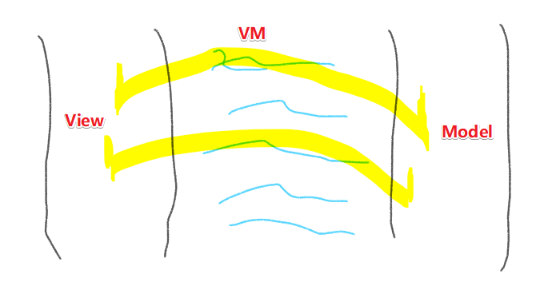
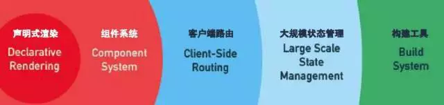
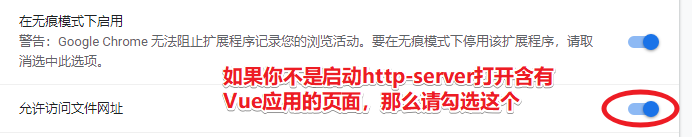
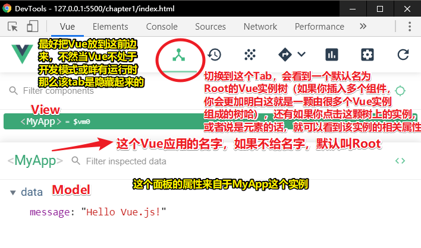

# 第 1 章　Vue开发入门

## ★MVVM

Vue整体上遵循MVVM（Model-View-ViewModel，模型－视图－视图模型）架构，也就是说View（用户界面或视图）和Model（数据）是**独立的**，ViewModel（Vue）是View和Model交互的桥梁。Vue对View和Model之间的更新操作做了自动化处理，并且已经为开发者进行了优化。因此，当View的某个部分需要更新时，开发者并不需要特别指定，Vue会选择恰当的方法和时机进行更新。



## ★Vue核心功能概述

- 一个响应式的数据系统，能通过轻量级的虚拟DOM引擎和最少的优化工作来自动更新用户界面。
- 灵活的视图声明，包括优雅友好的HTML模板、JSX（在JavaScript中编写HTML的技术）以及hyperscript渲染函数（完全使用JavaScript）。
- 由可维护、可复用组件构成的组件化用户界面。
- 官方的组件库提供了路由、状态管理、脚手架以及更多高级功能，使Vue成为了一个灵活且功能完善的前端框架。

> 数据变化，视图也会变化；定义一个视图如同写HTML一样；组件化的存在，极大的提升了我们的开发效率；在核心功能的基础上追加了高级功能，让我们具备开发复杂应用的能力！



**➹：**[Vue作者尤雨溪：Vue 2.0，渐进式前端解决方案](https://mp.weixin.qq.com/s?__biz=MzUxMzcxMzE5Ng==&mid=2247485737&amp;idx=1&amp;sn=14fe8a5c72aaa98c11bf6fc57ae1b6c0&source=41#wechat_redirect)

**➹：**[Vue2.0 中，“渐进式框架”和“自底向上增量开发的设计”这两个概念是什么？ - 知乎](https://www.zhihu.com/question/51907207)

## ★兼容性

Vue没有任何第三方依赖，可以在所有兼容ECMAScript 5的浏览器中使用。

不支持Internet Explorer 8及以下版本，因为Vue使用了JavaScript中相对较新的特性，比如`Object.defineProperty`，而它们在老版本的浏览器中是无法polyfill的。

## ★环境搭建

引入这个即可：

``` HTML
<script src="https://unpkg.com/vue/dist/vue.js"></script>
```
截止到 2019年10月25日，Vue 版本是 2.6.10

## ★创建一个应用

在Vue里边，什么叫应用？——可以理解为 「View+Vm+Model = 应用」

vue.js这整个库都是基于Vue实例的，而**实例**是View和Model（数据）交互的桥梁。因此需要创建一个新的Vue实例来启动应用：

``` html
<div id="root">
    <p>Is this an Hello world?</p>
  </div>
```

``` js
// 创建Vue实例
var app = new Vue({
  // 根DOM元素的CSS选择器
  el: '#root',
  // 一些数据
  data () {
    return {
      message: 'Hello Vue.js!',
    }
  },
})
```

说白了，用户看到的视图要想成为一个Vue应用，那么这个视图肯定被挂载了一个Vue实例！

在上边的代码里边，Vue构造器有一个参数—— `option` 对象，该参数可以携带多个属性（称为选项）

> 一个基本的Vue应用，得有两个选项才行：`el` 和 `data`，即刚好凑齐View 、VM、 Model

关于 `el`：通过它，我们使用**CSS选择器**告知Vue将实例添加（挂载）到Web页面的哪个DOM元素里边去！

在上边的例子里边，Vue实例将使用`<div id="root">` DOM元素作为其根元素。另外，也可以使用Vue实例的`$mount`方法替代`el`选项：

``` js
var app = new Vue({
  data () {
    return {
      message: 'Hello Vue.js!',
    }
  },
})
// 添加Vue实例到页面中
app.$mount('#root')
```
> 如果你不想写 `el`选项，那么你就用 Vue实例提供的 `$mount` 方法来挂载吧！

关于 `data`选项：用于初始化一些数据

> 在单个Web页面中，开发者可以添加任意多个Vue应用。只需要为每个应用创建出新的Vue实例并挂载到不同的DOM元素即可。当想要将Vue集成到已有的项目中时，这非常方便。

在写单文件组件的时候，我可以把这个组件当作是Vue应用吗？因为我写了模板和选项对象呀！——在我看来，这其实是不能的，因为我们需要全局或局部注册这个组件，然后把这个组件注入到某个Vue应用里边去！说白了组件需要插入到Vue应用里边使用，并不能像写一个HTML标签那样在body里边独自使用！

**➹：**[编写Vue.js组件前需要知道的10件事-InfoQ](https://www.infoq.cn/article/bgODkIpKMbsq-hcPoDJY)

## ★Vue开发者工具

Vue有一个官方调试工具，在Chrome中以扩展的方式呈现，名为Vue.js devtools。通过该工具可以看到应用的运行情况，这有助于调试代码。

> 有了这个调试工具之后，那么在Vue应用的过程中，如果出现了bug，那么解决起来就会方便很多！

配置一下这个插件，以防是用文件协议打开的，以致于无法使用该调试工具：



简单认识一下 Vue.js devtools 的使用：



可以通过name选项修改Vue实例的名字（方便我们调试代吗，尤其是使用单文件组件开发的时候，Vue实例树里边会有很多个组件Vue实例）：

``` js
var app = new Vue({
  name: 'MyApp',
  // ...
})
```

总之，`name`选项的作用是：

> 当一个页面中有多个Vue实例时，这有助于直观地在开发者工具中找到具体的某个实例。

## ★借助模板实现DOM的动态性

在Vue里边，我们开发者有可采用多种方式编写View：

1. 模板：模板是描述View最简单的方法，因为它看起来很像HTML，并且只需要少量额外的语法就能轻松实现**DOM的动态更新**。

> 编写View的方式？话说，写在template选项里边的算不算？单文件组件的template算不算？渲染函数？JSX？

**➹：**[Vue中拆分视图层代码的5点建议 - 知乎](https://zhuanlan.zhihu.com/p/77865679)
**➹：**[选用Vue做MVC架构模式 - 掘金](https://juejin.im/post/5c1d01d86fb9a049ff4e1afd)

### ◇文本显示

模板的第一个功能：**文本插值**

文本插值是干嘛的？——文本插值用于在Web页面中显示**动态的文本**

文本插值的语法？——在**双花括号内**包含**单个**任意类型的JavaScript**表达式**

我们在HTML里边写这样的代码（即写了一个模板）：

``` HTML
<div id="root">
  <p>{{ message }}</p>
</div>
```
难道就不会在页面显示成这样 `{{message}}`一个文本吗？

不会哈，因为首先你得明白此时这个 `div#root`已经是一个Vue应用的视图层了，那么运行JS 时，Vue就会处理模板，然后该JavaScript表达式的结果将会替换掉双花括号标签。

> 只要你作为一个Vue应用的模板，那么你就会有很多你意想不到的能力！如可以往这个模板里边添加类似 `v-xx`这样的非原生属性……

关于JS 表达式，在上边的模板中，`message`就是个JS 表达式，p元素的内容就是该表达式所返回的结果，而该结果正是Vue实例中`message`属性的值。

我们从Web页面中可以看到输出了一行新的文本内容：`Hello Vue.js!`，这就跟我们平时写HTML，然后在页面显示内容一样，但是Vue在背后里已经为我们开发者做了很多事情，如**DOM和数据连通**了

那么如何体现这一点呢？——很简单，在控制台里边输入以下内容然后回车即可：

``` js
app.message = 'Awesome!'
```
> 我们要访问data选项里边的key，本来应该是 `app.data.message` ，但Vue帮我们提了一层上来，让我们可以直接 `app.message`

你会发现，页面显示的文本发生了改变。我们并咩有 CRUD DOM，我们仅仅只是修改了`data`里边的某个key值，就能让DOM发生更新，即我们不用操作DOM就可以更新页面数据了。

而做到这一点的背后，用到的技术被称为 **数据绑定**！

一句话概括「数据绑定」：

> 每当数据有改变时，Vue都能够自动更新DOM，不需要开发者做任何事情。

注意：

> Vue框架中包含一个非常强大且高效的**响应式系统**，能对**所有的数据**进行**跟踪**，并且能在数据发生改变时**按需自动更新**View。所有这些操作都**非常快**

说白了，在一个DOM里边，更新某个元素里边的某个数据，不会更新整个DOM，简单来说就是局部更新啦！而且这些数据的更新贼鸡儿快，基本上我们的肉眼难以捕捉！毕竟计算机里边的时间观念和我们是不一样的，如计算机是ms，而我们人类则是s，那么感官感受是一个程序执行用了1000ms，那么计算机的感觉就像是「我们人类做了一件要用1000s/60s，即16.6分钟完成的事」的感觉一样。

### 利用指令添加基本的交互

如何在我们的静态应用中加入交互性呢？

如我希望「允许用户通过输入文本修改页面中显示的内容」

那么要达到这样的交互效果，我们可以在模板中使用称为**指令**的特殊HTML属性。

> tips：Vue中所有的指令名都是带`v-`前缀的，并遵循短横线分隔式（kebab-case）语法。这意味着要用短横线将单词分开。**HTML属性是不区分大小写的（大写或小写都没有任何问题）**。即你写 `xhi`和`xHi`是一样的

那么我该使用啥指令呢？

使用的是 `v-model`指令：该指令将`<input>`元素的值与message数据属性进行绑定了，当你往输入框里边输入值的时候，这种感觉就像是你在控制台里边执行 `this.message = 'hi'`一样，而这也就是所谓的，即View到Model，然后Model又到View。

How？

在模板里面添加一个新的`<input>`元素，而且该元素带有`v-model="message"`属性：

``` HTML
<div id="root">
  <p>{{ message }}</p>
  <!-- 添加一个文本输入框 -->
  <input v-model="message" />
</div>
```

当input值发生改变时，Vue会自动更新`message`属性的值

总之，文本内容是会随着输入的变化而变化的

除了 `v-model`指令以外，Vue还提供了许多指令，甚至开发者还可以**自定义指令**

## ★小结

本章首先快速设置了一个Web页面来着手使用Vue，然后编写了一个示例应用。我们在页面中**创建并挂载了一个Vue实例**到DOM中，接着编写模板实现了**DOM的动态性**。在这个模板中，我们借助文本插值用一个JavaScript表达式来显示文本内容。最后，通过v-model指令将input元素绑定到数据属性，给Web页面添加了一些交互。

在下一章中，我们会使用Vue创建第一个真正的Web应用——Markdown笔记本。我们将用到Vue提供的更多优秀功能，使得该应用的开发成为一次快速而有趣的体验。


## ★总结

- Vue实例的大多数**特殊方法和属性**都是以美元符号（`$`）开头的。
- 选项对象：给Vue构造函数的参数；选项：选项对象里边的一个个Key
- 构成一个Vue应用：需要data选项 和 el选项，当然，如果你不想写el选项，那么可以使用 Vue实例的 `$mount`方法（再次强调，对象里边的函数叫方法）
- 模板：挂载了Vue实例的DOM即是模板！
- DOM的动态性：因数据绑定而动态更新！

## ★Q&A

### ①变量是表达式吗？

已有的认识：操作数加操作符，然后有返回值的式子，就是表达式

查找资料的结果：

> 表达式：是由运算元和运算符(**可选**)构成，并产生运算结果的语法结构。

在ES5里边，以下东东被称为**基本表达式（Primary Expression）**：

- this、null、arguments等内置的关键字
- 变量。即一个已声明的标识符
- 字面量。仅包括数字字面量、布尔值字面量、字符串字面量、正则字面量
- 分组表达式，即用来表示立刻进行计算的

> 从这里可以看出变量它是表达式，但并不是我所认为的那种表达式，如 `+5`这样的。所以往双花括号内插入表达式，是正确的说法咯！毕竟变量它也叫基本表达式！如果你不相信这种说法，那么你可以看看这个模板字符串语法：

``` js
`string text ${expression} string text`
```
>我们在使用模板字符串的时候插入的正是变量！而这个变量用expression来命名，显然变量是个表达式哈！不然它为啥不叫 `variable`呢？（注意，这可不是数学证明，在这里是可以用「显而易见」的说辞的）

言归正传，基本表达式也叫原子表达式，**即这是一种无法再分解的表达式**。

当然，除基本表达式以外，还有如下表达式，而这类表达式被称为**复杂表达式**，为啥叫「复杂」呢？因为**这类表达式需要其它表达式参与**：

>对象的初始化表达式、数组的初始化表达式：分明也是**字面量的一种**，但不把它们算作基本表达式，是因为对象字面量、数组字面量所**包含的成员也都是表达式**。
  
- 数组初始化表达式语法如下：

```js
[expression,expression,expression] //可以有0个及其以上个子表达式
```

- 对象的初始化表达式如下：

``` JS
{
  expression1: expression2,
  expression1: expression2,
  expression1: expression2
}
//在ES5及其之前，expression1只能是字符串字面量
//ES6开始支持如下语法：
{
  [expression1]: expression,
  [expression1]: expression,
  [expression1]: expression
}
// expression1可以是任何返回值为字符串或Symbol类型的表达式
// expression1是变量哈！
```
- 函数定义表达式（注意，需与函数声明语句区分开）

- 属性访问表达式：之前一直以为跟在对象后面的句点或者方括号是运算符，实际上不是，它们是属性访问表达式的语法结构的一部分。属性访问表达式语法如下：

``` JS
expression.identifier
//其中，expression可以是任意的表达式，identifier是属性名（必须合法）
```
或者

``` JS
expression1[expression2]
// 其中，两个expression可以是任意的表达式
// expression2的值会被转化为字符串（除非它是一个Symbol类型）
```
- 调用表达式： 分为“方法调用”与“函数调用”。
  - 方法调用的语法是：
    
    ``` JS
    obj.exp0([exp1[,exp2[,exp3]]])
    <!-- 其中，`obj.exp0`是一个返回值为函数对象的属性访问表达式，小括号提供一个逗号分隔的参数列表。 -->
    ```
  - 函数调用的语法是：

    ``` JS
    exp0([exp1[,exp2[,exp3]]])
    <!-- 其中，`exp0`是一个返回值为函数对象的表达式，小括号提供一个逗号分隔的参数列表 -->
    ```

可见，**小括号并非一个操作符，而是调用表达式的语法的一部分**

- 对象创建表达式：语法如下：
  
  ``` JS
  new expression0([expression1[,expression2[,expression3]]])
  <!-- 其中，`expression0`是一个返回值为普通对象的函数表达式，
  小括号提供一个逗号分隔的参数列表（整个小括号内部的参数列表是可以省略的） -->
  ```
  同理，小括号并非一个操作符，而是调用表达式的语法的一部分。而`new`（运算符）则是为返回一个合理的普通对象加糖！需要注意的是，没有参数的时候，可以不加小括号！

以上所有表达式，由于未使用运算符，称为**单值表达式**。除此之外的叫做复合表达式

> 对象创建表达式可以说是复合表达式呀，因为用到了new呀！

**JavaScript表达式总有返回值**，其中，单值表达式的结果是**值本身**，其他表达式结果是根据运算符进行**运算的结果值**。

由于每个表达式都有返回值，因此每个表达式都能作为“邻近”的表达式的运算元参与运算。可以将无限个表达式“邻近”地连接成**复合表达式**

小结，分类如下：

- 单值表达式：不使用运算符的表达式
  - 简单表达式：不能再分解的表达式（如数值、字符串、布尔值）
  - 复杂表达式：需要其它表达式参与的表达式（如普通对象、数组）

- 复合表达式：由**运算符**将**一个或多个单值表达式**结合而成的表达式。（按照我的理解`+5`就是个复合表达式）

- 所有表达式均有返回值

**语句**

> JavaScript代码由语句构成，表明了执行过程的流程、限定和约定，形式上可以是**单行语句**，也可以是由大括号括起来的**复合语句**。语句由分号来分隔。语句是“**使某事发生**”的指令，**不存在返回值**一说

当语句位于以下地点之一时，可以省略分号（不会出现语法错误，但可能造成执行阶段的错误）：

- 一行的最后
- 整个代码文件的最后
- 在语法分隔符之前（如复合语句的大括号“}”）
- 复合语句的大括号“}”之后

其它情况下遗漏分号，会在语法分析过程中报错，全部代码完全不执行。
  
语句中比较特殊的一类是**表达式语句**，表示“**只有表达式，没有其它语法元素的语句**”，例如：

``` JS
1+2+3;
```
而这就是一个表达式语句啦！

总之，在程序设计语言中，语句指的是**执行单元**，通常以行为单位，表达式指的是**可用于计算的式子**，即可能产生一个值的式子。语句可以包含有表达式，表达式也可以单独形成一个语句

**➹：**[js语句和表达式分别是什么，区别是什么，什么时候需要用分号作为结束标志呢？ - 郑航的回答 - 知乎](https://www.zhihu.com/question/39420977/answer/81250170)

**➹：**[js语句和表达式分别是什么，区别是什么，什么时候需要用分号作为结束标志呢？ - 知乎](https://www.zhihu.com/question/39420977)

**➹：**[模板字符串 - JavaScript | MDN](https://developer.mozilla.org/zh-CN/docs/Web/JavaScript/Reference/template_strings)

**➹：**[为什么数学里会证明一些显而易见的东西? - 知乎](https://www.zhihu.com/question/51439301)


