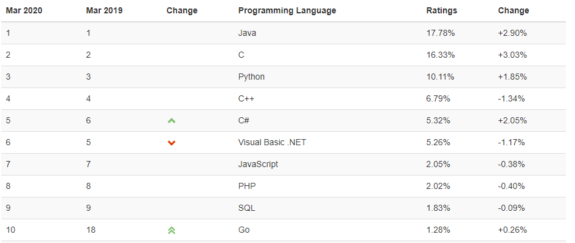

# 01-编程改变思维

## 1、为什么要学习编程？

你以为的计算机 -> 抽烟、喝酒、烫头…… -> 上网、聊天、打游戏

在我们的生活中有这么一群人，对世界的影响越来越大，如：

- 比尔盖茨 -> 创立了微软 -> 让计算机更容易被我们平常人使用
- 乔布斯 -> 创立了苹果 -> iPhone、iPad等每一样产品都在改变着我们的日常生活
- 谢尔盖·布林、拉里·佩奇 -> 创立了Google -> 让我们获得知识变得前所未有的容易
- 马克·扎克伯格 -> 创立Facebook -> 正在改变人与人之间的关系
- ……

这群人都有这么一个特征 -> 少年时酷爱编程

> 幸存者偏差？

对「计算机编程」的疑问三连：

- 它究竟有怎样的非凡魔力？
- 它是否给以上所提到的这些人带来了与常人不同的思维或思考方式？
- 它是否为以上所提到的这些人开启了不一样的人生道路？

话又说回来，他们从小就接触计算机了，为啥没有沉迷游戏？反而是改变了世界？

12岁的托马斯说到：

现在的孩子不再只是爱玩游戏 -> 还想自己制作更好玩的游戏 -> 不过，孩子们大多不知道到哪儿去学编程，而懂计算机编程的家长又少之又少

> 我觉得这书的作者是在为自己打广告 -> 即你们来找我为孩子们培训编程吧！ 

## 2、为啥要发明计算机？

计算机从被发明的那一天起，其使命就是**帮助我们提高学习和工作的效率，并且改变世界**。利用计算机编程，你可以轻松解决数学难题！

## 3、学计算机编程究竟是学什么？

**逻辑思维+编程思维**

20世纪50年代 -> 美国教育界就开始重视计算机编程教学

20世纪80年代后 -> 计算机编程教学逐渐进入中小学习，以教**程序设计语言**为主，目的是提高学生的逻辑推理、批判性思维和动手解决问题的能力

> 我一直认为这些逻辑推理能力、批判性思维能力通过看书习得，没想到可以借助编程这一途径来学习……本来，我还打算去看一本「一本小小的蓝色逻辑书」，现在想来，似乎没有必要了

实践证明，学习了计算机编程的中小学生 -> 思考问题的方式变得非常**逻辑化**，学会了**严密的逻辑推理方法**，并**无形中把它应用到其它学科的学习中**。

> 我在学习编程之前，我做事就是凭感觉的，感觉对了，就是对了……我高中物理考过8分（满分100），高考物理好像三四十分，我也不知道为啥物理就是学不会……难道我做题做少了？或许是我无法过多的深入思考吧！同样，我对做数学应用题也是菜得抠脚 -> 数学应用题+物理都比较贴近生活的，我无法把生活的问题进行抽象，然后再具象回去……或许，我是个过多关注于内心感受，而不是生活的人……我有个念头，那是重学高中物理，因为这个学科让我感到无能为力！我想要克服它……我想找到为啥不能学好它的原因…

➹：[高二物理20分，选择题完全避开正确答案，还能补救吗? - 知乎](https://www.zhihu.com/question/351906748)

➹：[物理真的很差，距离高考还有97天应该怎么补起来，选择题基本上都是蒙的，现在应该刷题还是怎么？ - 知乎](https://www.zhihu.com/question/376239015)

**学习计算机编程本质上是在学习一种思维方式——编程思维，它是一种思维体操**

青少年 -> 对计算机有着浓厚的兴趣，并且因为年轻，有着超强的记忆力

而「计算机编程」将**有助于开发其学习潜力，提高逻辑推理能力和解决问题的能力**。

学习计算机编程的过程充满乐趣 -> 如果你有一想法 -> 马上就可以通过编程来实现 -> 而且这可以立即看到效果（程序运行成功就有结果） -> 这种即时的反馈，会让你的学习兴趣变得越来越浓厚，也会让你越来越有信心 -> 而这种超强的信心，是你在其它学科中难以感受到的！

> 我之所以学前端，有一部分原因是因为「即时反馈」，即改一下代码，就能在页面看到效果了 -> 而在学习编程的过程中，我对学习其它东西，也变得不抗拒了，如我打算重学高中物理，我想感受一下编程这些年来自己的学习能力是否有所提高，而高中物理是一门让我在高中时期备受打击的科目！

吕凯风（目前是清华姚班的学生，15届）学习编程时的感受：

学习编程 -> 全凭兴趣，兴趣引导我前进 -> 以前做完作业打游戏，如今写完作业就编程

学会编程 -> 带给我的反馈 -> 自己能用编程来解决几乎所有遇到的数学问题 -> 学数学最强调技巧性 -> 如7的2000次方除以3的余数是多少？157是不是质数？等 -> 你也许可以用一些小技巧把这两个问题解决掉，但是当我们遇到更难的问题时，往往无能为力，如483、673、45789是不是质数？ -> 很多实际问题并不像数学中那么理想和美好，许多数学结论，尽管被证明得很巧妙，式子简洁，但是归根到底，**如果它只解决了一个特殊问题，则不具有什么实用价值**

所以我更喜欢信息学 -> 它告诉我**如何去解决一个一般化的问题**而不是一个特殊的有技巧性的问题 -> 编程最让我感慨的是它无与伦比的唯一性与严谨性。

> 我记得小野老师说过「整合能力比单纯写代码更重要」
> 
> 不知为何，我觉得吕凯风应该说这是「高中数学」（出题人因技巧性而构思问题，你只要找到这技巧性以及对这技巧性很熟悉就能解决，这技巧性就像根钥匙一样），而不是「数学」 -> 关于技巧性这东西，难道不是在脑海翻来覆去的结果？我们仅仅只是知道了这个技巧然后去解题，可这技巧性怎么来的，我们根本不知道它是如何被想出来的……这已经不是在解决这个数学问题了，而是灵感与创造的问题

## 4、本书讲什么？

这是一本编程入门书。但是本书的**重点并不是编程入门**，而是向你**展示逻辑思维和编程思维的魅力**，让你像程序员一样思考。

> 数学有数学思维 -> 让你像数学家那样思考？

## 5、这本书是写给谁看的？

编程类图书给大众的印象一直是枯燥并且难懂的。究竞什么样的人才能学习编程呢？大学生？高中生？初中生？……不会连小学生都可以吧？！没错，只要有小学四年级的水平，我想你一定可以学习编程，并且轻松读懂本书的全部内容。

> 字都能读懂，但是连起来就看不懂了！

如果你的情况恰好符合以下一点或几点，那么本书正是为你所写的。

1. 想自己写个游戏，而不是沉迷于他人的游戏
2. 对数学感兴趣 -> 学习编程并不需要精通数学，即便数学不好，甚至糟糕，也可以阅读本书
3. 对逻辑感兴趣 -> 与计算机展开逻辑较量是非常有意思的 -> 因为有时计算机是很不听话的，你告诉它要这样做，但它就是不听你的，此时一定是我们所编写的程序出现了逻辑问题 -> 将你的思维清晰有条理地变成计算机程序，就如同一场你与计算机之间的**逻辑对决** -> 学习计算机编程能很好地锻炼你的**逻辑思维能力**
4. 从小喜欢拆东西、装东西 -> 计算机编程会给你带来更多的创造机会
5. 正在读「高中数学必修三」的「算法」一章 -> 此书能该让你了解计算机编程和算法的本质
6. 正在学C的理工科或文科的大学生们
7. 准备学习编程的爱好者，或者准备以此为工作的人
8. 看了很多编程书籍但是一直没看懂的人 -> 读懂本书 so easy
9. 没有那么多原因，就是喜欢计算机 -> 或许这就是原因

## 6、为什么要写这本书呢？

正如前面所说，**计算机是一门科学**，如果你只是把它当成上网、聊天和玩游戏的工具，那就太可惜了，你将可能失去一个**发现自己才能**的机会。即使在计算机编程上有一些天赋，你也有可能失去这一机会。和其他人一样，你必须去**主动发现自己的天赋和兴趣，就好比你从来没有吃过冰淇淋，就不可能知道自己喜欢吃冰淇淋**。然而，如果学习了计算机编程，你就会发现计算机编程就如同玩游戏一样**有趣**，充满活力的思考过程就如同一场比赛令人兴奋。在感受到了计算机编程给你带来的乐趣后，你就再也不会沉迷于计算机游戏，**计算机编程将成为你生活中不可缺少的一部分，成为你的一种爱好，成为你的一种学习动力**。我想有更多人期待去了解计算机编程。

> 你不试试，不接触接触，你怎么知道自己是不是喜欢她？

## 7、选用哪一门编程语言入门？

学习编程的重点在于**学习编程的逻辑和思维**。本书选用较为简单的C语言。你可能要间为什么不选C++、C#、Java或者Python之类。因为我觉得相比之下**C语言最为单纯，没有那么多乱七八糟的东西，非常简洁**。即使以c语言为载体，我也尽量做到重点去讲解最有用的内容，而不是C语言的高深语法或者我至今都没有用过的“奇怪”语句。这样就有更多的时间**去思考如何解决问题，去关注编程的逻辑和思维**。

当然，说到底**C语言仅仅是我们与计算机沟通的一门语言**而已，相信你在阅读完本书之后，可以很**轻松地上手任何一门语言**，因为其**本质都是一样的**。

目前编程语言[流行](https://www.tiobe.com/tiobe-index/)排行榜：

C目前排第二，但这并不意味我们就应该去学排第一的Java，因为C是九阳神功呀！

以C为根本，将帮助我们**更好地去理解编程的思想，而不仅仅是学会编程**

另外我想告诉你，编程真的是一件非常有趣的事。你就像是一个指挥官，让计算机**毫无怨言地**为你工作。通过编程，你将体会到战胜困难和挑战后的快乐与满足。编程的世界充满无限的可能，**只有想不到，没有做不到**。当然在编程的时候也会遇到很多问题，我在书中也为你设置了绊脚石，希望你能够顺利地把它找出来。**尽信书，不如无书**。学习不但要**细致**，还要有**思辨**的能力，这样才会有创新，才能总结并创造出自己的东西。现在开始自己动手编程，不要放弃曾经的梦想，大胆地创造你的作品。

> 思辨 -> v -> 思考辨别（思辨是非正误） -> v -> 哲学上指运用逻辑推导进行理论上的思考（思辨性） -> 简单来说，思辨就是「解释」之意

## 8、对艾伦·凯的话有所启发？

艾伦·凯曾经这样说道：“**在自然科学中，是大自然给出一个世界，而我们去探索其中的法则。对于计算机来说，却是我们自己来构建法则，创造一个世界。**”

当下，我们的学习不应该再忙碌于重复的计算、记忆等技能。**阅读、逻辑推理和主动思考**等技能将成为学习的重点。我们应该使用计算机来增强自己的智能，同时发挥人类独有的创造天赋，让我们的思维插上计算机的翅膀。

> 计算思维？

> 这是一个有关「计算机编程」的神奇世界，在这里「编程」就是「吃饭」，我们要让「编程」变得好吃，就需要我们去探索和发现「食物」（代码）的魅力！

