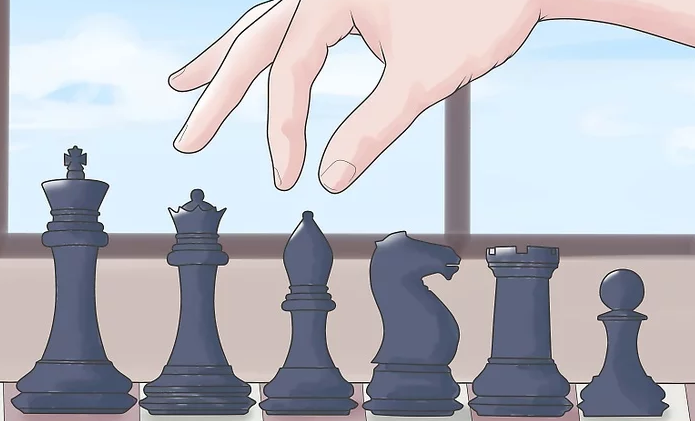
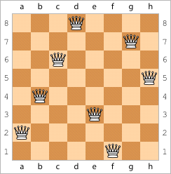
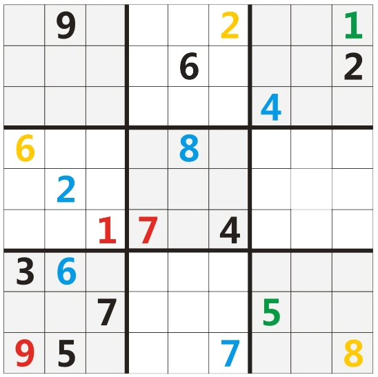
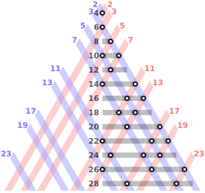

# 02-梦想起航

## 1、感受一下编程的魔力？

1）如何证明「2147483647」是个质数

2147483647 -> 是一个神奇的数字 -> 它是一个质数 -> 来自于欧拉的发现 -> 在当时那个年代，这就是世界已知的最大质数 -> 欧拉因此获得了「数学英雄」的美名

那么他是如何发现的呢？

1772 年，1707 年出生的欧拉今年 65 岁，但他此时早已双目失明（无休止的阅读、演算、书写，废寝忘食的工作，致使他的视力迅速减退），在这种情况之下，他以惊人的毅力靠心算证明了「2147483647」是一个质数。

> 2147483647 -> 也叫梅森素数 -> 二进制表示 31 个 1

然而，现在通过计算机，你只需要 1s 就可以证明「2147483647」是一个质数

2）八皇后问题

国际象棋规则：

有 6 种棋子 -> 王后象马车兵

> 兵有 8 个，除了王后各位为一个，其余都是一对的 -> 一方总共 16 个棋子 -> 8+6+2

后的走法：

> 后：形状像王后的王冠，是**最强大的棋子**。它可以横着走，竖着走，也可以斜着走，**每步格数不受限制**，并且可以攻击这些方向上的任何棋子。

➹：[3 种方法来下国际象棋（初学者）](https://zh.wikihow.com/%E4%B8%8B%E5%9B%BD%E9%99%85%E8%B1%A1%E6%A3%8B%EF%BC%88%E5%88%9D%E5%AD%A6%E8%80%85%EF%BC%89)

八皇后问题描述：

> 如何能够在 8×8 的国际象棋棋盘上放置八个皇后，使得任何一个皇后都无法直接吃掉其他的皇后？

为了达到此目的：

> 任两个皇后都不能处于同一条横行、纵行或斜线上

一种解决方案：

话说，如果我想知道所有的解决方案，那我该咋办呢？

难道我要一个个用笔在纸上划来划出吗？

不用的，用计算机就可以解决 -> 它只需要 **1s** 就可以算出不同的解 -> 一共有 **92** 种不同的解决方案

> 如何把棋盘、棋子抽象成在计算机里边的数据？如何把规则抽象成计算机里边的程序或者说是算法？

3）很流行的益智游戏——数独

数独的游戏规则：

> 在一个`9×9`格的大九宫格中有 9 个`3×3`的小九宫格。默认已经在其中填写了一些数字，现在请在其它的空格上填入 1 到 9 的数字。**每个数字在每个小九宫格内只能出现一次，每个数字在每行每列也只能出现一次**。

例子如下：

填写一种可行的解不需要多少时间，但是，你可知道上边这个数独一共有多少种不同的解吗？

一共有 **51965** 种不同的解哈！ -> 对于计算机来说，得出这个结果仍然只需要 **1s** 的时间！

4）哥德巴赫猜想

猜想：

> 任一大于 2 的偶数，都可表示成两个素数之和。

> 将一个偶数用两个素数之和表示的方法，等于同一横线上，蓝线和红线的交点数。

> 从中我了解到了什么叫枚举法，即2+2=4，3+3=6……13+7=20……

神奇的计算机，还可以轻而易举的在**一定范围内**去验证“哥德巴赫猜想”！

➹：[哥德巴赫猜想 - 维基百科，自由的百科全书](https://zh.wikipedia.org/wiki/%E5%93%A5%E5%BE%B7%E5%B7%B4%E8%B5%AB%E7%8C%9C%E6%83%B3)

➹：[知乎闹剧之“证明”的“哥德巴赫猜想” - 知乎](https://zhuanlan.zhihu.com/p/53756431)

> 数学的证明过程 -> 给我一种在看天书的赶脚 -> 数学真得要比编程难吗？还是说二者没有可比性，数学可以难到爆炸，而编程也可以难到爆炸……也有人说「编程意味着你还要学习数学的东西，也就是说学编程还得学数学，而学数学不一定要学编程」

➹：[高数难还是编程难？ - 知乎](https://www.zhihu.com/question/363815500)

➹：[学好高数更难还是自学一门编程语言更难？ - 知乎](https://www.zhihu.com/question/271724053)

➹：[我学编程为什么难？是思维方式不对还是学习方式不对？ - 知乎](https://www.zhihu.com/question/27436363)

➹：[数学不好能学编程吗？ - 知乎](https://www.zhihu.com/question/27947339)

➹：[如何评价数学的深渊这张图？ - 知乎](https://www.zhihu.com/question/60416243)

## 2、一场有趣的逻辑思维大战？

- 学会如何与计算机对话
- 如何让计算机进行数学计算和判断
- 如何让计算机永不停止地工作
- 如何让计算机做一些很有意思的程序和游戏

