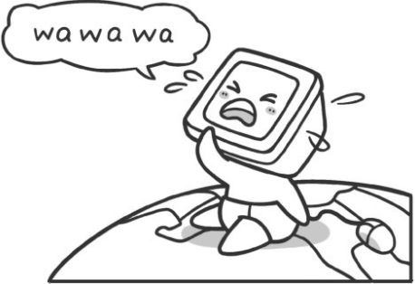
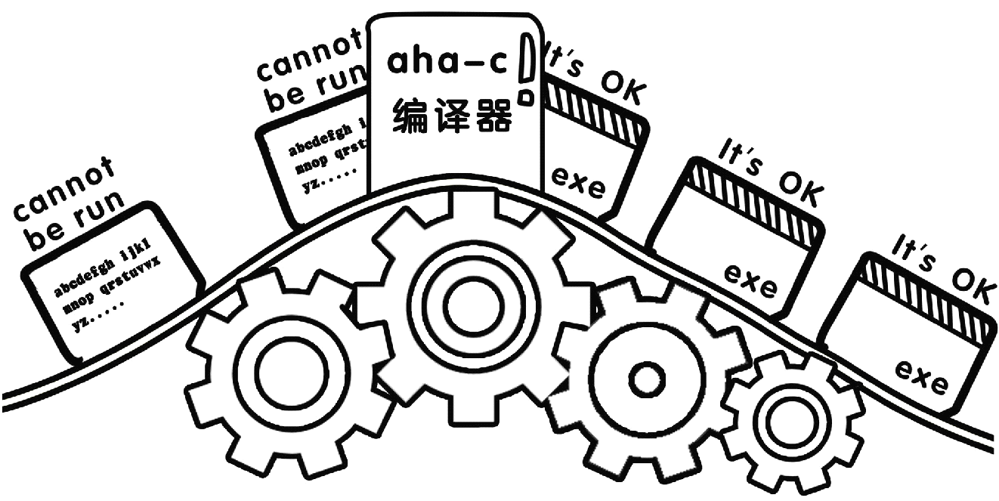
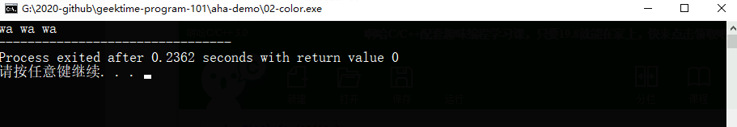
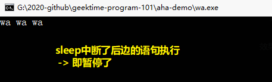
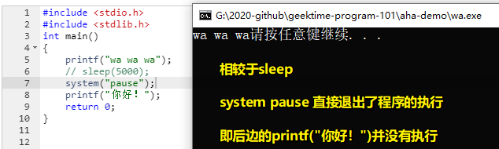
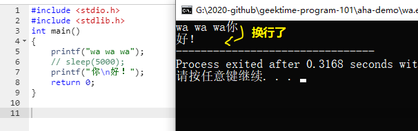

# 02-梦想起航

## 1、感受一下编程的魔力？

1）如何证明「2147483647」是个质数

2147483647 -> 是一个神奇的数字 -> 它是一个质数 -> 来自于欧拉的发现 -> 在当时那个年代，这就是世界已知的最大质数 -> 欧拉因此获得了「数学英雄」的美名

那么他是如何发现的呢？

1772 年，1707 年出生的欧拉今年 65 岁，但他此时早已双目失明（无休止的阅读、演算、书写，废寝忘食的工作，致使他的视力迅速减退），在这种情况之下，他以惊人的毅力靠心算证明了「2147483647」是一个质数。

> 2147483647 -> 也叫梅森素数 -> 二进制表示 31 个 1


然而，现在通过计算机，你只需要 1s 就可以证明「2147483647」是一个质数

2）八皇后问题

国际象棋规则：

有 6 种棋子 -> 王后象马车兵


> 兵有 8 个，除了王后各位为一个，其余都是一对的 -> 一方总共 16 个棋子 -> 8+6+2

后的走法：

> 后：形状像王后的王冠，是**最强大的棋子**。它可以横着走，竖着走，也可以斜着走，**每步格数不受限制**，并且可以攻击这些方向上的任何棋子。

➹：[3 种方法来下国际象棋（初学者）](https://zh.wikihow.com/%E4%B8%8B%E5%9B%BD%E9%99%85%E8%B1%A1%E6%A3%8B%EF%BC%88%E5%88%9D%E5%AD%A6%E8%80%85%EF%BC%89)

八皇后问题描述：

> 如何能够在 8×8 的国际象棋棋盘上放置八个皇后，使得任何一个皇后都无法直接吃掉其他的皇后？

为了达到此目的：

> 任两个皇后都不能处于同一条横行、纵行或斜线上

一种解决方案：


话说，如果我想知道所有的解决方案，那我该咋办呢？

难道我要一个个用笔在纸上划来划出吗？

不用的，用计算机就可以解决 -> 它只需要 **1s** 就可以算出不同的解 -> 一共有 **92** 种不同的解决方案

> 如何把棋盘、棋子抽象成在计算机里边的数据？如何把规则抽象成计算机里边的程序或者说是算法？

3）很流行的益智游戏——数独

数独的游戏规则：

> 在一个`9×9`格的大九宫格中有 9 个`3×3`的小九宫格。默认已经在其中填写了一些数字，现在请在其它的空格上填入 1 到 9 的数字。**每个数字在每个小九宫格内只能出现一次，每个数字在每行每列也只能出现一次**。

例子如下：


填写一种可行的解不需要多少时间，但是，你可知道上边这个数独一共有多少种不同的解吗？

一共有 **51965** 种不同的解哈！ -> 对于计算机来说，得出这个结果仍然只需要 **1s** 的时间！

4）哥德巴赫猜想

猜想：

> 任一大于 2 的偶数，都可表示成两个素数之和。


> 将一个偶数用两个素数之和表示的方法，等于同一横线上，蓝线和红线的交点数。

> 从中我了解到了什么叫枚举法，即 2+2=4，3+3=6……13+7=20……

神奇的计算机，还可以轻而易举的在**一定范围内**去验证“哥德巴赫猜想”！

➹：[哥德巴赫猜想 - 维基百科，自由的百科全书](https://zh.wikipedia.org/wiki/%E5%93%A5%E5%BE%B7%E5%B7%B4%E8%B5%AB%E7%8C%9C%E6%83%B3)

➹：[知乎闹剧之“证明”的“哥德巴赫猜想” - 知乎](https://zhuanlan.zhihu.com/p/53756431)

> 数学的证明过程 -> 给我一种在看天书的赶脚 -> 数学真得要比编程难吗？还是说二者没有可比性，数学可以难到爆炸，而编程也可以难到爆炸……也有人说「编程意味着你还要学习数学的东西，也就是说学编程还得学数学，而学数学不一定要学编程」

➹：[高数难还是编程难？ - 知乎](https://www.zhihu.com/question/363815500)

➹：[学好高数更难还是自学一门编程语言更难？ - 知乎](https://www.zhihu.com/question/271724053)

➹：[我学编程为什么难？是思维方式不对还是学习方式不对？ - 知乎](https://www.zhihu.com/question/27436363)

➹：[数学不好能学编程吗？ - 知乎](https://www.zhihu.com/question/27947339)

➹：[如何评价数学的深渊这张图？ - 知乎](https://www.zhihu.com/question/60416243)

## 2、一场有趣的逻辑思维大战？

- 学会如何与计算机对话
- 如何让计算机进行数学计算和判断
- 如何让计算机永不停止地工作
- 如何让计算机做一些很有意思的程序和游戏

## 3、如何让计算机开口说话？

为啥会有计算机出现？

伟大的人类发明的每一样东西都是为了帮助我们改善生活。计算机同样是用来帮助我们的工具。

如果我们想要计算机帮我们做一件事情，那么我们首先得干啥？

显然就是与计算机进行沟通

既然需要沟通，那么就得需要依赖一门语言。

我们人类是怎么沟通的？ -> 可以通过 -> 如肢体语言、汉语、英语等来沟通

那我们**人类若要与计算沟通，那就得需要使用一门计算机能够听懂的语言** -> 如 C 语言便是计算机语言的一种 -> 除此之外还有 C++、Java 等 -> 不过这些都是高级语言 -> 与之相对应的还有低级语言，如汇编语言、机器语言

➹：[低级语言和高级语言的区别 - 知乎](https://zhuanlan.zhihu.com/p/65746260)

C 语言 -> 一门比较简单的计算机语言 -> 相较于其它高级语言，更适合初学者学习 -> 所有的计算机语言都是相通的 -> 如果你能**熟练掌握** C 语言，那么再学习其它语言就会变得易如反掌

话又说回来，**我们如何才能让计算机开口说话并把它所知道的东西告诉我们呢？** -> 毕竟它是用来帮助我们人类计算的东西，如果不把计算结果告知我们岂不是一点用处都没有？

我们人类 -> 一出生，来到这个世界所说的第一句话是「wa wa wa」……一阵哭声 -> 可不是「你好！世界」

同样地，我们第一次与计算机打交道，计算机对我们而言就如同「婴儿」一般：


因此，**我们要让计算机「哭」起来**。

对于这个「婴儿」来说，它想把话说给我们听，有两种姿势：

1. 把话显示在显示器屏幕上
2. 用喇叭发出声音告诉我们

对比我们人类有话想说时：

1. 写在纸上
2. 用嘴巴说出来

基于目前我们的知识量不多，所以让计算机用音箱输出声音还是比较麻烦滴，所以我们只好采用第一种姿势，即用屏幕输出「wa wa wa」啦！



让计算机说话 或者说 我们主动给计算机发出一条指令：

``` c
printf("wa wa wa");
```

`printf` -> 等同中文的「说」，英文的「say」 -> 简单来说，它就是一个用来控制计算机说法的单词 -> `printf`后边跟着的`()`就像一个「嘴巴」 -> 把「要说的内容」放在这个嘴巴「里边」 -> 注意 -> wa wa wa 两边有双引号哈！双引号里边的内容才是计算机这个「婴儿」所要说的内容哈！

**我们知道在写作文的时候，一句话的结束要有一个结束的符号。**

- 在汉语里边，我们用句号`。`表示一句话的结束
- 在英语里边，我们用点号`.`表示一句话的结束
- 在计算机语言里边，则是用分号`;`表示一个语句的结束

**注：计算机的每一句话，就是一个语句。**

所以，如果我们想要让计算机说「ni hao」 -> 那么就得写一个语句：

``` c
printf("ni hao");
```

让计算机运行这个语句，注意，如果仅仅只有这条语句，计算机是识别不了的，你得需要再加上一个框架才行，完整的程序如下：

``` c
#include <stdio.h>
#include <stdlib.h>
int main()
{
    printf("wa wa wa");
    return 0;
}
```

这里的：

``` c
#include <stdio.h>
#include <stdlib.h>
int main()
{
    return 0;
}
```

是所有 C 语言都必须要有的框架。目前，你不需要了解它，反正你就记住没有这个东东，程序是无法跑起来的……

**注：今后写的所有类似`printf`这样的语句都要写在这一对`{}`之间，因为这样才会起作用**

话又说回来，我们要让计算机运行我们所写的东西（其实就是一个 c 语言程序），需要一个特殊的软件——「C 语言编译器」 -> C 语言编译器有很多种，在这里介绍一种比较简单的软件——「啊哈 C」



> 软件下载：[一款简洁可爱的 C/C++编译器 - 啊哈 C](https://www.ahacpp.com/)
>
> “啊哈 C”是一个 C 语言集成开发环境，使用的 gcc 的内核。

点击「运行」按钮 -> 计算机就会把你所写的代码运行起来 -> 如果代码没错 -> 「啊哈C」会弹出一个对话框则有「编译成功」字眼 -> 最后出现「运行」成功字眼



> 把这个终端看做是一个「黑影」

**注：输入的代码，一定不要是通过中文输入法输入的，这里出现的所有符号都是英文的，而且一般也都是小写的，还有一定是「半角输入法」的**

小结：

- 学到了什么？
  - 如何让计算机这个「婴儿」开口说话 -> 我们选择「写字」 -> 通过编译器把我们写的「稿子」编译成计算机可执行的「exe」文件 -> 运行「exe」文件，计算机就会弹出一个「黑影」 -> 这个黑影就是计算机这个「婴儿」说话的平台 -> 我们日常浏览网页，所看到的信息都是计算机这个「青少年」在说话
  - 让计算机开口说话的语句是啥？ -> `printf("wa wa wa");`

## 4、关于 C 语言编译器？

“C 语言编译器”的作用就是**把我们写的程序“变”成一个“exe”可以让计算机直接运行的程序**。**这个“变”的过程的专业术语叫做“编译”**。当你的程序“变”成一个“exe”后，你就可以脱离“C 语言编译器”直接运行你的程序了。此时你就可以把你写的 exe 发给你的朋友和同学让他们一起来使用你编写的程序了。这里程序从某种意义上来讲也可以叫做“软件”。

## 5、sleep？pasus？

``` c
sleep(5000);
```

sleepj ->表示暂停 -> 圆括号里边的数字表示需要暂停的时间 -> 单位是ms -> 1000ms为1s

> 我测试了一下单位应该是s才对

以前的终端，如果没有这条语句，那么C程序编译运行，就会闪出一个「黑影」，而这个黑影一瞬间就会自动消失，毕竟计算机的运行速度实在是太快了

完整的C程序代码：

``` c
#include <stdio.h>
#include <stdlib.h>
int main()
{
    printf("wa wa wa");
    sleep(5000);
    printf("你好！");
    return 0;
}
```

效果：



> 书中是有错误的，我等了5s也不见会走下一条语句，所以5000是指5000s哈！

`system("pause")`也是暂停程序执行，按下任意键即可让程序继续执行下去：



> 图中的标注 -> 我理解错了

`sleep()` 与 `system("pause")` 的区别：

- `sleep()` -> 自行设定暂停时间，暂停时间一过，会自动走下边的语句 -> 有点像JS里边的`setTimeout` -> 类似于把后边的语句给「冻结」了，xx s后才解冻……
- `system("pause")` -> 你想让程序走，直接在「黑影」里边摁任意键就可以走了 -> 你想走就走，不想走就等着……

**二者都没有让程序执行直接退出，都是暂停了程序，前者到点就继续走，而后者需要你主动按下任意键才能继续走，走完之后，也就意味着程序执行完毕了**。

## 6、换行符？




