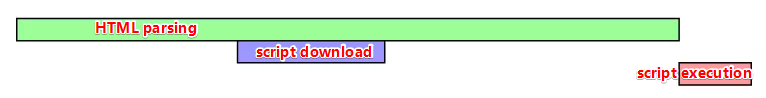
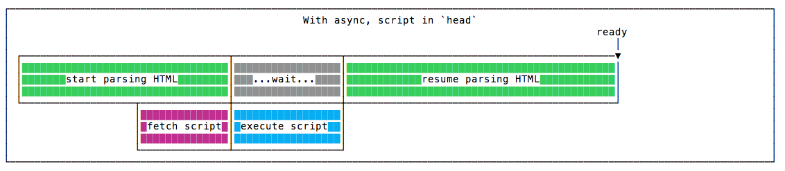
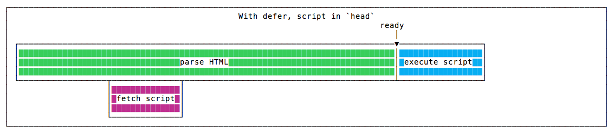

# The document heading

## ★The document heading

`head` 标签包含用于**定义文档属性**的特殊标签。

那 `head` 标签写在哪儿呢？

> 它总是写在 body 标签之前，紧挨着 html 开标签的后边

``` html
<!DOCTYPE html>
<html>

<head>
  <!-- ... -->
</head>
<!-- ... -->

</html>
```

我们从不在这个标签上使用任何属性，也不在其中编写任何内容

它只是一个用于容纳其它标签的容器罢了。根据你的需要，我们可以在里边放置各种各样的标签：

* `title` 
* `script` 
* `noscript` 
* `link` 
* `style` 
* `base` 
* `meta` 

### ◇The `title` tag

`title` 标签用于确定页面的标题。标题在浏览器中显示，而这一点尤为重要，因为它是搜索引擎优化（Search Engine Optimization，SEO）的关键因素之一。

### ◇The `script` tag

该标签用于把 JS 添加到页面里边去。

你可以把 JS 代码内嵌（inline）其中，即「开标签」JS 代码「闭标签」这样子：

``` html
<script>
  ..some JS
</script>
```

或者你可以使用 `src` 属性来加载一个外部的 JavaScript 文件：

``` html
<script src="file.js"></script>
```

> 默认情况下， `type` 属性被设置为 `text/javascript` ，因此这是一个完全可选的属性！说白了，你写不写都行！

关于这个标签有一些非常重要的事情需要知道。

有时，在页面底部的 `</body>` 标签之前使用该标签。可这是为啥呢？——这是出于对性能的考虑哈！

默认情况下，脚本的加载会阻塞页面的渲染，直到脚本被解析（parsed）、加载（loaded）结束

> 加载？下载脚本 -> 解析？脚本解析执行 -> 话说，脚本应该下载完后再去解析执行吧！ -> DOM的解析是顺序+渐进式的，即逐行解析html，然后构建DOM树，CSSOM、把不完全的renderTree直接先渲染出来，说白了「渐进式则指得是浏览器会迫不及待的将解析完成的部分显示出来」

➹：[浏览器是如何解析html的？ - 掘金](https://juejin.im/post/5c1dde33f265da61776bf49a)

通过将脚本放在页面底部，在整个页面已经被解析和加载之后，脚本才会被加载并执行，而这会给用户带来更好的体验，而不是将脚本直接搞在 `head` 标签中。

总之，我的观点是，对现在而言，这是一个糟糕的做法，即让 `script` 留在 `head` 标签中。

在现代的 JavaScript 中，我们有一个替代方案，而这比让 `script` 保留在页面底部更加高效 —— `defer` 属性。 这是一个加载 `file.js` 文件的例子，相对于当前路径的URL:

``` html
<!-- 放在head里边 -->
<script defer src="file.js"></script>
```

这种方案会触发fast-loading页面，以及 fast-loading JS的快速路径

> This is the scenario that triggers the faster path to a fast-loading page, and fast-loading JavaScript.



> 外链defer JS -> HTML解析 -> 遇到这类script标签不阻塞解析，而是会异步请求，然后把下载完毕的代码暂存到一个队列里边去 -> 等整个HTML解析完成后，再按队列的顺序执行JS

> Note： `async` 属性与之类似，但在我看来，这比 `defer` 还要糟糕，为啥这样说呢？我在 <https://flaviocopes.com/javascript-async-defer/> 详细描述了原因！



而defer则是这样的：



### ◇The `noscript` tag

当浏览器禁用了脚本，那么这个标签就会检测到

> Note：在浏览器的设置里边，用户可自行选择禁用JS 脚本。或者浏览器默认就不支持它们

根据放在文档头部（head）还是放在文档正文（body）中的不同，它的使用也会有所不同

我们现在讨论的是文档头（document head），因此让我们首先介绍一下 `noscript` 在文档头里边的这种用法。

在这种情况下， `noscript` 标签只能包含其他标签:

* `link` tags
* `style` tags
* `meta` tags

如果脚本被禁用了，则修改页面所提供的资源或 `meta` 信息。

在这个例子中，我用 `no-script-alert` class设置了一个元素，以便在脚本被禁用时显示，因为它默认情况下就是 `display:none` 哈：

``` html
<!DOCTYPE html>
<html>

<head>
  ...
  <noscript>
    <style>
      .no-script-alert {
        display: block;
      }
    </style>
  </noscript>
  ...
</head>
...

</html>
```

> 让我们来解决另一种情况: 如果放在正文（body）中，它可以包含在 UI 中所渲染的内容（content），比如段落和其它标签……

### ◇The `link` tag

`link` 标签用于设置文档和其他资源之间的关系。

它主要用于链接（link）要加载的外部 CSS 文件。

> 说白了link标签是当前文档与其它资源的纽带哈！就像是Node.js 与MongoDB之间的纽带是mongoose一样

此元素没有闭标签。

用法（Usage）：

``` html
<!DOCTYPE html>
<html>

<head>
  ...
  <link href="file.css" rel="stylesheet">
  ...
</head>
...

</html>
```

`media`属性允许根据设备功能（device capabilities）的不同来加载不同的样式表（stylesheets）：

``` html
<link href="file.css" media="screen" rel="stylesheet">
<link href="print.css" media="print" rel="stylesheet">
```

> 用于打印页面的，那就激活print.css这个样式表；默认情况下，media是screen值，表示计算机屏幕

➹：[HTML `<link>` 标签的 media 属性](https://www.w3school.com.cn/tags/att_link_media.asp)

我们还可以链接到样式表以外的资源。

例如，我们可以使用以下方法来关联RSS订阅

``` html
<link rel="alternate" type="application/rss+xml" href="/index.xml">
```

➹：[如何用RSS订阅？ - 掘金](https://juejin.im/post/5c382a326fb9a049f15469eb)

或者我们可以联合favicon来一起使用：

``` html
<link rel="apple-touch-icon" sizes="180x180" href="/assets/apple-touch-icon.png">
<link rel="icon" type="image/png" sizes="32x32" href="/assets/favicon-32x32.png">
<link rel="icon" type="image/png" sizes="16x16" href="/assets/favicon-16x16.png">
```

此标签还用于多页面（multi-page）内容，使用`rel="prev"`和`rel="next"`可以指示前一页和下一页。而这主要用于谷歌的搜索引擎可以爬取到你的分页内容。但到了2019年，谷歌[宣布](https://twitter.com/googlewmc/status/1108726443251519489)不再使用这个标签的这种`rel=prev/next`用法了，因为没有它谷歌搜索引擎也可以找到正确的页面结构。

> 宣布中提到「用户只关心单页内容，至于多页不太关心，所以把rel=prev/next给kill掉了」，但有些电商网站就骂了，因为总不能让它们的产品列表都在同一个页面显示吧，然后通过滚动懒加载这种姿势来搞吧！不过也有很多网站根本就咩用过rel=prev/next。但其实Googlebot足够聪明，你不需要明确rel=prev/next，它也可以正确的找到这个页面的上一页和下一页。

> rel=prev/next  -> 之前是用于做SEO优化的！ -> 用法：在head标签中使用，第一个分页只有next，最后一个分页只有prev，中间的有next/prev -> 可见这上下都有边界 -> 而这就是标准规则

➹：[SEO:分页使用rel=“next” 和 rel=“prev” -解道Jdon](https://www.jdon.com/idea/js/rel-prev-net.html)

➹：[Rel = Next / Prev＆SEO：Google抓取行為的見解 - SEO-軍火庫](https://www.twseo.com.tw/rel-next-prev%EF%BC%86seo%EF%BC%9Agoogle%E6%8A%93%E5%8F%96%E8%A1%8C%E7%82%BA%E7%9A%84%E8%A6%8B%E8%A7%A3/)

➹：[W3C HTML5标准阅读笔记 – link元素](http://blog.shaochuancs.com/w3c-html5-link/)

### ◇The `style` tag

该标签可用于向文档里边添加样式，注意，这可不是加载外部样式表哈！

用法：

``` html
<style>
.some-css {}
</style>
```

和 `link` 标签一样，你也可以使用 media 属性来宣告仅在指定的媒体（medium）上使用该 CSS:

``` html
<style media="print">
.some-css {}
</style>
```

### ◇The `base` tag

此标签用于为页面中包含的所有相对URL设置一个 base URL。

``` html
<!DOCTYPE html>
<html>
  <head>
  ...
    <base href="https://flaviocopes.com/">
  ...
  </head>
  ...
</html>
```

``` html
<!DOCTYPE html>
<html>
<head>
  <meta charset="utf-8">
  <meta name="viewport" content="width=device-width">
  <title>JS Bin</title>
  <base href="https://ppambler.github.io">
</head>
<body>
  <!-- href -> https://ppambler.github.io/xdmala/  -->
  <a href="xdmala">你好</a>
</body>
</html>
```

### ◇The `meta` tag

元标签执行各种各样的任务，它们非常非常重要。

尤其是 SEO。

`meta` 元素只有开标签。

最基本的一个是`description`元标签：

``` html
<meta name="description" content="A nice page">
```

如果Google发现它比页面上的内容更好地描述了页面，那么Google可能会使用它来生成结果页面中的页面描述(不要问我怎么做到的) 


`charset` 元标签用于设置页面字符编码。

大多数情况下是 `utf-8`:

``` html
<meta charset="utf-8">
```

`robots`meta标签指示搜索引擎bots是否为页面建立索引：

``` html
<!-- 告诉搜索引擎不要索引页面，默认值是index -->
<meta name="robots" content="noindex">
```

或者它们是否应该跟踪（follow）链接：

``` html
<!-- 
告诉爬虫不要关注页面上的任何链接，也不需要传递任何链接的权重
 -->
<meta name="robots" content="nofollow">
```

> 你也可以在单个链接上设置`nofollow`。这就是如何全局设置`nofollow`的方法。

你可以将它们组合起来使用：

``` html
<meta name="robots" content="noindex, nofollow">
```

注意：默认行为是 `index`，`follow`。

你可以使用其他属性，这包括 `nosnippet`、 `noarchive`、 `noimageindex` 等。

➹：[Meta Robots - 知乎](https://zhuanlan.zhihu.com/p/56496818)

➹：[三分鐘搞懂 SEO的《meta robots、robots.txt》 - Harris先生](https://www.yesharris.com/meta-robots-and-robots-txt/)

你也可以只告诉 Google，而不是针对所有的搜索引擎:

``` html
<meta name="googlebot" content="noindex, nofollow">
```

其它搜索引擎可能也有自己的meta标签。

说到这儿，我们可以告诉谷歌禁用某些功能。这就阻止了搜索引擎结果中的翻译功能:

``` html
<meta name="google" content="notranslate">
```

`viewport` meta 标签用于告诉浏览器根据设备宽度设置页面宽度。

``` html
<meta name="viewport" content="width=device-width, initial-scale=1">
```

> 基于设备宽度来设置页面宽度

[有关这个标签的更多的内容](https://developer.mozilla.org/en-US/docs/Mozilla/Mobile/Viewport_meta_tag)

另一个相当流行的meta标签是`http-equiv="refresh"`。

这一行告诉浏览器等待3秒，然后重定向到另一个页面：

``` html
<meta http-equiv="refresh" content="3;url=http://flaviocopes.com/another-page">
```

> 难怪我之前发送了一个请求 -> 响应回来 -> 自动刷新页面然后重定向到了另外一个页面

使用0而不是3会尽快重定向。

这不是完整的reference; 还存在其他使用较少的meta标签。

document heading 介绍完之后，我们可以开始深入document body（正文）了。


