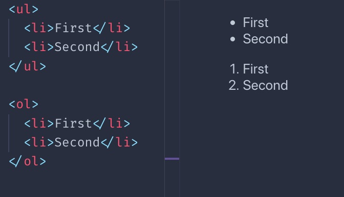

# Tags that interact with text

## ★The `p` tag

该标签定义了一段文本（a paragraph of text）。

``` html
<p>Some text</p>
```

> 或者说是 p 标签声明了这文本是个段落

它是个块元素。

在它内部，我们可以添加任何我们喜欢的内联元素，比如 `span` 或者 `a`

我们不能添加块元素。

我们不能将一个 p 元素嵌套到另一个 p 元素中。

默认情况下，浏览器为段落设置样式，即在顶部和底部留有空白。 在 Chrome 中为 16px，但实际值可能因浏览器而异。

> 有默认的 margin

这导致两个连续的段落被隔开，从而复制了我们在打印文本中所认为的“段落”（paragraph）。

> 说白了，我们不需要自己去调样式，用默认的样式就可以了

## ★The `span` tag

这是一个内联元素，可被用于在段落中创建一个片段（section），而这个片段可被作为使用 CSS 的目标片段：

``` html
<p>A part of the text <span>and here another part</span></p>
```


## ★The `br` tag

此标签表示换行符（line break），它是内联元素，不需要结束标签。

我们使用它在 `p` 标签中创建新行（new line），而无须创建新段落。

与创建新段落相比，它不会增加额外的间距（additional spacing）。

``` html
<p>Some text<br>A new line</p>
```


## ★The heading tags

HTML 为我们提供了 6 个标题（heading）标签。从最重要的到最不重要的，我们有`h1`, `h2`, `h3`, `h4`, `h5`, `h6`。

通常一个页面有一个 h1 元素，即页面标题。然后根据页面内容可能有一个或多个 h2 元素。

标题，特别是标题的组织，对 SEO 来说也是必不可少的，搜索引擎以各种方式使用它们。

> h1 是 SEO 优化的一个很关键的点，用户能否搜索到你的网站、文章就看它了
>
> 页面只能出现一个 h1

➹：[How to Create the Perfect H1 Tag for SEO](https://neilpatel.com/blog/h1-tag/)

➹：[The SEO Guide for H1 - H6 Header Tags](https://seranking.com/blog/header-tags/)

默认情况下，浏览器渲染的`h1`标签会更大，并且元素的大小（size）随着`h`一旁的数字的增加而减小：


所有的标题都是块元素。它们不能包含其它元素，只能包含文本（text）

## ★The `strong` tag

此标签用于将其中的文本标记为 strong。这很重要，不过，它不是一个视觉提示（visual hint），而是一个**语义提示**（semantic hint）。根据所使用的媒介（medium），其解释将有所不同。

默认情况下，浏览器会将此标签中的文本**加粗**（bold）。

## ★The `em` tag

此标签用于将其中的文本标记为_强调的_（emphasized）。同`strong`一样，它不是一个视觉提示，而是一个**语义提示**。

浏览器默认将文本设置为**斜体**（italic）。

## ★Quotes

`blockquote` HTML 标签可用于在文本中插入引文（citations），说白了，你引入了他人所说的话，那么你就需要用这个标签来标记这段话

默认情况下，浏览器对`blockquote`元素应用** margin**。

Chrome 会应用一个左右** 40px **的 margin，以及上下** 10px **的 margin。

`q` HTML 标签则是**内联的引号**（quotes）。

## ★Horizontal line

它不是一个真正的基于文本的存在，但是`hr`标签通常用于页面内部。它表示`horizontal rule`（水平线、水平分割线、水平尺），即用了它之后可以在页面中添加一条**水平线**。

它的存在，有助于**分隔**页面中的各个部分（sections）。

## ★Code blocks

`code`标签在显示代码时特别有用，因为浏览器给它一个**等宽**（monospaced）字体。

这通常是浏览器做的唯一一件事，下面是 Chrome 应用的 CSS：

``` css
code {
  font-family: monospace;
}
```

此标签通常被`pre`标签包裹着，因为`code`元素忽略空白（whitespace）和换行符（line breaks）。就像`p`标签那样。

Chrome 给`pre`提供了默认的样式：

``` css
pre {
  display: block;
  font-family: monospace;
  white-space: pre;
  margin: 1em 0px;
}
```

它可以防止**空白区域折叠**（white space collapsing）并使其成为块元素。


## ★Lists

我们有三种类型（types）的列表：

- 无序列表（unordered lists）
- 有序列表（ordered lists）
- 定义列表（definition lists）

无序列表是使用`ul`标签创建的。而列表（list）中的每一项（item）都是用`li`标签创建的：

``` html
<ul>
  <li>First</li>
  <li>Second</li>
</ul>
```

有序列表与之类似，只是使用 `ol` 标签：

``` html
<ol>
  <li>First</li>
  <li>Second</li>
</ol>
```

两者之间的区别在于，有序列表在每个 item（翻译成「条目」比较好）之前都会有个数字：



定义列表有点不同。你得有一个**术语**（term）以及它的**定义**（definition）：

``` html
<dl>
  <dt>Flavio</dt>
  <dd>The name</dd>
  <dt>Copes</dt>
  <dd>The surname</dd>
</dl>
```

浏览器通常以这种方式来呈现它们：


我必须说，你很少在野外（wild）看到它们，肯定不会像`ul`和`ol`那样多，当然，有时它们可​​能会很有用。

## ★Other text tags

有许多具有表示目的（presentational purposes）的标签：

- the `mark` tag
- the `ins` tag
- the `del` tag
- the `sup` tag
- the `sub` tag
- the `small` tag
- the `i` tag
- the `b` tag

这是它们的视觉渲染（visual rendering）的示例，默认情况下，浏览器会应用它们：


你可能会问，`b`和`strong`有什么不同？`i`和`em`又有什么不同？

区别在于**语义**。虽然 `b` 和 `i` 都是向浏览器直接提示**让一小块文本粗体化或斜体化**，但`strong`和 `em` 则是赋予文本一个**特殊的意义**（special meaning），它们的样式取决于浏览器给定的样式。默认情况下，它们恰好与`b`和`i`完全相同哈。尽管你可以用 CSS 改变它们。

还有许多其它较少使用的**与文本相关的**标签。我只是提到了我看到的使用最多的那些。

> 根据二八定律，以上作者所提到的这些标签足矣完成我们日常的工作需要了！

> 入门上手的最快方式：了解常用的，而哪些是常用的？我想一定会有人归纳出来，就如这本书的作者一样 -> 说白了，就是抓住主要矛盾


