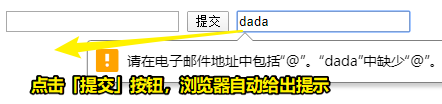

# Forms

## ★Forms

表单是你与使用 Web 技术构建的页面或应用程序进行**交互**的一种方式

> 用户 -> 表单 -> 交互 -> page or app

你有一组控件，当你通过单击“submit”按钮或通过编程（programmatically）提交表单时，浏览器将向服务器发送数据（send data）。

默认情况下，这种数据发送会导致页面在数据被发送之后重新加载（reload），但是使用 JavaScript 可以改变这种行为（在本书中不会解释这该如何改变）。

一个表单是使用`form`标签创建而来的：

``` html
<form>
...
</form>
```

默认情况下，表单是使用 GET HTTP 方法提交的。 不过，这有其缺点，通常您更希望使用 POST。

您可以通过使用 `method` 属性设置表单在提交时使用 POST：

``` html
<form method="POST">
...
</form>
```

使用 GET 或 POST 将表单提交到它所在的同一个 URL。

因此，如果表单在 `https://flaviocopes.com/contacts` 这个地址的页面里边，那么按下“submit”按钮将向该 URL 发出请求。

这可能会导致什么都不会发生。

您需要一些在服务器端（server-side）的东西来处理这个请求，通常您会“监听”（listen）这些在专用 URL（a dedicated URL）上的表单提交事件。

你可以通过 `action` 参数（parameter）指定 URL:

``` html
<form action="/new-contact" method="POST">
...
</form>
```

这将导致浏览器使用 POST 将表单数据提交到同一来源的`/new-contact` URL。

如果来源（协议+域+端口）为 `https://flaviocopes.com`（默认端口 80），那么这则意味着表单数据将会被发送到 `https://flaviocopes.com/new-contact`。

> origin (protocol + domain + port)

我谈到了数据。但，这是哪些数据呢？

**数据**是由用户通过 Web 平台上的**一组控件**（set of controls）所提供的：

- input boxes (single line text)
- text areas (multiline text)
- select boxes (choose one option from a drop-down menu)
- radio buttons (choose one option from a list always visible)「从始终可见的列表中选择一个选项」
- checkboxes (choose zero, one or more option)
- file uploads
- and more!

让我们在以下表单字段（form fields）概述中介绍其中的每一个。

## ★The `input` tag

`input`字段是使用最广泛的表单元素之一。 它也是一个非常通用的元素，它可以根据 `type` 属性来完全改变自身的行为（behavior，表现）。

默认行为是成为一个单行文本输入控件（single-line text input control）：

``` html
<input>
```

等同于使用：

``` html
<input type="text">
```

与随后的其他的所有字段一样，您需要**为字段指定一个名称**，以便在提交表单时将其内容发送到服务器：

``` html
<input type="text" name="username">
```

> 服务器那边的程序会根据 name 属性来接收表单的参数值！

`placeholder`属性用于在字段为空（empty）时显示（showing up）一些浅灰色的文本。可用于向用户添加一个**提示**，以便告诉用户输入什么：

``` html
<input type="text" name="username" placeholder="Your username">
```

## ★Email

使用`type="email"`，client-side (in the browser)将验证用户输入的email的正确性（语义正确性，而不是确保email地址是存在的），然后再提交。

``` html
<input type="email" name="email" placeholder="Your email">
```



> 这样一来我们就不需要用正则来校验了，不过这默认样式有点丑哈！

## ★Password

使用`type="password"`将使输入的每个键（key）显示为星号(*)或着是点（dot），这对于存放密码（password）的字段非常有用：

``` html
<input type="password" name="password" placeholder="Your password">
```

## ★Numbers

你可以让一个 input 元素只接受数字（numbers）:

``` html
<input type="number" name="age" placeholder="Your age">
```

您还可以指定接受的最小值和最大值：

``` html
<input type="number" name="age" placeholder="Your age" min="18" max="110">
```

> 如果不在 `[18,110]`这个区间，那么当你提交按钮时，浏览器会给出提示而不让你提交

`step` 属性用来帮助确定两个不同值之间的差值。

例如，它接受一个介于10到50之间的值，步幅是5：

``` html
<input type="number" name="a-number" min="10" max="50" step="5">
```

> 输入的值只能是5的倍数，而且在`[10,50]`之间，每次输入的值递增或递减都是+5或-5

## ★Hidden field


