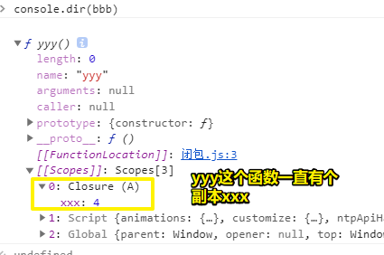
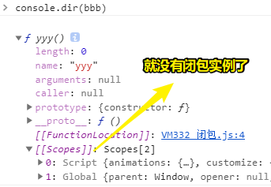
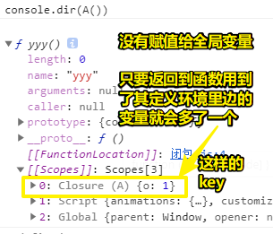
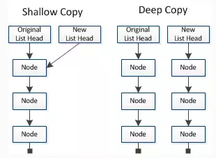

# 1~10

## 1、如何 debug nodejs 程序？

姿势一：

在chrome的dev tools里边调试

1. 调试非服务脚本
2. 打开 `chrome://inspect` -> Remote Target
3. 运行 `node --inspect-brk=9229 debug.js` -> 在代码的第一行打上断点！即代码一运行就是暂停状态 -> 看到Remote Target下边有个链接 -> 点开它，我们的node成代码就开启debug模式了！

➹：[Node 调试工具入门教程 - 阮一峰的网络日志](http://www.ruanyifeng.com/blog/2018/03/node-debugger.html)

## 2、JS的变量声明？定义？

> 搜索未定义js

> 附录A：JS 高级特性 -> A.1.1函数作用域

* 变量声明 -> 告诉编译器或解析器有这个变量存在，但不分配内存空间 -> var a
* 定义 -> 为变量分配内存空间，在C语言中，一般声明了变量就意味着变量被定义了，我们这样做 `var a` ，所以解析器给了a的值是 `undefined` ，即a这个变量是未定义的哈！
* 初始化 -> 给变量一个有意义的值 -> 如 `var a = 'hi'` ， `var a` 这样的a是咩有状态的，但我们 `var a = 'hi'` 这样做了，意味着a有了状态，而这叫做「**声明a变量并初始化为'hi'**」 -> 初始化了变量a意味着a有了分配好的内存空间
* 赋值 -> 改变变量的状态，如 `var a = 1;a=2` -> 变量的状态被改变了

注：

在初始化之前不应该允许对变量进行赋值操作 -> 啥意思？ -> 主要是逻辑上的区分，初始化是状态从无到有，赋值是改变状态，工作中没必要严格区分，写的爽就完事了

还有 `var a` 和 `var a = undefined` 是两码事！前者只是声明，而后者已经是「声明、定义、初始化」了，虽然可以读取a的值为undefined，但这咩有任何意义！

➹：[变量的声明、定义、赋值和初始化有什么区别？ - 知乎](https://www.zhihu.com/question/27639400)

## 3、作用域？

1）作用域是个什么东东？

它是结构化编程语言（可以搞顺序、判断、循环的）中的重要概念，它决定了 **变量的可见范围** 和 **生命周期**，如：

你要读写这个变量得在这个范围里边，因为只要在这个范围里边，你才能看到该变量

在函数里边的局部变量，在函数的执行的过程中，局部边量还活着，但函数执行结束就GG了，或许你会说有闭包，但闭包本质是拷贝了一个变量的副本，具体变量早已释放了（我猜的）

总之，正确使用作用域可以：

* 使代码更清晰、易懂
* 减少命名冲突，而且是辣鸡回收机制的基本单元

JS的作用域 -> 不以花括号包围的块级作用域，如if和for -> 当然，let和const声明的变量除外 -> 完全由函数来决定

2）什么叫函数作用域？

> 在一个函数中定义的变量只对这个函数内部可见

3）什么叫作用域链？

> 在函数中引用一个变量时，JavaScript 会先搜索当前函数作用域，或者称为“局部作用域”，如果没有找到则搜索其上层作用域，一直到全局作用域

总之，JS 的函数定义是可以嵌套的 -> 每一层是一个作用域 -> 变量搜索顺序**从内到外**

4）静态作用域和词法作用域？

> 函数作用域的嵌套关系是定义时决定的，而不是调用时决定的，也就是说，JavaScript 的作用域是静态作用域，又叫词法作用域，这是因为作用域的嵌套关系可以在语法分析时确定，而不必等到运行时确定

``` js
var scope = 'top';
var f1 = function() {
  console.log(scope);
};
f1(); // 输出 top

var f2 = function() {
  var scope = 'f2';
  f1();
};
f2(); // 输出 top
```

总之，**作用域的嵌套关系不是在调用时确定的，而是在定义时确定的**。

5）什么叫全局作用域？

在JS有一种**特殊的对象**——全局对象，该对象在Node.js 里边对应的是**global**对象，而在浏览器是**window**对象

1、全局作用域？

> 由于全局对象的所有属性在任何地方都是可见的，所以这个对象又称为 全局作用域

全局作用域中的变量不论在什么函数中都可以被直接引用，而不必通过全局对象

2、如何让一个变量全局可见？

满足以下条件的变量属于全局作用域：

* 在最外层定义的变量 -> 不在函数肚子里声明的变量、不在 `{}` 用let和const声明的变量
* 全局对象的属性
* 任何地方隐式定义的变量 -> 没有用var、let、const声明直接赋值的变量，即未定义直接赋值的变量

**模块化编程的一个重要原则就是避免使用全局变量，所以我们在任何地方都不应该隐式定义变量**

## 4、闭包？

``` js
function A() {
  let xxx = 1

  function yyy() {
    console.log(xxx)
    xxx += 1
  }
  return yyy
}

let bbb = A()
bbb()
```

形式上：

一个函数A的肚子里边 -> 有一个变量xxx和一个函数yyy -> yyy用到了xxx -> A返回了yyy

使用：

调用A，把返回值赋给了bbb -> A里边的xxx变量释放了，但xxx的一份副本交给了bbb，说白了，带了一个背包出去

bbb的值就是yyy的引用值

每次调用bbb都会改变xxx的状态，即+1赋值了



如果代码是这样的：

``` js
let xxx = 1

function A() {
  function yyy() {
    console.log(xxx)
    xxx += 1
  }
  return yyy
}

let bbb = A()
bbb()
```



闭包是函数函数式编程中的概念 -> 1960年代出现 -> 最早实现闭包的语言是schema（LISP的一种方言）

之后该特性被其它语言广泛吸纳

闭包是如何产生的？

一个函数返回它内部定义的函数，而且该内部函数还用到了它定义环境里边的变量（如简单的读，简单的写）

``` js
let xxx = 1

function A() {
  let o = 1

  function yyy() {
    console.log(o)
    console.log('yyy')
  }
  return yyy
}
```



总之 `A()` + `o` 就构成了一个闭包

注意，如果你把A()的返回结果，分别给了全局变量d和f的话

那么d它自己维护它的一份副本o（新开辟的内存），f也自己维护它的一份副本o（新开辟的内存），即这是相互独立的！

话说，假如局部变量是引用值会咋样？

``` js
let xxx = 1

function A() {
  let o = [1, 2]

  function yyy(index, key) {
    o[index] = key
    console.log('yyy')
  }
  return yyy
}

let bbb = A()
let ccc = A()
```

bbb往o追加了元素，但ccc读取到的o并没有发生变化，也就说这是深拷贝的



闭包的使用用途：

1. 嵌套的回调函数 -> 关键点 -> 局部变量可能会被copy
2. 实现私有成员 -> 改变变量的状态 -> 需要通过函数式的方式来修改 -> 把一个对象有闭包的方式封装起来，然后只返回一个「访问器」对象

➹：[Private Members in JavaScript](http://crockford.com/javascript/private.html)

➹：[浅拷贝与深拷贝 - 掘金](https://juejin.im/post/5b5dcf8351882519790c9a2e)

## 5、啥叫命令式编程？

简单来说，看到if、for这样的代码就是命令式（指令式）

而声明式（说明式），则是用到了 `Array.forEach` 这样的API

越接近底层越命令，越接近应用层越声明

A的回答：

我不知道为什么这样一组概念会被提炼出来，因为通常这是一个只有在设计语言的时候才会考虑的问题。

计算机系统是分层的，也就是下层做一些支持的工作，暴露接口给上层用。注意：语言的本质是一种接口。

计算机的最下层是CPU指令，其本质就是用“变量定义+顺序执行+分支判断+循环”所表达的逻辑过程。计算机应用的最上层是实现人类社会的某种功能。所以所有计算机编码的过程，就是用逻辑表达现实的过程。层与层之间定义的借口，越接近现实的表达就叫越“声明式”（declarative），越接近计算机的执行过程就叫越“命令式”（imperative）。注意这不是绝对的概念，而是相对的概念。

当接口越是在表达“要什么”，就是越声明式；越是在表达“要怎样”，就是越命令式。SQL就是在表达要什么（数据），而不是表达怎么弄出我要的数据，所以它就很“声明式”。C++就比C更声明式，因为面向对象本身就是一种声明式的体现。HTML也很声明式，它只描述我要一张什么样的表，并不表达怎么弄出一张表。

简单的说，接口的表述方式越接近人类语言——词汇的串行连接（一个词汇实际上是一个概念）——就越“声明式”；越接近计算机语言——“顺序+分支+循环”的操作流程——就越“命令式”。

越是声明式，意味着下层要做更多的东西，或者说能力越强。也意味着效率的损失。越是命令式，意味着上层对下层有更多的操作空间，可以按照自己特定的需求要求下层按照某种方式来处理。

实际上，这对概念应该叫做“声明式接口”和“命令式接口”。可能是因为它大部分时候是在谈论“语言”这种接口方式时才会用到，所以会叫做“声明式编程”和“命令式编程”。

当然，你也可以把它当成一种编程思想，也就是说，在构建自己的代码时，为了结构的清晰可读，把代码分层，层之间的接口尽量声明式。这样你的代码自然在一层上主要描述从人的角度需要什么；另一层上用计算机逻辑实现人的需要。

另外，这组概念总让人迷惑，可能一个原因是翻译问题。如果翻译成”说明式“和”指令式“应该容易理解的多。

有人问A「“语言的本质是一种接口”是您自己的理解还是有相关的参考」

”接口“的意思，就是我们约定好一种方式 ，我来实现你来用。**从编译的角度说，语言定义成什么样都行**。所以，设计一种语言本质上设计一种”表达逻辑的方式“。

另外，从微观上说，设计语言的一个重要选择是哪些是语言本身支持的，哪些放在工具包里。比如Executor，在Java里是包，go是语言支持的，叫”协程“。所以语言支持和放在包里只是一件事的两种实现方式而已。放在包里的时候，就觉得是一种”接口“。作为语言的一部分，其实是一样的。就是定义一种方式，让你用。

➹：[声明式编程和命令式编程有什么区别？ - Jinfeng Hu的回答 - 知乎](https://www.zhihu.com/question/22285830/answer/469177185)

## 6、什么叫关联数组？

- 索引数组:仅仅用于存储数据. 优势在于迭代方便
- 关联数组:用于存放对应的数据格式, 优势在于 可以很方便 特定key对应的value 缺点:迭代麻烦

它们在内存中存在的方式有什么不同？

所谓关联数组 就是object 这种解释知道啦吗? 他们在内存中都是指向关系. 因为js中一切都是对象 所以一开始我就想说 其实js中 根本不应该有关联数组 索引数组 这种说法. 你就把 关联数组看成js中的`object` 索引数组看成`[]` 他们本质都是Object

至于你说的速度 环境影响着js执行速度 他们两个不同的适应环境 直接影响着他们的速度

➹：[javascript 关联数组 和 索引数组的区别？ - rambo的回答 - 知乎](https://www.zhihu.com/question/21589942/answer/18707884)

➹：[【风格】伪数组与关联数组 - 知乎](https://zhuanlan.zhihu.com/p/19742508)